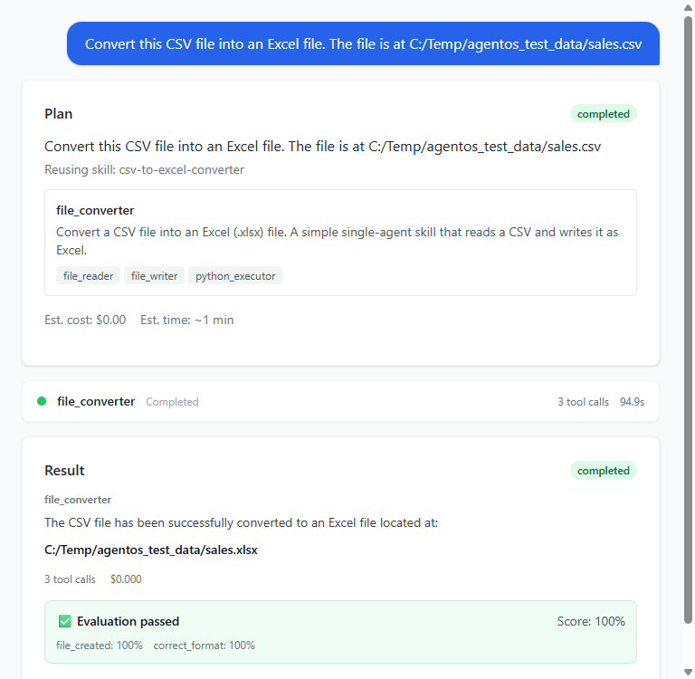
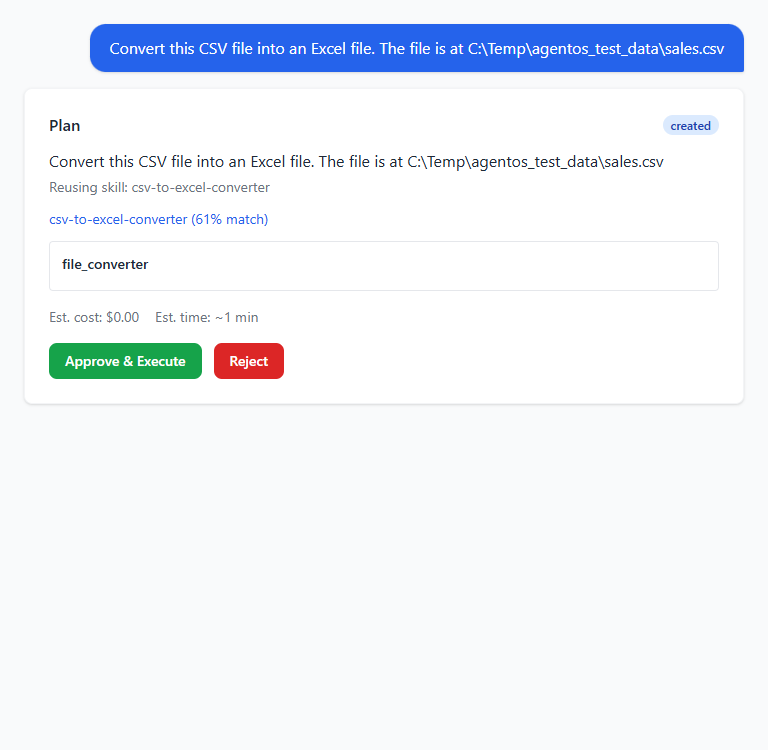
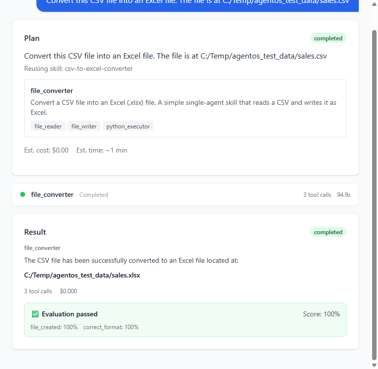

Languages: **English** | [日本語](README.ja.md)

---

# AgentFlow — Dynamic Multi-Agent Workflow & Skill Orchestrator

> A dynamic multi-agent orchestration platform where an LLM converts user intent into a structured agent workflow, obtains approval, executes it through tools, evaluates the result and saves successful workflows as reusable skills.


-003B57?logo=sqlite&logoColor=white)


## Why This Project Exists

Demonstrates dynamic multi-agent orchestration where the workflow is generated from user intent rather than being hard-coded into a fixed sequence of agents. The same engine handles any task — the plan is data, the platform is the product.

## What This Project Demonstrates

- LLM planning producing validated, structured agent plans (Pydantic `PlanSpec`)
- DAG orchestration with Kahn-level parallelism, cycle detection and bounded retries
- Human-in-the-loop approval before execution and at permission boundaries
- Evaluator stage with per-criterion scoring and bounded replanning
- Reusable, versioned skills (`.skill.yaml` / `.skill.zip`) with discovery and recommendations

## Architecture

```text
Intent → Intent Parser → Skill Discovery (reuse if match ≥ 0.5)
       → LLM Planner (PlanSpec JSON) → User Approval
       → Agent Factory → DAG Orchestrator (levels · parallel · retry)
       → Tool Runtime (python · files · web · HTTP)
       → Evaluation Engine (score vs criteria 0–1)
       → fail → Replanner (≤ 2) | success → Skill Library (versioned)
```

- **Backend**: FastAPI wrapping a Google ADK runner — planner, orchestrator, policy, evaluation and skills as five separate engines
- **Frontend**: React 18 + TypeScript + Vite + Zustand workspace UI (plan card, live agent activity, approval cards, evaluation badge)
- **LLM**: Ollama Cloud `gpt-oss:120b` via LiteLLM OpenAI-compatible endpoint; model router (fast/default/reasoning tiers)
- **State**: SQLite via async SQLAlchemy — tasks, plans, executions, events, skills, approvals

## Workflow

1. **Describe** — user states a goal in one sentence; intent parser classifies it (data analysis, research, QA…)
2. **Reuse or plan** — skill discovery runs first (keyword match ≥ 0.5 reuses a proven plan); otherwise the LLM planner generates a `PlanSpec` validated by `plan_validator` (unknown tools, dangling dependencies and cycles fail loudly)
3. **Approve** — nothing runs until the user approves the plan; any agent using `EXTERNAL_ACTION`/`DESTRUCTIVE` tools triggers a second, mid-flight approval gate
4. **Execute** — DAG orchestrator runs agents level-by-level (`asyncio.gather` parallelism, retry ≤ 3 per agent), emitting persisted events (`AGENT_STARTED`, `TOOL_STARTED/COMPLETED`, `HUMAN_APPROVAL_REQUIRED`…)
5. **Evaluate** — structural checks + per-criterion scores vs threshold (default 0.7); failure feeds the replanner (max 2 replans)
6. **Save as skill** — successful workflows freeze into versioned `.skill.yaml`/`.skill.zip`; import pipeline validates, security-scans and previews before install

## Technology Stack

| Area | Technology |
|---|---|
| LLM | Ollama Cloud (`gpt-oss:120b`) via LiteLLM |
| AI Framework | Google ADK (`LlmAgent`, `Runner`, `FunctionTool`) |
| Backend | FastAPI + Uvicorn, SSE streaming |
| Database | SQLite (async SQLAlchemy, PostgreSQL-ready) |
| Frontend | React 18, TypeScript, Vite, TailwindCSS, Zustand |
| Validation | Pydantic v2 (`PlanSpec`/`AgentSpec`) |
| Testing | pytest + pytest-asyncio (222 tests) |

## Key AI Engineering Concepts

- Plans as validated data, not prompts — free-form LLM output never reaches the orchestrator
- DAG execution: sequential / parallel / merge / retry / cancel patterns from one dependency spec
- Permission-level policy engine (`READ < WRITE < EXTERNAL_ACTION < DESTRUCTIVE`)
- Skill reuse before regeneration; semantic versioning with usage metrics
- Model routing by task type and complexity

## Safety / Reliability

- 4-level permission model with human approval gates (DB rows + asyncio Events — approvals survive restarts)
- `python_executor` blocks network imports via regex so code execution can't bypass the `EXTERNAL_ACTION` gate
- `calculator` uses AST-whitelisted arithmetic only (no `eval`)
- Bounded autonomy everywhere: per-agent iteration/tool-call/timeout caps; per-workflow replan/time/total-tool-call caps
- Execution state persisted after every step (crash-recoverable); bounded replanning (≤ 2)

## Testing / Evaluation

- **222 unit + API tests passing** (pytest, `asyncio_mode=auto`) covering planner, DAG, factory, evaluation, skills, approvals and API routes
- Evaluation engine: structural checks + criteria scoring (`completeness`, `accuracy`, `format`, `relevance`) with threshold gate; optional LLM-as-judge pass
- Demo run verified end-to-end: CSV → Excel in 95s, 3 tool calls, evaluation score 1.00

## Demo

Real UI captures from a recorded session (CSV → Excel demo) in [`docs/screenshots/`](docs/screenshots/):

| Intent & plan | Skill library | Completed run result |
|:---:|:---:|:---:|
|  |  |  |

Full walkthrough: [`AI_AgentFlow Orchestrator_userguide.html`](AI_AgentFlow%20Orchestrator_userguide.html) — 4-tab guide (Elevator Pitch / Non-Technical / Technical / Glossary).

## How to Run

```bash
# 1. Backend environment
python -m venv venv
venv\Scripts\activate                 # Windows
pip install -r requirements.txt

# 2. Configure .env (project root) — copy from .env.example
#    OPENAI_API_KEY=<your ollama.com key>
#    OPENAI_API_BASE=https://ollama.com/v1
#    AGENTOS_LLM_MODEL=openai/gpt-oss:120b

# 3. Start the backend
venv\Scripts\python -m uvicorn app.main:app --app-dir backend --port 8000

# 4. Frontend (second terminal)
cd frontend
npm install
npm run dev                           # → http://localhost:5173

# 5. Tests
venv\Scripts\python -m pytest -q      # 222 passed
```

Requires an Ollama Cloud API key (ollama.com/settings/keys). Optional `SERPAPI_API_KEY` enables real web search.

## Project Structure

```text
AgentFlow-Orchestrator/
├── backend/app/
│   ├── main.py               # FastAPI + lifespan + 10 routers + /health
│   ├── planner/              # intent · planner (ADK output_schema) · plan_validator
│   ├── factory/              # agent_factory · base_agent (ADK loop) · runtime
│   ├── orchestrator/         # engine · dag (Kahn + DFS cycle check) · state · events (SSE)
│   ├── policy/               # permission engine · approval pause/resume
│   ├── evaluation/           # structural + criteria scoring · replanner
│   ├── skills/               # registry · discovery · creation · import/export · recommender
│   ├── tools/builtins/       # file_reader · file_writer · python_executor · calculator · http_request · web_search
│   ├── memory/               # working / long-term / skill scopes
│   ├── llm/                  # LiteLLM config · model router
│   └── models/               # Pydantic schemas (PlanSpec, AgentSpec, SkillSpec…)
├── frontend/src/             # React workspace: timeline, PlanCard, AgentActivityCard, ApprovalInlineCard, EvaluationBadge
├── skills/                   # builtin skill YAMLs (csv-to-excel-converter, document-summarization, web-research)
├── tests/                    # 222 pytest tests
├── docs/screenshots/         # real UI captures
├── instruction.md            # 65-section platform specification
└── AI_AgentFlow Orchestrator_userguide.html
```

## How This Project Differs

Dynamic workflow generation rather than a fixed multi-agent hierarchy — the agent plan is generated per task, validated, approved, executed as a DAG, scored, and frozen into reusable skills. The E-Commerce project shows a fixed hierarchy; this platform generates the workflow itself.

## AI-Assisted Development

This project was developed using AI-assisted coding workflows. Architecture, implementation decisions, testing, debugging and validation were reviewed and refined during development.