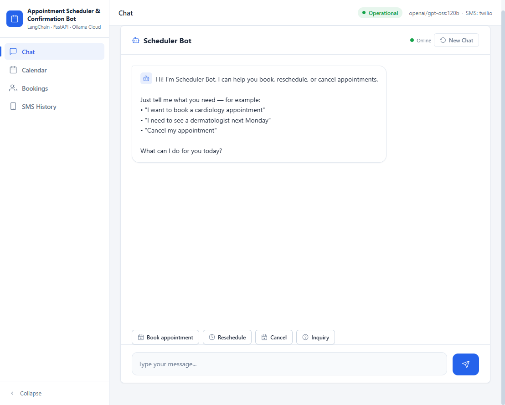
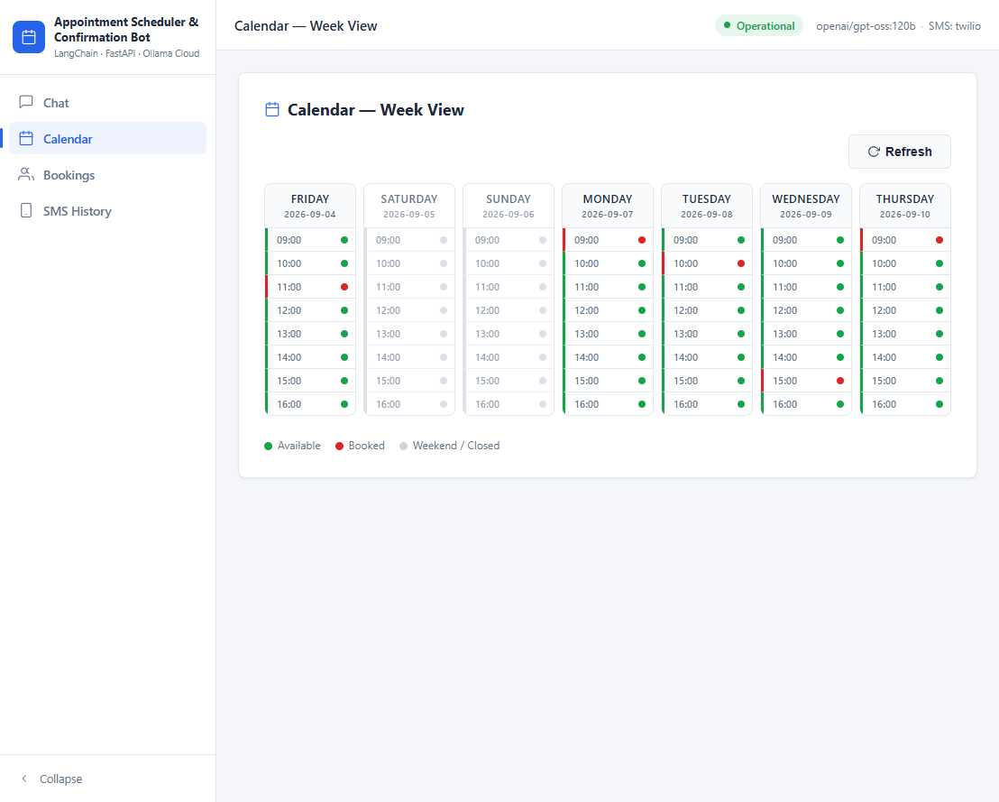

# 🏥 Hospital Appointment Scheduler & Confirmation Bot

> Part of the [AI_Projects](../README.md) showcase  Ea curated collection of AI/ML projects.

A lightweight, deterministic backend service built with **LangChain (LCEL)**, **FastAPI**, and **Pydantic** that processes inbound patient/client scheduling requests  Ewith a full **enterprise-grade web console** for conversational booking and admin management.

## Why This Project Exists

Demonstrates how an LLM can extract structured intent from free-form natural language while deterministic Python code owns the actual appointment decisions  Ecalendar rules, slot selection and confirmations  Eso the AI never makes the business decision.

[](https://www.python.org/)
[](https://fastapi.tiangolo.com/)
[](https://python.langchain.com/)
[](https://ollama.com/)
[](https://www.twilio.com/)
[](LICENSE)

## Screenshots

| Chat Console | Calendar  EWeek View |
|:---:|:---:|
|  |  |
| **Booking History** | **SMS Sent History** |
|  |  |

## Features

### Conversational Chat Bot
- 💬 Natural-language booking: *"I want to book a cardiology appointment for John Doe next Monday at 2pm"*
- 🤁ELLM-powered intent extraction ↁEstructured appointment fields via LangChain LCEL + Pydantic
- 📋 Booking confirmation cards with patient, department, scheduled time, masked phone, and SMS SID
- ⚡ Quick-action chips (Book / Reschedule / Cancel / Inquiry) and session-aware multi-turn chat

### Admin Console
- 📆 **Calendar  EWeek View**: 7-day ÁE8-slot availability grid with color-coded status rails
- 👥 **Booking History**: searchable table with masked phone numbers (click-to-reveal), SMS SIDs
- 📱 **SMS History**: full audit trail of sent messages with mode badges (twilio / mock / seed / error)
- 🟢 Live health status pill in the app bar (model + SMS mode at a glance)

### Enterprise UI
- Light-theme sidebar shell with collapsible nav and top app bar
- Inline SVG icon system (zero emoji, zero icon-library dependencies)
- Keyboard-accessible focus rings, reduced-motion support, light scrollbars
- Responsive: off-canvas sidebar on mobile, adapted layouts at 1024px / 900px / 640px

## What It Does

1. **Parses** raw natural-language input (text/email/SMS)
2. **Extracts** structured appointment variables (intent, date/time, department, contact info) via LLM
3. **Checks** a mock Calendar API for availability
4. **Sends** an SMS confirmation via Twilio (or mock equivalent)
5. **Returns** a structured JSON execution summary

## Tech Stack

| Component | Technology |
|-----------|-----------|
| LLM Orchestration | LangChain (LCEL)  E`langchain`, `langchain-core`, `langchain-openai` |
| LLM Provider | Ollama Cloud (`gpt-oss:120b`) via local OpenAI-format proxy |
| API Framework | FastAPI + Uvicorn |
| Data Validation | Pydantic v2 |
| Testing | pytest + pytest-asyncio |
| SMS | Twilio (mock by default) |

## Project Structure

```text
├── app/
━E  ├── __init__.py
━E  ├── main.py              # FastAPI entry point + web UI serving
━E  ├── schemas.py           # Pydantic schemas (input/output/extraction)
━E  ├── chain.py             # LangChain LCEL pipeline + orchestrator
━E  ├── services.py          # Mock Calendar & SMS services
━E  ├── config.py            # Environment configuration (pydantic-settings)
━E  └── static/
━E      └── index.html       # Enterprise web console (single-file, no build step)
├── tests/
━E  ├── __init__.py
━E  ├── conftest.py          # Shared fixtures
━E  ├── test_chain.py        # Extraction & orchestrator tests
━E  └── test_api.py          # FastAPI endpoint tests
├── docs/
━E  └── screenshots/         # UI screenshots for README
├── data/
━E  └── appointments.db      # SQLite store (bookings, SMS records)
├── ollama_cloud_proxy.py    # OpenAI→Ollama format translator
├── .env                     # API keys (gitignored)
├── .env.example             # Template for .env
├── .gitignore
├── requirements.txt
├── pytest.ini
├── Instruction.md           # Original spec
└── README.md
```

## Web Console

The UI is served at `http://127.0.0.1:8000/`  Ea single-file `app/static/index.html` (no Node, no build step).

| Endpoint | Purpose |
|----------|---------|
| `GET /` | Enterprise web console (chat + admin views) |
| `GET /api/health` | Service health (status, model, SMS mode) |
| `POST /api/chat` | Conversational booking (session-aware) |
| `POST /api/chat/reset` | Reset a chat session |
| `GET /api/calendar/week` | 7-day availability grid |
| `GET /api/calendar/bookings` | All bookings |
| `GET /api/sms/history` | SMS audit trail |
| `POST /api/appointment` | Direct scheduling API (JSON in/out) |

## Setup

### 1. Create virtual environment & install dependencies

```powershell
cd 01-Agentic-AI\Hospital-Appointment-Agent   # from the repository root
.\.venv\Scripts\Activate.ps1
pip install -r requirements.txt
```

### 2. Configure environment

Copy `.env.example` to `.env` and fill in your Ollama Cloud API key:

```powershell
Copy-Item .env.example .env
```

Edit `.env`:
```
OLLAMA_API_KEY=your_real_key_from_ollama_com
```

Get your key from: https://ollama.com/settings/keys

### 3. Start the Ollama Cloud Proxy

**This must be running before you start the app or run integration tests.**

```powershell
.\.venv\Scripts\python.exe ollama_cloud_proxy.py
```

The proxy listens on `http://127.0.0.1:11435/v1` and translates OpenAI-format requests to Ollama Cloud native format.

### 4. Run the API server

In a new terminal:

```powershell
.\.venv\Scripts\Activate.ps1
uvicorn app.main:app --host 127.0.0.1 --port 8000 --reload
```

API docs: http://127.0.0.1:8000/docs

### 5. Run tests

```powershell
.\.venv\Scripts\Activate.ps1
pytest tests/ -v
```

> Unit tests mock the LLM chain  Eno proxy or Ollama Cloud needed.

## API Usage

### POST /api/appointment

```bash
curl -X POST http://127.0.0.1:8000/api/appointment \
  -H "Content-Type: application/json" \
  -d '{
    "raw_text": "I need to book a cardiology appointment for John Doe on 2026-09-07 at 14:00. My phone is +15551234567.",
    "channel": "web"
  }'
```

**Response:**
```json
{
  "status": "confirmed",
  "extracted": {
    "intent": "schedule",
    "patient_name": "John Doe",
    "department": "cardiology",
    "preferred_datetime": "2026-09-07T14:00:00",
    "contact_phone": "+15551234567",
    "contact_email": null,
    "notes": null
  },
  "scheduled_datetime": "2026-09-07T14:00:00",
  "confirmation_message_sid": "MOCK_SID_abc123",
  "message": "Appointment confirmed for 2026-09-07 at 14:00. SMS sent (SID: MOCK_SID_abc123)."
}
```

### GET /api/health

```bash
curl http://127.0.0.1:8000/api/health
```

## How It Works

```
Raw Text ↁE[ChatPromptTemplate | ChatOpenAI | PydanticOutputParser] ↁEExtractedAppointment
                                                                         ━E
                                                                         ▼
                                                              ┌─── Calendar Check ───━E
                                                              ━E                     ━E
                                                         Available?            Not Available?
                                                              ━E                     ━E
                                                         Book Slot          Find Next Available
                                                              ━E                     ━E
                                                              └────── SMS ──────────━E
                                                                         ━E
                                                                         ▼
                                                                  ExecutionSummary
```

## Configuration

| Env Var | Description | Default |
|---------|-------------|---------|
| `OLLAMA_API_KEY` | Ollama Cloud API key | (required) |
| `OPENAI_API_KEY` | Dummy key for langchain-openai | `ollama-cloud-proxy` |
| `OPENAI_API_BASE` | Proxy endpoint | `http://127.0.0.1:11435/v1` |
| `OLLAMA_MODEL` | Ollama model with `openai/` prefix | `openai/gpt-oss:120b` |
| `TWILIO_ACCOUNT_SID` | Twilio SID (`mock` = mock mode) | `mock` |
| `TWILIO_AUTH_TOKEN` | Twilio token | `mock` |
| `TWILIO_FROM_NUMBER` | Twilio sender number | `+10000000000` |
| `APP_HOST` | API host | `127.0.0.1` |
| `APP_PORT` | API port | `8000` |

## Available Ollama Cloud Models

- `gpt-oss:120b` (default)
- `gpt-oss:20b`
- `glm-5.2`
- `kimi-k2.6`
- `deepseek-v4-flash`

To change the model, edit `OLLAMA_MODEL` in `.env`.

## Notes

- **No LangGraph / no vector retrievers**  Estrictly linear LCEL pipeline per spec.
- **Mock services**  ECalendar and SMS are mock by default. Set real Twilio creds in `.env` to enable actual SMS.
- **Proxy required**  EThe Ollama Cloud proxy must be running before the app can make LLM calls.
