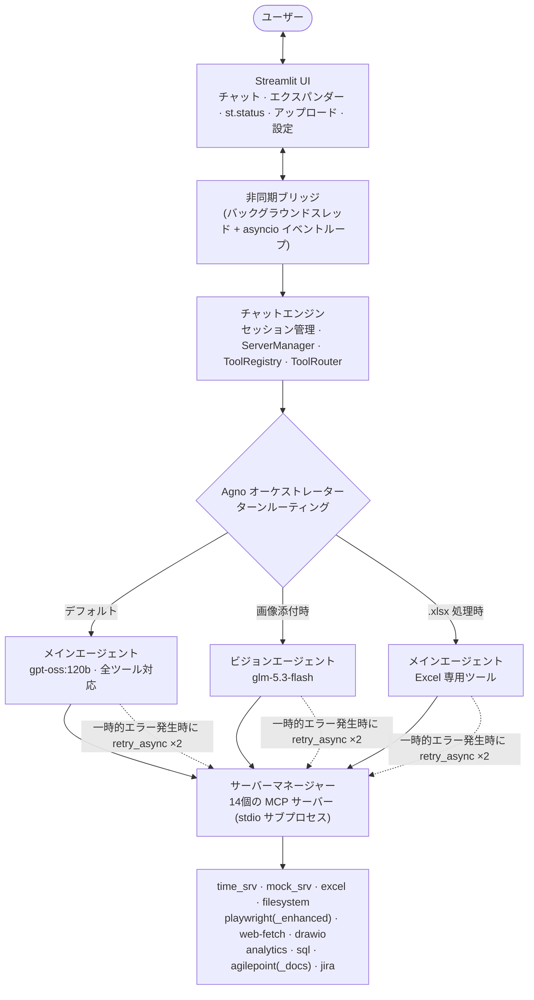

言語 / Languages: [English](README.md) | **日本語**

---

# 🤖 Agentic AI — MCP ツール オーケストレーション

**14 個の MCP(Model Context Protocol)ツール サーバーを任意の LLM の背後でオーケストレーションする、本番スタイルの AI チャット アシスタント** — 時刻、Excel、ファイルシステム、ブラウザ自動化、図、チャート、SQL、Jira、ドキュメント検索、画像理解を、プロバイダーを切り替え可能なレイヤー(Ollama Cloud / ローカル Ollama / 任意の OpenAI 互換エンドポイント)とともに Streamlit チャット UI の背後に提供します。

## デモ動画

[](https://youtu.be/lk8tUGTuk-E)
[](https://youtu.be/AIMl9B_d6Yg)


<div align="center">
  
</div>

基本アイデア: LLM が**脳**、MCP ツール サーバーが**手**です。1 回のチャットターンは
`user → agent → tool call → tool result → agent → answer` と流れ、エージェント ループは最大 20 ラウンドのツール呼び出しを連鎖でき、
複数ステップの作業(「このワークブックを読んで、チャート化して、傾向を説明して」)を実現します。

## なぜこのプロジェクトが存在するのか

AI エージェントが Model Context Protocol を通じて外部ツールを発見・オーケストレーションする仕組みを実証します — LLM と 14 個の実際のツール サーバーの間にある、制御されたリトライ可能なツール呼び出しレイヤーです。

---

## ✨ 何ができるか

| 機能 | プロンプト例 | ツール サーバー |
|---|---|---|
| 💬 チャット & 回答 | "REST API とは何か説明して" | — (純粋な LLM) |
| ⏰ 実際の日付/時刻 | "東京は今何時?" | `time_srv` |
| 📊 Excel の読み書き | "`C:\Temp\mcp_test_data\sales.xlsx` の Sales シートを読んで" | `excel` |
| 📁 ファイル & フォルダー | "`.\config` のファイル一覧を出して" | `filesystem` |
| 🌐 Web ページの取得 | "https://example.com を取得して要約して" | `web-fetch` |
| 🖥️ 実ブラウザの操作 | "bbc.com を開いて、スクリーンショットを撮って、見出しを要約して" | `playwright` / `playwright_enhanced` |
| 📈 チャート & ダッシュボード | "Q1 の売上の棒グラフ: 1 月 120、2 月 90、3 月 150" | `analytics` |
| 🧩 図の作成(draw.io) | "フローチャート: Start → Validate → Process → End" | `drawio` |
| 🗄️ SQL クエリ | "SELECT dept, AVG(salary) FROM employees GROUP BY dept" | `sql` |
| 🖼️ 画像理解 | *(画像を添付)* "これに何が見える?" | ビジョン エージェント(`glm-5.3-flash`) |
| 📖 ドキュメント検索 | "AgilePoint ドキュメントで 'worklist' を検索" | `agilepoint_docs` |
| 🏢 BPM ワークリスト | "自分の AgilePoint ワークリストを見せて" | `agilepoint` |
| 🎫 Jira(オプション) | "自分の未解決 Jira チケット一覧" | `jira` |

**主な設計判断**

- 🧩 **MCP 標準ツール** — すべてのツール サーバーは stdio 上の JSON-RPC で通信。MCP 互換サーバーなら `config/mcp_servers.yaml` に追加するだけでコード変更ゼロで組み込めます。
- 🔀 **プロバイダー非依存の LLM レイヤー** — メインモデル(Ollama Cloud の `gpt-oss:120b`、ローカル Ollama、Baseten などの OpenAI 互換)と専用ビジョン モデルは独立して切り替え可能。シークレットは `.env.llm` 経由でのみ流れ、コードには決して埋め込みません。
- 🛡️ **堅牢なターン処理** — 一時的なツール障害は自動リトライ(タイムアウト/トランスポートのみ。ポリシーエラーはフェイルファスト)、Excel ターンは Excel 専用ツールへ自動スコープ、draw.io リンクは LLM コメントときれいに合成。
- 🎛️ **設定可能なガードレール** — 承認モード(`auto` / `require_approval`)、ツールの許可/拒否ポリシー、サーバーごとの行数上限(`EXCEL_MAX_ROWS`、`SQL_MAX_ROWS`)、「全出力を表示」エクスパンダー付き出力切り詰め。
- 🔍 **完全な可観測性** — シークレットをマスクしたセッションごとの JSONL トレース、構造化ロギング、UI 上のツール呼び出しエクスパンダーで実際のリクエスト/レスポンス ペイロードを確認可能。
- 🧪 **品質ゲート** — 44 個の pytest テスト、実際の Excel MCP サーバーを起動するライブ 5 ステップ プリフライト ハーネス、生成テストデータ付きの手動 E2E テスト計画。

---

## 🏗 アーキテクチャ



**ターン ルーティング ロジック**(`core/agno_orchestrator.py` 内):

1. 画像が添付されビジョンが有効 → 専用ビジョン エージェント(失敗時はメイン エージェントにフォールバック)。
2. メッセージが `.xlsx/.xls/.xlsm` パスに言及(引用符付き、UNC、または通常)→ Excel 専用ツールスコープ。
3. draw.io ツールが URL を生成 → 返信は `[Open in draw.io]` リンク + モデル コメントになる。
4. それ以外 → 全 14 サーバーのツールスキーマを持つメイン エージェント。

---

## 📂 プロジェクト構成

```
Agentic-AI-MCP-Tool-Orchestration/
├── config/                       # すべての実行時設定ファイル (YAML)
│   ├── app_settings.yaml         #   LLM プロバイダー/モデル、制限値、タイムアウト、UI設定
│   ├── mcp_servers.yaml          #   14個のツールサーバー定義、実行コマンド、タイムアウト設定
│   └── policies.yaml             #   グローバルなツールの許可/拒否ルール
├── src/mcp_app/
│   ├── ui/                       # Streamlit アプリ、非同期ブリッジ、ランチャー
│   ├── core/                     # ChatEngine, AgnoOrchestrator, ToolRouter, レジストリ, セッション管理
│   ├── llm/                      # Ollama / OpenAI 互換アダプター、システムプロンプト生成
│   ├── mcp/                      # ServerManager, MCP クライアント, stdio/http/ws トランスポート層
│   ├── config/                   # Pydantic v2 スキーマ、YAML/環境変数ローダー
│   ├── storage/                  # SQLite セッション保存、JSONL トレース、機密情報の伏字処理
│   ├── observability/            # 構造化ログ記録、トレース機能
│   ├── cli/                      # `mcp chat` ターミナルインターフェース (Click 実装)
│   └── utils/                    # リトライ処理、タイムアウト制御
├── servers/                      # 同梱されたカスタム MCP サーバー群 (stdio JSON-RPC)
│   ├── excel/                    # Excel 操作自動化サーバー
│   ├── drawio/                   # ダイアグラム生成サーバー
│   ├── analytics/                # データ分析サーバー
│   ├── agilepoint/               # AgilePoint 連携サーバー
│   ├── agilepoint_docs/          # AgilePoint ドキュメント検索サーバー
│   ├── playwright/               # Web 自動化サーバー
│   └── sql/                      # データベースクエリ実行サーバー
├── tests/                        # pytest テストスイート、モック MCP サーバー
├── docs/                         # システムアーキテクチャ図 (SVG + PNG)
├── images/                       # GitHub ソーシャルプレビュー用画像
├── userguide.html                # インタラクティブな2タブ構成ガイド (日常利用 + 技術詳細)
├── howtotest.md                  # 完全手動 E2E テスト計画、テストデータ生成スクリプト
├── pyproject.toml                # プロジェクトのビルドメタデータおよび依存関係定義
└── .env.example                  # 環境変数のテンプレートファイル
```

---

## 🚀 はじめに

### 1 · 前提条件

- **Python 3.11+**(3.12 推奨)
- **LLM エンドポイント** — 次のいずれか 1 つ:
  - [Ollama Cloud](https://ollama.com) の API キー(`gpt-oss:120b`、`glm-5.3-flash` が利用可能)
  - ローカル [Ollama](https://ollama.com/download)(`ollama pull gpt-oss:120b`)
  - 任意の OpenAI 互換 API(Baseten、Groq、OpenAI、Azure OpenAI など)
- **Node.js 18+** — `filesystem` と `playwright` サーバーのみに必要(同梱の Python サーバーには不要)

### 2 · 仮想環境の作成

```bash
python -m venv .venv
# Windows
.venv\Scripts\activate
# macOS/Linux
source .venv/bin/activate
```

### 3 · 依存関係のインストール

```bash
pip install -e ".[dev]"
```

### 4 · 認証情報の設定

`.env.example` → `.env.llm` にコピーしてキーを記入します:

```bash
cp .env.example .env.llm       # Windows: copy .env.example .env.llm
```

| 変数 | 必須 | 用途 |
|---|---|---|
| `LLM_PROVIDER` | ✅ | `ollama`(ローカルまたはクラウド)または `openai_compat` |
| `OLLAMA_HOST` | ✅ | `https://ollama.com`(クラウド)または `http://localhost:11434`(ローカル) |
| `OLLAMA_MODEL` | ✅ | 例: `gpt-oss:120b` |
| `OLLAMA_API_KEY` | クラウドのみ | Ollama Cloud キー — **実際の値をコミットしないこと** |
| `OPENAI_COMPAT_BASE_URL` / `_MODEL` / `_API_KEY` | provider = `openai_compat` の場合 | 例: Baseten `Kimi-K2.6` |
| `VISION_ENABLED` / `VISION_PROVIDER` / `VISION_MODEL` / `VISION_BASE_URL` / `VISION_API_KEY` | オプション | 画像ターン用の専用ビジョン モデル |

> 🔐 **実際の `.env.llm` をコミットしないでください** — `.gitignore` で除外されています。このリポジトリの
> `config/app_settings.yaml` は `api_key` フィールドが意図的に**空**で同梱されています。値は実行時に `.env.llm` からオーバーレイされます。

### 5 · チャット UI の起動

```bash
# Option A — console entry point
mcpapp-ui

# Option B — Streamlit directly
streamlit run src/mcp_app/ui/app.py --server.port 8502
```

**http://localhost:8502** を開きます。最初のメッセージ送信時に、有効な全 MCP サーバーが
(サブプロセスとして)起動し、サイドバーで 🟢 READY になります。

### 6 · または CLI を使用(ブラウザ不要)

```bash
mcpapp chat
```

---

## 💬 サンプル会話

```
ユーザー:   現在の時刻を教えてください。
🔧 time_srv.get_current_time
エージェント: 現在時刻は 7:38 AM (米国東部夏時間、America/New_York) です。

ユーザー:   "C:\Temp\mcp_test_data\sales.xlsx" 内のシート一覧を取得し、Sales シートの最初の10行を表示してください。
🔧 excel.read_sheet_names → [Sales, Regions]
🔧 excel.read_sheet_data  → 5列 × 行
エージェント: ワークブックには2つのシートがあります。Sales シートには Month/Region/Product/Units/Revenue の項目が含まれています。最初の10行は以下の通りです…

ユーザー:   月別の Revenue (売上) をグラフ化してください。
🔧 excel.read_sheet_data · analytics.create_chart
エージェント: グラフを ./.mcp_app_logs/chart_20260908_103812.html に出力しました — ブラウザで開いて棒グラフを確認できます。

ユーザー:   (画像を添付) この画像には何が写っていますか？
👁️ ビジョンモデルへルーティング
エージェント: 赤色の背景に黄色の円があり、その中に数字の 742 が描かれています。
```

---

## 🧪 テスト

```bash
# Unit tests (44 passed; test_cli_smoke.py has 11 pre-existing click/CliRunner failures)
python -m pytest tests/ -q

# Live preflight harness — starts a REAL Excel MCP server and verifies the
# system prompt, tool-name resolver, and xlsx turn scoping end to end
python test_preflight.py        # → "ALL 5 STEPS PASSED"

# Excel server regression scripts
python test_excel_tools.py
python test_excel_schema.py
```

完全な手動 E2E プラン(サーバーごとの 12 個のテスト レシピ + `sales.xlsx`、ビジョン テスト画像、
SQLite DB、チャート データを 1 コマンドで生成するスクリプト)は **[howtotest.md](./howtotest.md)** を参照してください。

> 💡 手軽なインタラクティブ ツアーは **[userguide.html](./userguide.html)** にあります — タブ 1 は
> コピー&ペースト可能なテスト プロンプト付きの非技術者向けウォークスルー、タブ 2 は完全な技術リファレンスです。

---

## ⚙️ 設定ハイライト

| 設定 | 場所 | デフォルト | 備考 |
|---|---|---|---|
| プロバイダー / モデル | `.env.llm` → `LLM_PROVIDER`、`OLLAMA_MODEL` | `ollama` / `gpt-oss:120b` | 設定フォームから実行時に切り替え可能 |
| ビジョン モデル | `.env.llm` → `VISION_*` | `glm-5.3-flash`(Ollama Cloud) | フォールバック付きの画像ターン専用エージェント |
| 承認モード | `config/app_settings.yaml` → `tool_calling.mode` | `auto` | `require_approval` は各ツールの前に確認を求める |
| ツール ラウンド数 | `limits.max_tool_rounds` | 20 | チャット 1 ターンあたりのエージェント ラウンド |
| Excel 行数上限 | `limits.excel_max_rows` | 2000 | excel サーバー環境に注入(`EXCEL_MAX_ROWS`) |
| SQL 行数上限 | `limits.sql_max_rows` | 500 | sql サーバー環境に注入(`SQL_MAX_ROWS`) |
| ツール出力上限 | `limits.max_tool_output_chars` | 8000 | UI は 3000 で切り詰め + 全出力エクスパンダー |
| ツール ポリシー | `config/policies.yaml` + サーバーごとの `policy:` | 空 | グローバル/サーバーごとの許可 & 拒否リスト |

すべての設定はサイドバーの ⚙️ Settings フォームからライブ編集できます — YAML と `.env.llm` の両方に書き込まれます。

---

## 🛠 技術スタック

| レイヤー | 技術 |
|---|---|
| 言語 | Python 3.12 |
| UI | Streamlit 1.54(`st.status`、エクスパンダー、アップロード) |
| オーケストレーション | **Agno 2.5.10**(`Agent`、`Ollama`、`OpenAIChat`)+ 独自レガシー ループ |
| LLM(メイン) | Ollama Cloud `gpt-oss:120b` · ローカル Ollama · Baseten `Kimi-K2.6`(OpenAI 互換) |
| LLM(ビジョン) | Ollama Cloud `glm-5.3-flash` |
| ツール プロトコル | **MCP over stdio**(JSON-RPC 2.0)、クラッシュ分離されたサブプロセス |
| HTTP | タイムアウト + Bearer 認証付きの `httpx.AsyncClient` |
| 設定 | Pydantic v2 + YAML ×3 + `.env.llm` オーバーレイ |
| 永続化 | SQLite(セッション)、マスク処理付き JSONL トレース |
| CLI | click(`mcp chat`、`list-servers`、`health`) |
| テスト | pytest(44)、ライブ プリフライト ハーネス |

---

## 🔧 拡張

- **ツール サーバーの追加** — サイドバー → Manage Servers → ➕ Add Server(または `config/mcp_servers.yaml` を編集)。再起動時にツールが自動登録されます。MCP 互換サーバーであれば何でも動作します。
- **プロバイダーの追加** — `src/mcp_app/llm/` のアダプター契約を実装して設定ブロックを追加します。OpenAI 互換アダプターがすでにほとんどのホスト型エンドポイントをカバーしています。
- **ロードマップ** — ストリーミング応答(フェーズ 4)、MCP Streamable HTTP トランスポート(フェーズ 5)、オプションの WebSocket トランスポート(フェーズ 6)。ユーザー ガイドの技術タブを参照してください。

## 📄 ライセンス

MIT — 詳細はリポジトリ ルートを参照してください。
