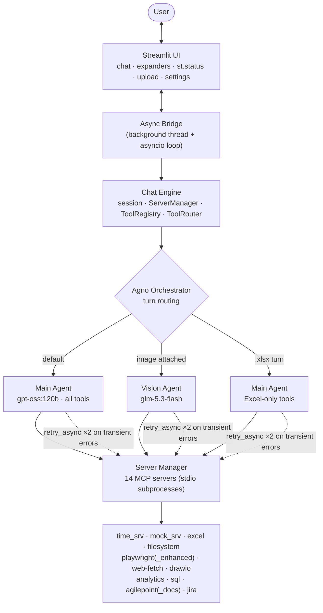

Languages: **English** | [日本語](README.ja.md)

---

# 🤖 Agentic AI — MCP Tool Orchestration

**A production-style AI chat assistant that orchestrates 14 MCP (Model Context Protocol) tool servers behind any LLM** — time, Excel, filesystem, browser automation, diagrams, charts, SQL, Jira, docs search, and image understanding — all behind a Streamlit chat UI with a switchable provider layer (Ollama Cloud / local Ollama / any OpenAI-compatible endpoint).

## Demo Video

[](https://youtu.be/lk8tUGTuk-E)
[](https://youtu.be/AIMl9B_d6Yg)

<div align="center">
  
</div>

The core idea: the LLM is the **brain**, the MCP tool servers are the **hands**. A single chat turn flows
user → agent → tool call → tool result → agent → answer, and the agent loop can chain up to 20 tool rounds
to accomplish multi-step work ("read this workbook, chart it, and explain the trend").

## Why This Project Exists


Demonstrates how an AI agent can discover and orchestrate external tools through the Model Context Protocol — a controlled, retry-capable tool-calling layer between the LLM and 14 real tool servers.

---

## ✨ What It Does

| Capability | Example prompt | Tool server |
|---|---|---|
| 💬 Chat &amp; answer | "Explain what a REST API is" | — (pure LLM) |
| ⏰ Real date/time | "What time is it in Tokyo?" | `time_srv` |
| 📊 Read/write Excel | "Read the Sales sheet from `C:\Temp\mcp_test_data\sales.xlsx`" | `excel` |
| 📁 Files & folders | "List the files in `.\config`" | `filesystem` |
| 🌐 Fetch web pages | "Fetch https://example.com and summarize it" | `web-fetch` |
| 🖥️ Drive a real browser | "Open bbc.com, take a screenshot, summarize headlines" | `playwright` / `playwright_enhanced` |
| 📈 Charts & dashboards | "Bar chart of Q1 sales: Jan 120, Feb 90, Mar 150" | `analytics` |
| 🧩 Diagrams (draw.io) | "Flowchart: Start → Validate → Process → End" | `drawio` |
| 🗄️ SQL queries | "SELECT dept, AVG(salary) FROM employees GROUP BY dept" | `sql` |
| 🖼️ Image understanding | *(attach image)* "What do you see?" | vision agent (`glm-5.3-flash`) |
| 📖 Docs search | "Search AgilePoint docs for 'worklist'" | `agilepoint_docs` |
| 🏢 BPM worklists | "Show my AgilePoint worklist" | `agilepoint` |
| 🎫 Jira (optional) | "List my open Jira tickets" | `jira` |

**Key design decisions**

- 🧩 **MCP-standard tools** — every tool server speaks JSON-RPC over stdio; any MCP-compatible server plugs in via `config/mcp_servers.yaml` with zero code changes.
- 🔀 **Provider-agnostic LLM layer** — main model (`gpt-oss:120b` on Ollama Cloud, local Ollama, or Baseten/other OpenAI-compatible) and a dedicated vision model are independently switchable; secrets flow through `.env.llm`, never through code.
- 🛡️ **Robust turn handling** — transient tool failures auto-retry (timeouts/transport only; policy errors fail fast), Excel turns are auto-scoped to Excel-only tools, and draw.io links compose cleanly with LLM commentary.
- 🎛️ **Configurable guardrails** — approval mode (`auto` / `require_approval`), tool allow/deny policies, per-server row ceilings (`EXCEL_MAX_ROWS`, `SQL_MAX_ROWS`), output truncation with a "view full output" expander.
- 🔍 **Full observability** — per-session JSONL traces with secret redaction, structured logging, tool-call expanders in the UI showing exact request/response payloads.
- 🧪 **Quality gates** — 44 pytest tests, a live 5-step preflight harness that starts a real Excel MCP server, and a manual E2E test plan with generated test data.

---

## 🏗 Architecture



**Turn routing logic** (in `core/agno_orchestrator.py`):

1. Images attached + vision enabled → dedicated vision agent (fallback to main agent on failure).
2. Message mentions a `.xlsx/.xls/.xlsm` path (quoted, UNC, or plain) → Excel-only tool scope.
3. draw.io tool produces a URL → reply becomes `[Open in draw.io]` link + model commentary.
4. Everything else → main agent with all 14 servers' tool schemas.

---

## 📂 Project Structure

```
Agentic-AI-MCP-Tool-Orchestration/
├── config/                       # All runtime configuration (YAML)
│   ├── app_settings.yaml         #   LLM provider/model, limits, timeouts, UI
│   ├── mcp_servers.yaml          #   the 14 tool servers + commands + timeouts
│   └── policies.yaml             #   global tool allow/deny rules
├── src/mcp_app/
│   ├── ui/                       # Streamlit app, async bridge, launcher
│   ├── core/                     # ChatEngine, AgnoOrchestrator, ToolRouter, registry, session
│   ├── llm/                      # Ollama + OpenAI-compat adapters, system prompting
│   ├── mcp/                      # ServerManager, MCP client, stdio/http/ws transports
│   ├── config/                   # Pydantic v2 schemas + YAML/env loader
│   ├── storage/                  # SQLite sessions, JSONL traces, secret redaction
│   ├── observability/            # Structured logging + tracing
│   ├── cli/                      # `mcp chat` terminal interface (click)
│   └── utils/                    # retry, timeouts
├── servers/                      # Bundled custom MCP servers (stdio JSON-RPC)
│   ├── excel/  drawio/  analytics/  agilepoint/  agilepoint_docs/
│   ├── playwright/  sql/
├── tests/                        # pytest suite + mock MCP server
├── docs/                         # architecture diagram (SVG + PNG)
├── images/                       # GitHub social preview
├── userguide.html                # Interactive 2-tab guide (everyday + technical)
├── howtotest.md                  # Full manual E2E test plan + test-data generators
├── pyproject.toml
└── .env.example
```

---

## 🚀 Getting Started

### 1 · Prerequisites

- **Python 3.11+** (3.12 recommended)
- **An LLM endpoint** — any ONE of:
  - [Ollama Cloud](https://ollama.com) API key (has `gpt-oss:120b`, `glm-5.3-flash`)
  - Local [Ollama](https://ollama.com/download) (`ollama pull gpt-oss:120b`)
  - Any OpenAI-compatible API (Baseten, Groq, OpenAI, Azure OpenAI…)
- **Node.js 18+** — only for the `filesystem` and `playwright` servers (the bundled Python servers don't need it)

### 2 · Create a virtual environment

```bash
python -m venv .venv
# Windows
.venv\Scripts\activate
# macOS/Linux
source .venv/bin/activate
```

### 3 · Install dependencies

```bash
pip install -e ".[dev]"
```

### 4 · Configure credentials

Copy `.env.example` → `.env.llm` and fill in your key(s):

```bash
cp .env.example .env.llm       # Windows: copy .env.example .env.llm
```

| Variable | Required | Purpose |
|---|---|---|
| `LLM_PROVIDER` | ✅ | `ollama` (local or cloud) or `openai_compat` |
| `OLLAMA_HOST` | ✅ | `https://ollama.com` (cloud) or `http://localhost:11434` (local) |
| `OLLAMA_MODEL` | ✅ | e.g. `gpt-oss:120b` |
| `OLLAMA_API_KEY` | cloud only | Ollama Cloud key — **never commit the real value** |
| `OPENAI_COMPAT_BASE_URL` / `_MODEL` / `_API_KEY` | if provider = `openai_compat` | e.g. Baseten `Kimi-K2.6` |
| `VISION_ENABLED` / `VISION_PROVIDER` / `VISION_MODEL` / `VISION_BASE_URL` / `VISION_API_KEY` | optional | dedicated vision model for image turns |

> 🔐 **Never commit your real `.env.llm`** — it is excluded via `.gitignore`. The `config/app_settings.yaml`
> in this repo ships with **empty** `api_key` fields on purpose; values are overlaid at runtime from `.env.llm`.

### 5 · Run the chat UI

```bash
# Option A — console entry point
mcpapp-ui

# Option B — Streamlit directly
streamlit run src/mcp_app/ui/app.py --server.port 8502
```

Open **http://localhost:8502**. On your first message all enabled MCP servers start
(subprocesses) and turn 🟢 READY in the sidebar.

### 6 · Or use the CLI (no browser)

```bash
mcpapp chat
```

---

## 💬 Sample Conversation

```
You:    What time is it now?
        🔧 time_srv.get_current_time
Agent:  It's currently 7:38 AM (Eastern Daylight Time, America/New_York).

You:    List the sheets in "C:\Temp\mcp_test_data\sales.xlsx" and show the first
        10 rows of the Sales sheet.
        🔧 excel.read_sheet_names → [Sales, Regions]
        🔧 excel.read_sheet_data  → 5 columns × rows
Agent:  The workbook has two sheets. Sales contains Month/Region/Product/
        Units/Revenue; here are the first 10 rows …

You:    Now chart Revenue by Month.
        🔧 excel.read_sheet_data · analytics.create_chart
Agent:  Chart written to ./.mcp_app_logs/chart_20260908_103812.html — open it
        in a browser to see the bars.

You:    (attach image) What do you see in this image?
        👁️ routed to vision model
Agent:  A yellow circle on a red background, with the number 742.
```

---

## 🧪 Testing

```bash
# Unit tests (44 passed; test_cli_smoke.py has 11 pre-existing click/CliRunner failures)
python -m pytest tests/ -q

# Live preflight harness — starts a REAL Excel MCP server and verifies the
# system prompt, tool-name resolver, and xlsx turn scoping end to end
python test_preflight.py        # → "ALL 5 STEPS PASSED"

# Excel server regression scripts
python test_excel_tools.py
python test_excel_schema.py
```

For the full manual E2E plan (12 per-server test recipes + one-command generators for
`sales.xlsx`, a vision test image, a SQLite DB, and chart data), see **[howtotest.md](./howtotest.md)**.

> 💡 A quick interactive tour lives in **[userguide.html](./userguide.html)** — Tab 1 is a
> non-technical walkthrough with copy-paste test prompts; Tab 2 is the full technical reference.

---

## ⚙️ Configuration Highlights

| Setting | Where | Default | Notes |
|---|---|---|---|
| Provider / model | `.env.llm` → `LLM_PROVIDER`, `OLLAMA_MODEL` | `ollama` / `gpt-oss:120b` | switchable at runtime via the Settings form |
| Vision model | `.env.llm` → `VISION_*` | `glm-5.3-flash` (Ollama Cloud) | dedicated image-turn agent with fallback |
| Approval mode | `config/app_settings.yaml` → `tool_calling.mode` | `auto` | `require_approval` prompts before each tool |
| Tool rounds | `limits.max_tool_rounds` | 20 | agentic rounds per chat turn |
| Excel row ceiling | `limits.excel_max_rows` | 2000 | injected into the excel server env (`EXCEL_MAX_ROWS`) |
| SQL row ceiling | `limits.sql_max_rows` | 500 | injected into the sql server env (`SQL_MAX_ROWS`) |
| Tool output cap | `limits.max_tool_output_chars` | 8000 | UI truncates at 3000 + full-output expander |
| Tool policies | `config/policies.yaml` + per-server `policy:` | empty | global/per-server allow & deny lists |

All settings are editable live in the sidebar ⚙️ Settings form — it writes both the YAML and `.env.llm`.

---

## 🛠 Tech Stack

| Layer | Technology |
|---|---|
| Language | Python 3.12 |
| UI | Streamlit 1.54 (`st.status`, expanders, upload) |
| Orchestration | **Agno 2.5.10** (`Agent`, `Ollama`, `OpenAIChat`) + in-house legacy loop |
| LLM (main) | Ollama Cloud `gpt-oss:120b` · local Ollama · Baseten `Kimi-K2.6` (OpenAI-compat) |
| LLM (vision) | Ollama Cloud `glm-5.3-flash` |
| Tool protocol | **MCP over stdio** (JSON-RPC 2.0), crash-isolated subprocesses |
| HTTP | `httpx.AsyncClient` with timeouts + Bearer auth |
| Config | Pydantic v2 + YAML ×3 + `.env.llm` overlay |
| Persistence | SQLite (sessions), JSONL traces with redaction |
| CLI | click (`mcp chat`, `list-servers`, `health`) |
| Testing | pytest (44), live preflight harness |

---

## 🔧 Extending

- **Add a tool server** — sidebar → Manage Servers → ➕ Add Server (or edit `config/mcp_servers.yaml`); tools register automatically on restart. Any MCP-compatible server works.
- **Add a provider** — implement the adapter contract in `src/mcp_app/llm/` and add a settings block; the OpenAI-compat adapter already covers most hosted endpoints.
- **Roadmap** — streaming responses (Phase 4), MCP Streamable HTTP transport (Phase 5), optional WebSocket transport (Phase 6). See the user guide's technical tab.

## 📄 License

MIT — see the repo root for details.