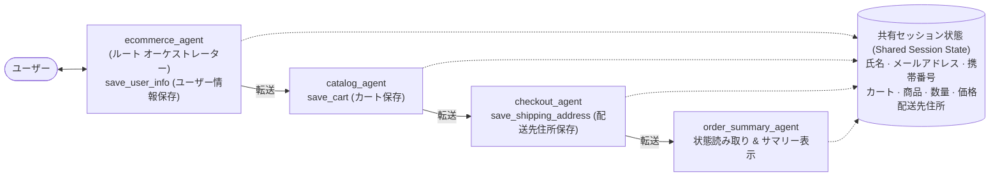

言語 / Languages: [English](README.md) | **日本語**

---

# 🛒 Agentic AI — マルチエージェント E コマース オーケストレーター

**Google ADK(Agent Development Kit)** 上に構築されたマルチエージェント型 E コマース アシスタント: ルート オーケストレーター エージェントが 3 つの専門エージェント(カタログ → チェックアウト → 注文サマリー)と連携し、ショッパーを *「新しいスマホが欲しい」* から Amazon 風の完全な注文サマリーまで導きます。すべてのワークフロー データは**共有セッション ステート**を流れます。


## デモ動画

[](https://youtu.be/3BAo1_u-L9k)

## なぜこのプロジェクトが存在するのか

専門化されたドメイン エージェントとハンドオフを備えた、固定階層型マルチエージェント アーキテクチャを実証します — オーケストレーターが委譲し、スペシャリストが実行する — 動的に生成されるエージェント ワークフローとの対比として。

<div align="center">
  
</div>

---

## ✨ 何ができるか

4 つの協調エージェントが処理する単一の会話ワークフロー:

| エージェント | 役割 | ツール |
|-------|------|-------|
| `ecommerce_agent`(ルート) | ユーザーに挨拶し、**名前 / メール / 携帯番号**を収集して共有ステートに保存し、各リクエストを必ず 1 つのサブエージェントにルーティング | `save_user_info` |
| `catalog_agent` | 商品カテゴリ & 商品一覧(スマートフォン · ノート PC · ヘッドフォン)を表示し、選択をカートに追加 | `save_cart` |
| `checkout_agent` | 配送先住所を収集して共有ステートに保存 | `save_shipping_address` |
| `order_summary_agent` | セッション ステートから**完全な注文を読み取り**、Amazon/Flipkart 風のサマリーを描画 | — (ステート読み取り) |

**主な設計判断**

- 🧭 **独り言ではなく委譲** — ルート エージェントはドメインの質問に*決して*自分で答えず、必ず 1 つのサブエージェントに転送します(`transfer_to_agent`)。
- 🔐 **ゲーティング ルール** — `save_user_info()` が実行される前にチェックアウトは不可能。ワークフローはユーザー プロファイルの取得を最初に強制します。
- 🚌 **データ バスとしてのセッション ステート** — エージェント間でチャット経由のデータ受け渡しは行いません。`tool_context.state` に書き込み、下流のエージェントは命令内のテンプレート変数(`{item}`、`{quantity}`、`{price}`、`{shipping_address}`)を読み取ります。
- 🧠 **ローカル LLM との親和性** — 4 つのエージェントすべてが **LiteLLM** 経由の OpenAI 互換エンドポイントで Ollama Cloud(`gpt-oss:120b`)上で動作します(Ollama エンドポイントのネイティブ `format: json` はツール呼び出しを壊しますが、`openai/` プロバイダーは正しく処理します)。
- 🔍 **完全な可観測性** — `adk web` で実行すると、イベントごとのトレース、エージェント転送グラフ、ライブのセッション ステートを確認できます。

## 🏗️ アーキテクチャ



## 📁 プロジェクト構成

```
Agentic-AI-Ecommerce-Orchestrator/
├── ecommerce_agent/          # ルートオーケストレーター — ユーザープロファイル、ルーティング
│   ├── agent.py
│   └── __init__.py
├── catalog_agent/            # 商品カタログ、価格管理、カート管理
│   ├── agent.py
│   └── __init__.py
├── checkout_agent/           # 配送先住所情報の収集
│   ├── agent.py
│   └── __init__.py
├── order_summary_agent/      # セッション状態からの注文サマリー生成
│   ├── agent.py
│   └── __init__.py
├── docs/
│   └── screenshots/          # ADK 開発用 UI の操作手順画面 (スクリーンショット8点)
├── userguide.html            # インタラクティブな平易な言葉によるユーザーガイド
├── requirements.txt
└── .env.example
```

## 🚀 はじめに

### 1. 前提条件

- Python **3.11+**
- `gpt-oss:120b` などのチャット モデルにアクセスできる **Ollama Cloud** API キー([ollama.com](https://ollama.com) で無料取得)— または OpenAI 互換エンドポイントを持つローカル Ollama

### 2. 仮想環境の作成

**Mac OS / Linux:**
```bash
python3 -m venv .venv
source .venv/bin/activate
```

**Windows:**
```bat
python3 -m venv .venv
.venv\Scripts\activate.bat
```

### 3. 依存関係のインストール

```bash
pip install -r requirements.txt
```

### 4. 環境変数の設定

`.env.example` を `.env` にコピーしてキーを記入します:

```bash
cp .env.example .env    # Windows: copy .env.example .env
```

| 変数 | 必須 | 用途 |
|----------|----------|---------|
| `OLLAMA_API_KEY` | ✅ | Ollama Cloud API キー(実際の値をコミットしないこと) |
| `SERPER_API_KEY` | オプション | コア ワークフローでは未使用。Web 検索拡張用に予約 |

> 🔐 **実際の `.env` をコミットしないでください** — リポジトリの `.gitignore` にすでに登録されています。

### 5. 開発 UI の起動

プロジェクト ルートから実行します(ADK が 4 つのエージェント フォルダーをすべて発見できるように):

```bash
adk web
```

**http://localhost:8000** を開き、アプリ ピッカーから **ecommerce_agent** を選択してチャットを開始します。

> 💡 `adk web` の UI にはライブ イベント、エージェント転送トレース、セッション **State** タブが表示されます — マルチエージェント ワークフローの動きを観察する最良の方法です。

## 💬 サンプル会話

```
ユーザー:   こんにちは
エージェント: こんにちは！Eコマースアシスタントです。商品カタログの閲覧、カートへの追加、お会計、ご注文の追跡をお手伝いいたします。
まずは、お名前を教えていただけますか？

ユーザー:   山田 太郎 → エージェント: 山田様、ありがとうございます。次にメールアドレスを教えていただけますか？
ユーザー:   taro.yamada@example.com → エージェント: ありがとうございます。最後に、お電話番号を教えていただけますか？
ユーザー:   09012345678
エージェント: ✔ save_user_info を実行 → 「お客様情報を保存いたしました。本日はどのようなご要件でしょうか？」

ユーザー:   新しいスマートフォンを買いたいです
エージェント: → catalog_agent へ転送 → 「スマートフォン、ノートPC、ヘッドホンの3つのカテゴリーがございます。どれをご覧になりますか？」

ユーザー:   スマートフォンをお願いします
エージェント: Pixel 9 — 70,000円 · iPhone 16 — 90,000円 · Galaxy S25 — 75,000円

ユーザー:   Pixel 9 を1台カートに追加して、チェックアウトへ進んでください
エージェント: ✔ save_cart を実行 → 「Pixel 9 を追加しました (1台 × 70,000円)。チェックアウトへご案内します。」

ユーザー:   配送先は 〒100-0005 東京都千代田区丸の内1-1-1 にしてください
エージェント: → checkout_agent → ✔ save_shipping_address を実行

ユーザー:   はい、注文のサマリーを表示してください
エージェント: → order_summary_agent → 注文品目、配送先住所、連絡先情報、および合計金額: 70,000円 を含む注文サマリーテーブルを表示
```

| | |
|:---:|:---:|
|  |  |
|  |  |
| **カート保存 + チェックアウトへの引き継ぎ** | **セッション ステート(データ バス)** |
|  |  |

> 🎬 ナレーション付きの完全ウォークスルー — 平易な言葉による "How It Works"、アーキテクチャ、シーケンス図、FAQ、手動テスト チェックリストを含む — は、ブラウザで **[userguide.html](./userguide.html)** を開いてください。

## 🧱 技術スタック

| レイヤー | ツール |
|-------|-------|
| エージェント フレームワーク | Google ADK 2.5(`LlmAgent`、サブエージェント、`transfer_to_agent`) |
| LLM | Ollama Cloud `gpt-oss:120b`(任意の OpenAI 互換エンドポイントで動作) |
| モデル ルーティング | LiteLLM(`openai/` プロバイダー) |
| ステート | ADK 共有セッション ステート(`tool_context.state`) |
| 開発ツール | `adk web` 開発 UI(イベント、トレース、ステート インスペクター) |

## 🔍 仕組み — 内部の動き

1. **ユーザー プロファイルの取得** — ルート エージェントの命令は、1 回に 1 つの質問での収集と、ルーティング前の*必須*の `save_user_info()` 呼び出しを義務付けています。
2. **インテント ルーティング** — ルート エージェントがリクエストを分類し(新規購入 → `catalog_agent`、チェックアウト → `checkout_agent`、注文追跡 → `tracking_agent` プレースホルダー)、`transfer_to_agent` で委譲します。
3. **カートの書き込み** — `save_cart()` はネストされた `cart` 辞書**に加えて**、フラット化されたトップレベル キー(`item`、`quantity`、`price`)も保存します。これにより `order_summary_agent` の命令内の `{item}` 方式のテンプレート変数が正しく解決されます。
4. **ハンドオフ** — 各サブエージェントは自身のスコープを `transfer_to_agent` 呼び出しで終了します。カタログ エージェントはスコープ外のリクエストを明示的に拒否します(注文も住所収集もしない)。
5. **サマリーの描画** — `order_summary_agent` はステートから*のみ*読み取り(捏造なし)、最終的な Amazon 風サマリーを整形します。

## ⚠️ 現在の制限

- デモ用カタログは意図的にインメモリ(3 カテゴリ、7 商品)— 実在の在庫ではない
- 注文追跡サブエージェントは命令上のプレースホルダー。未実装
- 決済処理なし。「チェックアウト」= 住所取得 + サマリー
- 単一セッションのステート — アプリ再起動後は何も保持されない

## 🧭 拡張のアイデア

- 注文状況参照付きの本物の `tracking_agent` を追加
- 架空のカタログを商品 API やベクトル検索に置き換え
- セッションを SQLite / Vertex AI Session Service に永続化
- ワークフローのリグレッション テスト用に評価セット(`adk eval`)を追加
- 同じエージェント ツリーの上に Streamlit/FastAPI フロントエンドを構築

## 📄 ライセンス

MIT — 詳細はリポジトリ ルートを参照してください。
