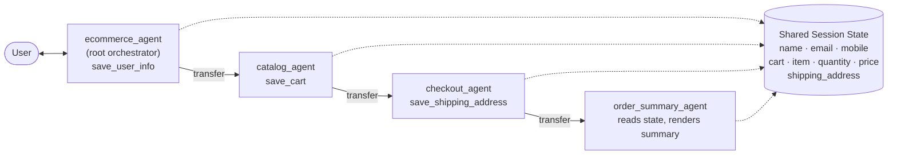
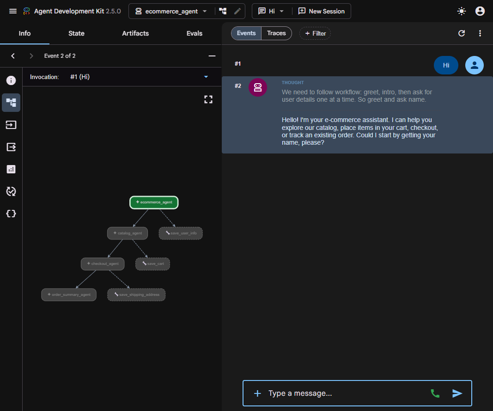
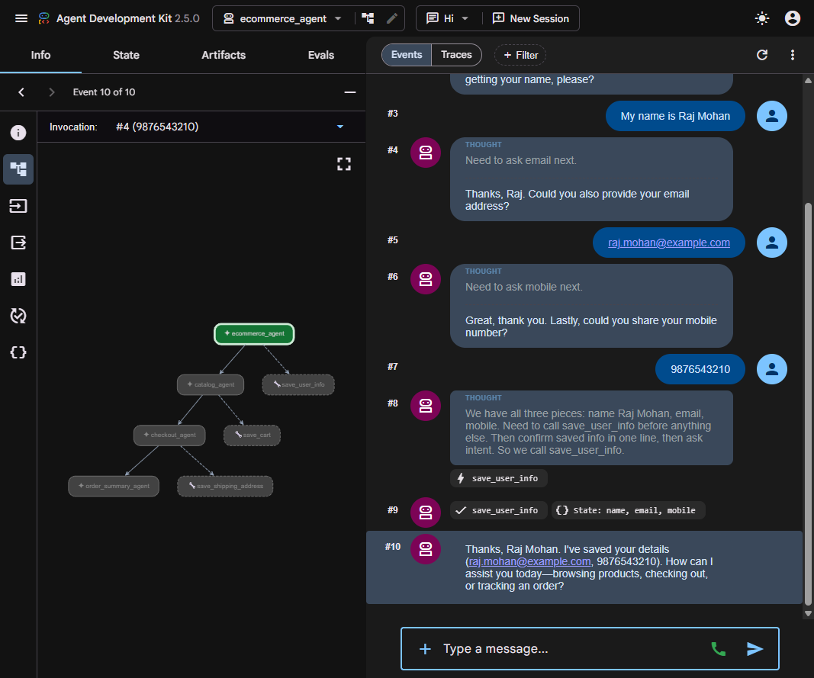
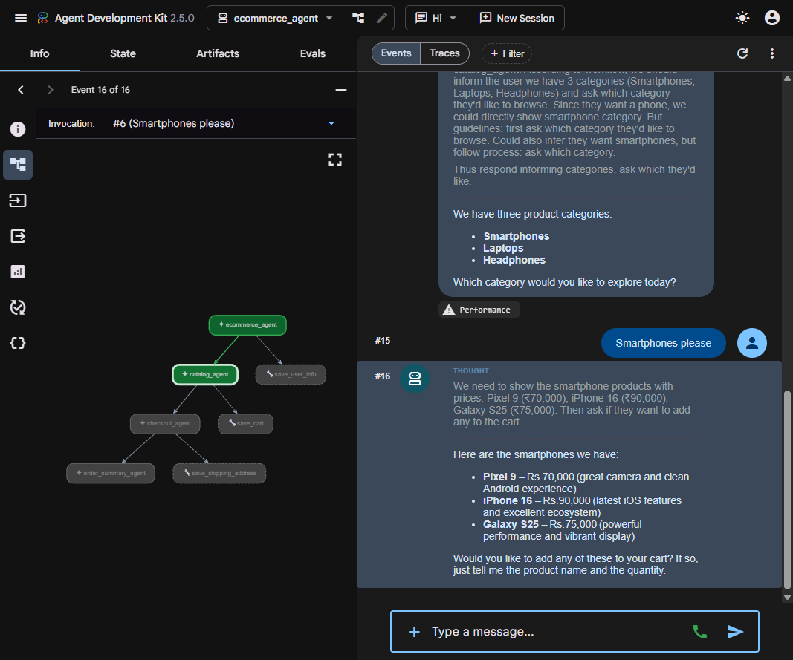
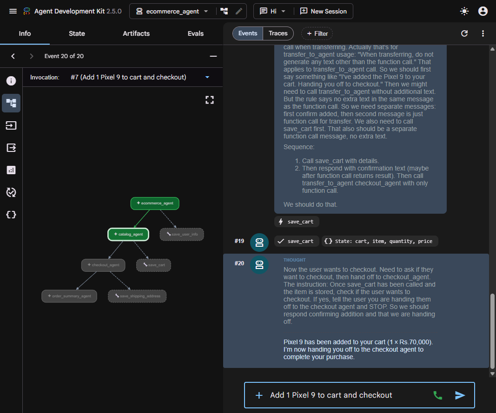
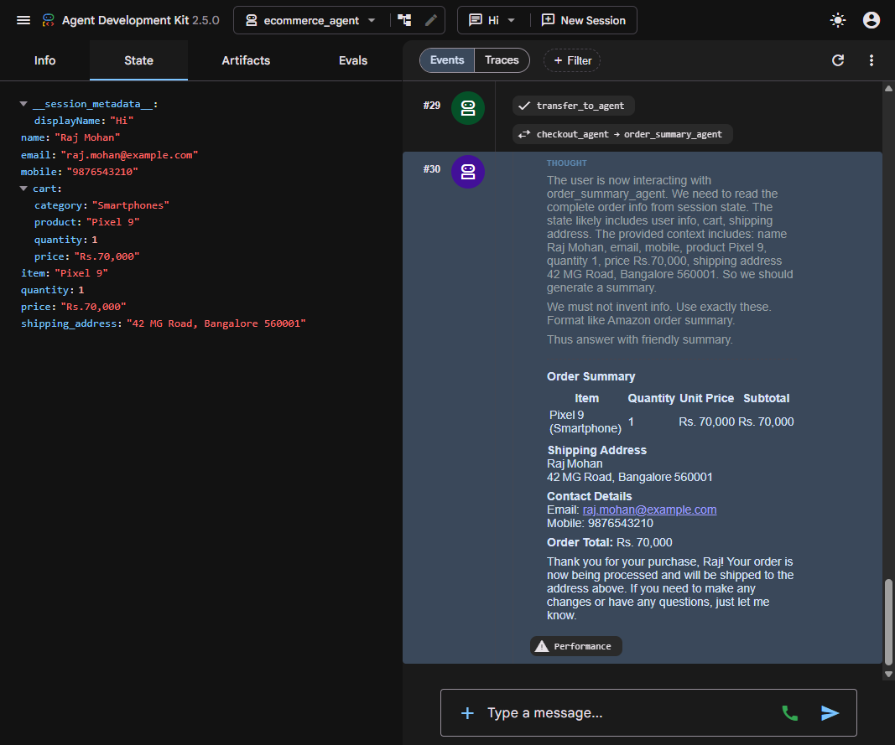

Languages: **English** | [日本語](README.ja.md)

---

# 🛒 Agentic AI — Multi-Agent E-Commerce Orchestrator

A multi-agent e-commerce assistant built on **Google ADK (Agent Development Kit)**: a root orchestrator agent collaborates with three specialist agents (catalog → checkout → order summary) to take a shopper from *"I want a new phone"* to a complete, Amazon-style order summary — with all workflow data flowing through **shared session state**.


## Demo Video

[](https://youtu.be/3BAo1_u-L9k)

## Why This Project Exists

Demonstrates a fixed hierarchical multi-agent architecture with specialized domain agents and handoffs — the orchestrator delegates, specialists execute — as a contrast to dynamically generated agent workflows.

<div align="center">
  
</div>

---

## ✨ What It Does

A single conversational workflow, handled by 4 cooperating agents:

| Agent | Role | Tools |
|-------|------|-------|
| `ecommerce_agent` (root) | Greets the user, collects **name / email / mobile**, saves them to shared state, then routes each request to exactly one sub-agent | `save_user_info` |
| `catalog_agent` | Shows product categories & items (Smartphones · Laptops · Headphones), adds selections to the cart | `save_cart` |
| `checkout_agent` | Collects the shipping address and saves it to shared state | `save_shipping_address` |
| `order_summary_agent` | Reads the **complete order from session state** and renders an Amazon/Flipkart-style summary | — (state reader) |

**Key design decisions**

- 🧭 **Delegation, not monologue** — the root agent *never* answers domain questions itself; it always transfers to exactly one sub-agent (`transfer_to_agent`).
- 🔐 **Gating rule** — checkout is impossible before `save_user_info()` has run; the workflow enforces user-profile capture first.
- 🚌 **Session state as the data bus** — agents don't pass data in chat; they write to `tool_context.state` and downstream agents read templated variables (`{item}`, `{quantity}`, `{price}`, `{shipping_address}`) from their instructions.
- 🧠 **Local-LLM friendly** — all four agents run on Ollama Cloud (`gpt-oss:120b`) via **LiteLLM** using the OpenAI-compatible endpoint (native `format: json` on the Ollama endpoint breaks tool calling; the `openai/` provider handles it correctly).
- 🔍 **Full observability** — run under `adk web` to see per-event traces, the agent-transfer graph, and live session state.

## 🏗️ Architecture



## 📁 Project Structure

```
Agentic-AI-Ecommerce-Orchestrator/
├── ecommerce_agent/          # Root orchestrator — user profile, routing
│   ├── agent.py
│   └── __init__.py
├── catalog_agent/            # Products, prices, cart management
│   ├── agent.py
│   └── __init__.py
├── checkout_agent/           # Shipping address collection
│   ├── agent.py
│   └── __init__.py
├── order_summary_agent/      # Order summary from session state
│   ├── agent.py
│   └── __init__.py
├── docs/
│   └── screenshots/          # ADK dev-UI walkthrough (8 screenshots)
├── userguide.html            # Interactive plain-language user guide
├── requirements.txt
└── .env.example
```

## 🚀 Getting Started

### 1. Prerequisites

- Python **3.11+**
- An **Ollama Cloud** API key (free at [ollama.com](https://ollama.com)) with access to a chat model such as `gpt-oss:120b` — or a local Ollama with an OpenAI-compatible endpoint

### 2. Create a virtual environment

**Mac OS / Linux:**
```bash
python3 -m venv .venv
source .venv/bin/activate
```

**Windows:**
```bat
python3 -m venv .venv
.venv\Scripts\activate.bat
```

### 3. Install dependencies

```bash
pip install -r requirements.txt
```

### 4. Configure environment variables

Copy `.env.example` to `.env` and fill in your key(s):

```bash
cp .env.example .env    # Windows: copy .env.example .env
```

| Variable | Required | Purpose |
|----------|----------|---------|
| `OLLAMA_API_KEY` | ✅ | Ollama Cloud API key (never commit the real value) |
| `SERPER_API_KEY` | Optional | Not used by the core workflow; reserved for web-search extensions |

> 🔐 **Never commit your real `.env`** — it is already listed in the repo's `.gitignore`.

### 5. Run the dev UI

From the project root (so ADK discovers all four agent folders):

```bash
adk web
```

Open **http://localhost:8000**, select **ecommerce_agent** from the app picker, and start chatting.

> 💡 The `adk web` UI shows live events, agent-transfer traces, and the session **State** tab — the best way to watch the multi-agent workflow in action.

## 💬 Sample Conversation

```
You:    Hi
Agent:  Hello! I'm your e-commerce assistant. I can help you explore our catalog,
        place items in your cart, checkout, or track an existing order.
        Could I start by getting your name, please?

You:    Raj Mohan → Agent: Thanks, Raj. Could you also provide your email address?
You:    raj.mohan@example.com → Agent: Great, thank you. Lastly, could you share your mobile number?
You:    9876543210
Agent:  ✔ save_user_info called → "I've saved your details. How can I assist you today?"

You:    I want to buy a new phone
Agent:  → transfers to catalog_agent → "We have three product categories:
        Smartphones, Laptops, Headphones. Which would you like to explore?"

You:    Smartphones please
Agent:  Pixel 9 — Rs.70,000 · iPhone 16 — Rs.90,000 · Galaxy S25 — Rs.75,000

You:    Add 1 Pixel 9 to cart and checkout
Agent:  ✔ save_cart called → "Pixel 9 added (1 × Rs.70,000). Handing you off to checkout."

You:    Ship to 42 MG Road, Bangalore 560001
Agent:  → checkout_agent → ✔ save_shipping_address called

You:    Yes, show my order summary
Agent:  → order_summary_agent → renders Order Summary table with
        item, shipping address, contact details, and Order Total: Rs. 70,000
```

| | |
|:---:|:---:|
|  |  |
|  |  |
| **Cart saved + checkout handoff** | **Session state (the data bus)** |
|  |  |

> 🎬 For the full narrated walkthrough — including the plain-language "How It Works", architecture, sequence diagram, FAQ, and a manual testing checklist — open **[userguide.html](./userguide.html)** in a browser.

## 🧱 Tech Stack

| Layer | Tools |
|-------|-------|
| Agent framework | Google ADK 2.5 (`LlmAgent`, sub-agents, `transfer_to_agent`) |
| LLM | Ollama Cloud `gpt-oss:120b` (any OpenAI-compatible endpoint works) |
| Model routing | LiteLLM (`openai/` provider) |
| State | ADK shared session state (`tool_context.state`) |
| Dev tooling | `adk web` dev UI (events, traces, state inspector) |

## 🔍 How It Works — Under the Hood

1. **User profile capture** — the root agent's instruction mandates one-question-at-a-time collection, then a *mandatory* `save_user_info()` call before any routing.
2. **Intent routing** — the root agent classifies the request (new purchase → `catalog_agent`, checkout → `checkout_agent`, order tracking → `tracking_agent` placeholder) and delegates via `transfer_to_agent`.
3. **Cart writes** — `save_cart()` stores a nested `cart` dict **plus** flattened top-level keys (`item`, `quantity`, `price`) so the `{item}`-style template variables inside `order_summary_agent`'s instruction resolve correctly.
4. **Handoffs** — each sub-agent ends its scope with a `transfer_to_agent` call; the catalog agent explicitly refuses out-of-scope requests (no ordering, no address collection).
5. **Summary rendering** — `order_summary_agent` reads *only* from state (no invention) and formats the final Amazon-style summary.

## ⚠️ Current Limitations

- Demo catalog is intentionally in-memory (3 categories, 7 products) — no real inventory
- Order tracking sub-agent is a placeholder in instructions; not yet implemented
- No payment processing; "checkout" = address capture + summary
- Single-session state — nothing persists across app restarts

## 🧭 Extension Ideas

- Add a real `tracking_agent` with order-status lookup
- Swap the fake catalog for a product API or vector search
- Persist sessions to SQLite / Vertex AI Session Service
- Add evaluation sets (`adk eval`) for regression-testing the workflow
- Streamlit/FastAPI front end on top of the same agent tree

## 📄 License

MIT — see the repo root for details.