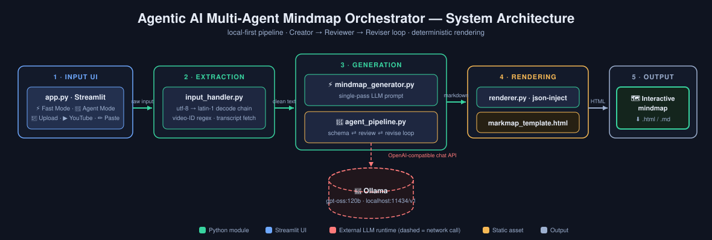

言語 / Languages: [English](README.md) | **日本語**

---

<div align="center">

# 🗺️ Agentic AI マルチエージェント マインドマップ オーケストレーター

**非構造化コンテンツを構造化されたナレッジへ変換。** テキスト ファイル、YouTube 文字起こし、貼り付けたテキストを入力すると、インタラクティブなマインドマップが出力されます。**作成者 → レビュアー → 修正者** のエージェント ワークフローが反復フィードバック ループ、LLM 出力バリデーション、決定論的な成果物生成を担います。


## デモ動画

[](https://youtu.be/MB1_OjKe114)

## なぜこのプロジェクトが存在するのか

反復的なマルチエージェント リファインメントを実証します — Creator → Reviewer → Reviser のループがフィードバック サイクルを通じて構造化ナレッジ成果物を段階的に改善します。最初の LLM 出力をそのまま受け入れるのではありません。

*Ollama で 100% ローカル実行 — クラウド API 不要、データはマシンの外に出ません。*




**[📖 インタラクティブ ユーザー ガイド](userguide.html) — 2 タブ構成: 平易な言葉による "How It Works" + 図付きの完全な技術詳細**

</div>

---

## 🎯 なぜこのプロジェクトなのか

多くの「AI マインドマップ」ツールは、願望を込めた単発の LLM 呼び出しです。このプロジェクトは**エージェンティックな代替案**を実証します: **Schema Creator** が JSON マインドマップ スキーマを提案し、**Schema Reviewer** が 6 つの明示的な品質基準(カバレッジ、バランス、簡潔さ、階層の深さ、正確性、JSON 妥当性)で採点し、**Reviser** がフィードバックを反映して反復する — スキーマが承認されるか、最大反復回数の予算を使い切るまでループします。

その結果: 一貫して整理された、決してフラットにならず、構造的に妥当なマインドマップ — すべての LLM 出力が最終成果物に触れる前にパース・検証されます。

## ✨ 何ができるか

| | |
|---|---|
| 📁 **3 つの入力モード** | `.txt`/`.md` をアップロード、YouTube URL を貼り付け(文字起こしを自動取得)、または生テキストを貼り付け |
| ⚡ **Fast Mode** | シングルパスの LLM 生成 — 1 プロンプト、1 マインドマップ、約 30〜60 秒 |
| 🤖 **Agent Mode** | Creator → Reviewer → Reviser のレビュー ループ。ライブ進捗ストリーミング付き |
| ✅ **出力バリデーション** | コードフェンスの除去 + JSON パース。最大反復時は穏やかに縮退 |
| 🗺️ **インタラクティブ マインドマップ** | markmap.js による折りたたみ可能な SVG — ノード説明からのホバー ツールチップ |
| 📝 **ライブ編集** | アプリ内で Markdown を編集。マインドマップが即座に再描画 |
| ⬇️ **ポータブル エクスポート** | スタンドアロン HTML(オフラインの任意のブラウザで動作)または生の Markdown をダウンロード |
| 🔒 **ローカル ファースト** | すべて Ollama 経由でマシン上で実行。何もアップロードされません |

## 🤖 マルチエージェント ワークフロー

sequenceDiagram
    participant P as run_agent_pipeline()
    participant C as エージェント 1 · スキーマ作成 (Schema Creator)
    participant V as エージェント 2 · スキーマレビュー (Schema Reviewer)
    participant M as エージェント 3 · マインドマップ作成 (Mindmap Creator)
    participant O as Ollama LLM

    P->>C: 元テキスト (source text)
    C->>O: スキーマ作成リクエスト (JSON)
    O-->>C: スキーマ v1
    loop 承認されるか、または最大反復回数 (デフォルト3回) に達するまで繰り返し
        P->>V: スキーマ + 元テキスト
        V->>O: 6つの基準で評価・採点
        O-->>V: "承認ステータス, フィードバック"
        alt 未承認の場合 (not approved)
            V-->>P: フィードバック返却
            P->>C: フィードバックを反映して修正指示
            C->>O: 修正版スキーマ作成 (JSON)
            O-->>C: スキーマ v(n+1)
        end
    end
    V-->>P: 承認完了 (approved)
    P->>M: 承認済みスキーマ渡す
    Note over M: schema_to_markdown()<br/>決定論的処理 · LLM呼び出しなし
    M-->>P: # ## ### マークダウン出力
    P-->>P: 実行結果辞書 (result dict) を返却

> 💡 **設計ノート:** エージェント 3 は意図的に LLM 呼び出しでは*ありません*。承認済み JSON スキーマから Markdown への変換は純 Python 関数(`schema_to_markdown()`)が行います — 決定論的、即時、しかも LLM の書き換えで起こりうる内容の欠落・変異を免れます。

## 🚀 クイックスタート

### 前提条件
- **Python 3.10+**
- **[Ollama](https://ollama.com/)** がローカルにインストール・起動済み

```bash
# 1. Pull a model (one-time, few GB)
ollama pull gpt-oss:120b

# 2. Clone and set up
git clone https://github.com/git4rajmohan/AI_Projects.git
cd AI_Projects/agentic-ai-mindmap-orchestrator

python -m venv venv
venv\Scripts\activate        # Windows  (macOS/Linux: source venv/bin/activate)
pip install -r requirements.txt

# 3. (Optional) configure via .env
copy .env.example .env       # Windows  (macOS/Linux: cp .env.example .env)

# 4. Run
streamlit run app.py
```

アプリは `http://localhost:8501` で開きます — Ollama に到達できるとサイドバーに ✅ が表示されます。

## 📖 使い方

1. **モードを選択** — ⚡ Fast Mode(シングルパス)または 🤖 Agent Mode(レビュー ループ)
2. **入力を提供** — ファイルをアップロード、YouTube URL を貼り付け、またはテキストを貼り付け
3. **生成** — 🚀 Generate Mindmap / 🤖 Run Agent Pipeline をクリック
4. **調整 & エクスポート** — Markdown をライブ編集し、スタンドアロン HTML または Markdown をダウンロード

**モード選択ガイド:**

| 状況 | 推奨 | 理由 |
|---|---|---|
| 短い記事、メモ、手早い要約 | ⚡ Fast Mode | 1 パスで十分。1 分以内に結果 |
| 長い文字起こし、密度の高いレポート | 🤖 Agent Mode | レビュー ループが散らかった内容をバランスの取れたブランチへ再構成 |
| 出力を共有 / 発表する場合 | 🤖 Agent Mode | 高品質な構造は追加の数分に見合う価値があります |

Agent Mode では**最大レビュー反復回数**(1〜5、デフォルト 3)を調整できます。**Pipeline Summary** エクスパンダーには最終スキーマ、反復回数、完全なレビュー フィードバック履歴が表示されます。

## 📁 プロジェクト構成

```
agentic-ai-mindmap-orchestrator/
├── app.py                     # Streamlit エントリーポイント — タブUI、入力フォーム、ダウンロード制御
├── src/
│   ├── input_handler.py       # ファイルデコード処理 · YouTube ID 正規表現抽出 · 字幕データ取得
│   ├── mindmap_generator.py   # 高速モード — 1パス LLM 呼び出し → マークダウン変換
│   ├── agent_pipeline.py      # エージェントモード — 作成/レビュー/修正のループ処理
│   └── renderer.py            # マークダウン → スタンドアロン markmap HTML 変換
├── templates/
│   └── markmap_template.html  # markmap.js CDN と {{MARKDOWN_JSON}} 挿入枠を持つ HTML 骨格
├── docs/
│   └── architecture.svg       # システムアーキテクチャ図
├── images/                    # README 用のスクリーンショット画像
├── userguide.html             # インタラクティブな2タブ構成のユーザーガイド (単一ファイル完結型)
├── requirements.txt
├── .env.example               # 環境変数テンプレート — シークレット情報なし (コミット可能)
└── README.md
```

## 🛠️ 技術スタック

| レイヤー | 技術 | 用途 |
|---|---|---|
| UI | Streamlit | タブ、アップロード、ライブ進捗ストリーミング、ダウンロード |
| LLM ランタイム | Ollama(ローカル) | OpenAI 互換 `/v1` API 経由のオープンウェイト モデル |
| LLM クライアント | `openai` SDK | `base_url` をローカル Ollama に指定。ダミー API キー |
| 文字起こし | `youtube-transcript-api` | キャプション取得 + プレーンテキスト整形 |
| 可視化 | markmap.js(CDN) | クライアント側で Markdown → 折りたたみ可能なインタラクティブ SVG |
| 設定 | `python-dotenv` | `OLLAMA_BASE_URL` / `OLLAMA_MODEL` 用の `.env` |

## 🔑 実装の重要ポイント

- **OpenAI-SDK ↔ Ollama ブリッジ** — `openai` クライアントは Ollama の OpenAI 互換エンドポイントに対して透過的に動作します。アダプター コード不要。
- **LLM 出力のハードニング** — 両生成パスとも `json.loads()` の前に Markdown コードフェンスを除去します。「生の JSON のみを出力せよ」と指示しても、モデルが構造化出力をフェンスで包むことがあるためです。構造的安定性のため温度は低め(0.2〜0.3)に保たれています。
- **6 つのレビュー基準** — Reviewer は カバレッジ、バランス、簡潔さ(1 ノード ≤8 語)、階層の深さ(3〜4 レベル、フラット禁止、5+ も禁止)、ソースに対する正確性、JSON 妥当性を採点します。
- **HTML コメントによるホバー ツールチップ** — ノード説明は Markdown 内の末尾 `<!-- ... -->` コメントとして運ばれ、markmap がツールチップとして描画します。追加依存ゼロ。
- **穏やかな縮退** — Reviewer が反復予算内で承認しない場合、パイプラインはエラーではなく最終スキーマで続行します(UI では ⚠️ 付きで表示)。
- **スタンドアロン エクスポート** — テンプレートは markmap JS と Markdown JSON を 1 つの HTML ファイルにインライン化します。ダウンロード物はポータブルでオフライン開示可能な成果物です。

## 🔒 セキュリティ

- **リポジトリに認証情報なし** — `.env` は gitignore 済み。`.env.example` はシークレットを含まない安全なテンプレートです。
- **クラウド呼び出しなし** — Ollama は `localhost` で動作。テキストがマシンの外に出ることはありません。
- **YouTube 文字起こし** — 読み取り専用、公開キャプションのみ、何も保存しません。

## 🩺 トラブルシューティング

| 問題 | 修正 |
|---|---|
| "❌ Ollama is not reachable" | `ollama serve` を実行し、ページを更新 |
| "Could not fetch transcript" | 動画のキャプションが無効の可能性 — 別の動画を試すかテキストを貼り付け |
| マインドマップが浅い/散らかっている | Agent Mode に切り替える、またはより大きなモデルを使う |
| 生成が遅い | より小さく速いモデル(例: `gpt-oss:20b`)を使う、または入力を短くする |

---

<div align="center">

**[AI_Projects](https://github.com/git4rajmohan/AI_Projects) コレクションの一部**

</div>
