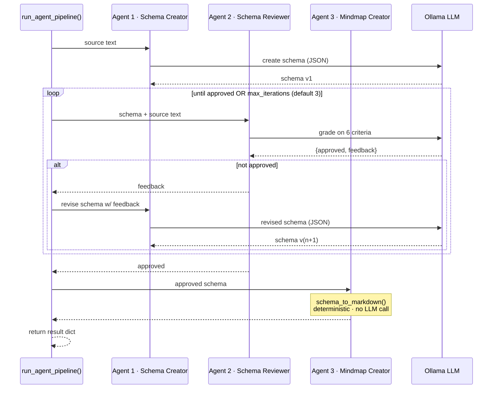

Languages: **English** | [日本語](README.ja.md)

---

<div align="center">

# 🗺️ Agentic AI Multi-Agent Mindmap Orchestrator

**Transform unstructured content into structured knowledge.** Text files, YouTube transcripts, or pasted text go in — an interactive mindmap comes out, produced by a collaborative **Creator → Reviewer → Reviser** agent workflow with iterative feedback loops, LLM output validation, and deterministic artifact generation.

## Why This Project Exists

Demonstrates iterative multi-agent refinement — a Creator → Reviewer → Reviser loop with feedback cycles that progressively improves a structured knowledge artifact rather than accepting the first LLM output.

*Runs 100% locally with Ollama — no cloud APIs, no data leaving your machine.*


**[📖 Interactive User Guide](userguide.html) — 2 tabs: plain-language "How It Works" + full technical deep-dive with diagrams**

</div>

---

## 🎯 Why This Project

Most "AI mindmap" tools are a single LLM call with a hope and a prayer. This project demonstrates the **agentic alternative**: a structured multi-agent pipeline where a **Schema Creator** proposes a JSON mindmap schema, a **Schema Reviewer** grades it against six explicit quality criteria (coverage, balance, conciseness, hierarchy depth, accuracy, JSON validity), and a **Reviser** iterates on the feedback — looping until the schema is approved or a max-iteration budget is exhausted.

The result: mindmaps that are consistently well-organized, never flat, and structurally valid — with every LLM output parsed and validated before it touches the final artifact.

## ✨ What It Does

| | |
|---|---|
| 📁 **Three input modes** | Upload `.txt`/`.md`, paste a YouTube URL (transcript auto-fetched), or paste raw text |
| ⚡ **Fast Mode** | Single-pass LLM generation — one prompt, one mindmap, ~30–60s |
| 🤖 **Agent Mode** | Creator → Reviewer → Reviser review loop with live progress streaming |
| ✅ **Output validation** | Code-fence stripping + JSON parsing with graceful degradation on max iterations |
| 🗺️ **Interactive mindmap** | Collapsible SVG via markmap.js — hover tooltips from node descriptions |
| 📝 **Live editing** | Edit the Markdown in-app; the mindmap re-renders instantly |
| ⬇️ **Portable export** | Download standalone HTML (works offline in any browser) or raw Markdown |
| 🔒 **Local-first** | Everything runs on your machine via Ollama. Nothing is uploaded anywhere |

## 🤖 The Multi-Agent Workflow



> 💡 **Design note:** Agent 3 is deliberately *not* an LLM call. Converting the approved JSON schema to Markdown is done by a pure-Python function (`schema_to_markdown()`) — deterministic, instant, and immune to the dropped/mutated content an LLM rewrite could introduce.

## 🚀 Quick Start

### Prerequisites
- **Python 3.10+**
- **[Ollama](https://ollama.com/)** installed and running locally

```bash
# 1. Pull a model (one-time, few GB)
ollama pull gpt-oss:120b

# 2. Clone and set up
git clone https://github.com/git4rajmohan/AI_Projects.git
cd AI_Projects/agentic-ai-mindmap-orchestrator

python -m venv venv
venv\Scripts\activate        # Windows  (macOS/Linux: source venv/bin/activate)
pip install -r requirements.txt

# 3. (Optional) configure via .env
copy .env.example .env       # Windows  (macOS/Linux: cp .env.example .env)

# 4. Run
streamlit run app.py
```

The app opens at `http://localhost:8501` — the sidebar shows ✅ when Ollama is reachable.

## 📖 Usage

1. **Pick a mode** — ⚡ Fast Mode (single-pass) or 🤖 Agent Mode (review loop)
2. **Provide input** — upload a file, paste a YouTube URL, or paste text
3. **Generate** — click 🚀 Generate Mindmap / 🤖 Run Agent Pipeline
4. **Refine & export** — edit Markdown live, then download standalone HTML or Markdown

**Mode selection guide:**

| Situation | Recommended | Why |
|---|---|---|
| Short article, notes, quick summary | ⚡ Fast Mode | One pass is plenty; result in under a minute |
| Long transcript, dense report | 🤖 Agent Mode | Review loop reorganizes messy content into balanced branches |
| Output will be shared / presented | 🤖 Agent Mode | Higher quality structure is worth the extra minutes |

In Agent Mode you can tune **Max review iterations** (1–5, default 3). The **Pipeline Summary** expander shows the final schema, iteration count, and full review feedback history.

## 📁 Project Structure

```
agentic-ai-mindmap-orchestrator/
├── app.py                     # Streamlit entry point — tabs, inputs, downloads
├── src/
│   ├── input_handler.py       # File decode chain · YouTube ID regex · transcript fetch
│   ├── mindmap_generator.py   # Fast Mode — single-pass LLM call → Markdown
│   ├── agent_pipeline.py      # Agent Mode — Creator/Reviewer/Reviser review loop
│   └── renderer.py            # Markdown → standalone markmap HTML
├── templates/
│   └── markmap_template.html  # HTML skeleton with markmap.js CDN + {{MARKDOWN_JSON}} slot
├── docs/
│   └── architecture.svg       # System architecture diagram
├── images/                    # Screenshots for README
├── userguide.html             # Interactive 2-tab user guide (self-contained)
├── requirements.txt
├── .env.example               # Template — safe to commit, no secrets
└── README.md
```

## 🛠️ Tech Stack

| Layer | Technology | Purpose |
|---|---|---|
| UI | Streamlit | Tabs, uploads, live progress streaming, downloads |
| LLM runtime | Ollama (local) | Open-weight models via OpenAI-compatible `/v1` API |
| LLM client | `openai` SDK | `base_url` pointed at local Ollama; dummy API key |
| Transcripts | `youtube-transcript-api` | Caption fetch + plain-text formatting |
| Visualization | markmap.js (CDN) | Client-side Markdown → collapsible interactive SVG |
| Config | `python-dotenv` | `.env` for `OLLAMA_BASE_URL` / `OLLAMA_MODEL` |

## 🔑 Key Implementation Details

- **OpenAI-SDK ↔ Ollama bridge** — the `openai` client works transparently against Ollama's OpenAI-compatible endpoint; no adapter code needed.
- **LLM output hardening** — both generation paths strip markdown code fences before `json.loads()`, since models occasionally wrap structured output in fences despite "output only raw JSON" instructions. Temperature is kept low (0.2–0.3) for structural stability.
- **Six review criteria** — the Reviewer grades coverage, balance, conciseness (≤8 words/node), hierarchy depth (3–4 levels, never flat, never 5+), accuracy vs source, and JSON validity.
- **Hover tooltips via HTML comments** — node descriptions travel as trailing `<!-- ... -->` comments in the Markdown; markmap renders them as tooltips. Zero extra dependencies.
- **Graceful degradation** — if the Reviewer never approves within the iteration budget, the pipeline proceeds with the last schema (flagged ⚠️ in the UI) rather than erroring out.
- **Standalone export** — the template inlines markmap JS + the Markdown JSON into one HTML file; the download is a portable, offline-openable artifact.

## 🔒 Security

- **No credentials in the repo** — `.env` is gitignored; `.env.example` is a safe template with no secrets.
- **No cloud calls** — Ollama runs on `localhost`; your text never leaves your machine.
- **YouTube transcripts** — fetched read-only, public captions only, nothing stored.

## 🩺 Troubleshooting

| Problem | Fix |
|---|---|
| "❌ Ollama is not reachable" | Run `ollama serve`, then refresh the page |
| "Could not fetch transcript" | Video likely has captions disabled — try another video or paste text |
| Mindmap too shallow/messy | Switch to Agent Mode, or use a larger model |
| Generation slow | Use a smaller/faster model (e.g. `gpt-oss:20b`), or shorten input |

---

<div align="center">

**Part of the [AI_Projects](https://github.com/git4rajmohan/AI_Projects) collection**

</div>