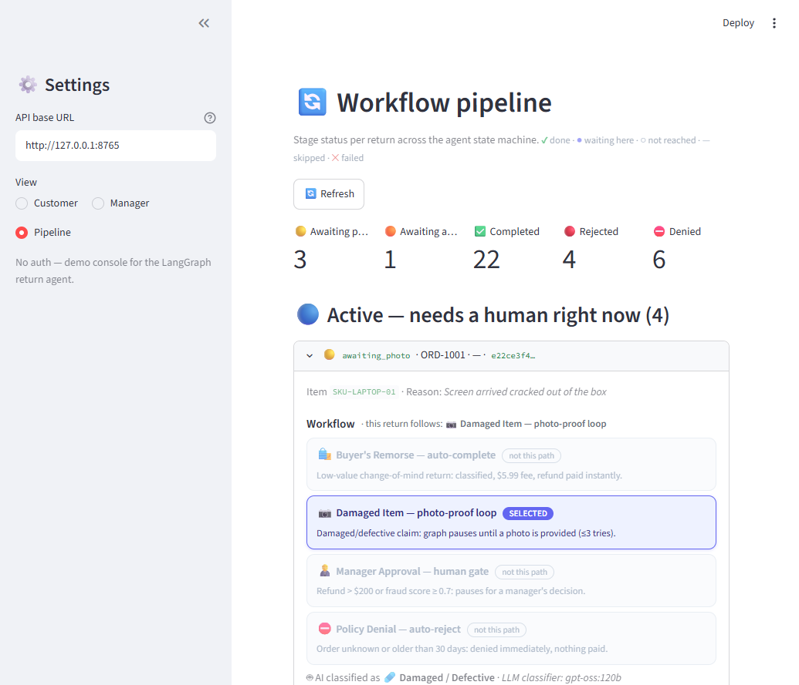

Languages: **English** | [日本語](README.ja.md)

---

# 🔁 Automated Order Returns & Fraud Prevention Agent


LangGraph + FastAPI service for e-commerce return/refund workflows, with a
cyclical photo-proof loop, deterministic fraud heuristics, an Ollama Cloud LLM
return-reason classifier, and SQLite-checkpointed **human-in-the-loop**
manager approval gates for high-value refunds (`interrupt()`-based, per
`INSTRUCTIONS.md`).

## Why This Project Exists

Demonstrates a stateful business-process agent where AI interprets the request but deterministic code makes the policy and refund decisions — with human approval gates and checkpointing for high-risk cases.

**Highlights**

- 🧠 4-path return workflow (auto-complete, photo-proof loop, manager approval, policy denial) driven by a single `StateGraph`
- 🤖 LLM return-reason classifier (Ollama Cloud `gpt-oss:120b`) with deterministic keyword fallback — never breaks if the model is unreachable
- 🚦 Deterministic fraud scoring (return velocity, no-photo-after-retries, high refund amount) gating a native `interrupt()` manager-approval step
- 🗄️ SQLite checkpointing — every run is durable and resumable across server restarts, mid-interrupt included
- 🖥️ Streamlit console with **Customer**, **Manager**, and **Pipeline** (workflow-stage dashboard) views
- 🧪 149 pytest tests (unit + FastAPI integration; live-LLM tests behind a marker)

> 📄 **In-depth design docs:** [`docs/plan.md`](./docs/plan.md) (phased build plan) ·
> [`docs/uiplan.md`](./docs/uiplan.md) (UI design) ·
> [`docs/howtotest.md`](./docs/howtotest.md) (full test walkthrough)

| Customer — track a return | Workflow pipeline dashboard |
|:---:|:---:|
|  |  |
| **Manager console — approvals & fraud breakdown** | **API reference (FastAPI / Swagger)** |
|  |  |

## Architecture

```
POST /returns ──► validate_policy ──► classify_condition (LLM) ──► check_photo_proof
                                                                        │  (loop on resume)
                                                                        ▼
                                          calculate_fee ◄───────────────┘
                                                │
                                                ▼
                                          fraud_check ──► (high value / fraud?) ──► human_gate
                                                                                            │ resume
                                                     completed ◄── finalize_refund ◄────────┤
                                                     rejected  ◄── reject_by_manager ◄──────┘
```

- **State machine:** `app/graph.py` — `StateGraph(ReturnState)` with conditional
  edges, a bounded photo-proof loop, and two native `interrupt()` gates
  (`check_photo_proof`, `human_gate`).
- **Persistence:** `langgraph-checkpoint-sqlite` `SqliteSaver` writing to
  `checkpoints.sqlite` — every run is durable and resumable across server
  restarts (mid-interrupt included).
- **LLM classifier:** `app/llm.py` — `langchain-ollama.ChatOllama` pointed at
  Ollama Cloud (`gpt-oss:120b`), classifying free-text reasons into
  `damaged_defective` / `buyer_remorse`. Any LLM failure silently falls back to
  a deterministic keyword classifier, so the service never breaks because of
  the model.
- **Business rules:** `app/services.py` — mock order DB, 30-day window check,
  shipping fees (damaged = $0.00, buyer's remorse = $5.99), fraud score
  heuristics, mock payment gateway.

## Business Rules

| Rule | Behavior |
| --- | --- |
| Return window | Order older than 30 days → `denied_policy` |
| Shipping fee | damaged/defective = **$0.00**; buyer's remorse = **$5.99** |
| Refund amount | `item_value - shipping_fee` |
| Fraud score | `+0.4` customer velocity (≥3 returns/30d) · `+0.4` damaged claim w/o photo after retries exhausted · `+0.3` refund > $500 |
| Human gate | refund **> $200.00** OR fraud score **≥ 0.7** → manager approval |
| Photo loop | Damaged/defective claim w/o photo → pause + request photo; bounded by `MAX_PHOTO_RETRIES` (3); on exhaustion the run proceeds and the fraud check flags it (`no_photo_proof`) |

## Setup

Requires **Python 3.11+**.

```powershell
# from this project's root folder
python -m venv .venv
.\.venv\Scripts\Activate.ps1          # Windows PowerShell
pip install -r requirements.txt

# configure
copy .env.example .env   # then edit values
```

`.env` keys (see `.env.example`):

| Key | Purpose | Default |
| --- | --- | --- |
| `OLLAMA_API_KEY` | Ollama Cloud key (from ollama.com/settings/keys) | *(empty → keyword fallback classifier)* |
| `OLLAMA_MODEL` | Chat model | `gpt-oss:120b` |
| `OLLAMA_BASE_URL` | Ollama endpoint | `https://ollama.com` |
| `SQLITE_DB_PATH` | Checkpoint DB file | `./checkpoints.sqlite` |
| `HIGH_VALUE_THRESHOLD` | Refund above which manager approval is required | `200.00` |
| `FRAUD_SCORE_THRESHOLD` | Fraud score above which manager approval is required | `0.7` |
| `MAX_PHOTO_RETRIES` | Photo-proof loop bound | `3` |

> The service runs with an empty `OLLAMA_API_KEY` — classification simply uses
> the keyword fallback instead of the LLM.

## Run

```powershell
.venv\Scripts\python.exe -m uvicorn app.main:app --reload
```

Interactive API docs: <http://127.0.0.1:8000/docs>.

> **Port note (Windows):** port 8000 is often occupied by an unrelated local
> service that answers on `/api/*` routes. Smoke-test on another port, e.g.:
> `.venv\Scripts\python.exe -m uvicorn app.main:app --reload --port 8765`

## Running the UI (Streamlit)

A Streamlit console drives the backend end-to-end — a **Customer** view
(start/track returns, photo resubmit) and a **Manager** view (pending
approvals queue + all-returns table). No auth, manual refresh buttons.

```powershell
# terminal 1 — backend (use 8765 to dodge the Windows port-8000 conflict)
.venv\Scripts\python.exe -m uvicorn app.main:app --reload --port 8765

# terminal 2 — UI
.venv\Scripts\python.exe -m streamlit run streamlit_app.py
```

The UI defaults to `http://127.0.0.1:8765`; change it in the sidebar if your
backend runs elsewhere.

### UI walkthrough (demo flows)

1. **Buyer's remorse (auto-complete):** Customer → *Start a new return* →
   pick `ORD-1002` (Wireless Headphones, $129.50) → reason "Changed my mind" →
   **Submit** → status `completed` immediately (refund $123.51, $5.99 fee).
2. **Photo loop:** pick `ORD-1002` again with reason "Headphones arrived
   broken", no photo → status `awaiting_photo` → Track section → tick
   *I have a photo*, enter a URL → **Submit photo** → `completed` (fee $0.00).
3. **Manager approval:** pick `ORD-1001` (Ultrabook, $899) with any reason →
   `awaiting_approval` → switch sidebar to **Manager** → the return appears in
   *Pending approvals* (refund $893.01, fraud score 0.7) → add a note →
   **Approve** → `completed` (or **Reject** → `rejected`).
4. **Policy denial:** pick `ORD-1003` (Mechanical Keyboard, 45 days old) →
   `denied_policy` shown immediately.

## Example Flows (curl)

### 1. Happy path — buyer's remorse, low value (auto-completes)

```powershell
curl -X POST http://127.0.0.1:8000/returns -H "Content-Type: application/json" -d '{
  "order_id": "ORD-1002", "item_id": "SKU-HEADPHN-02",
  "reason_text": "I changed my mind, the headphones are too heavy"
}'
# → {"thread_id":"<uuid>","status":"completed","message":"Return completed — refund processed successfully.",
#    "next_action":"none","refund_amount":123.51,"shipping_fee":5.99,"fraud_score":0.0,"fraud_flags":[]}
```

### 2. Photo-proof loop — damaged item, no photo

```powershell
curl -X POST http://127.0.0.1:8000/returns -H "Content-Type: application/json" -d '{
  "order_id": "ORD-1002", "item_id": "SKU-HEADPHN-02",
  "reason_text": "left earcup is broken"
}'
# → {"status":"awaiting_photo","next_action":"submit_photo", ...}

curl -X POST http://127.0.0.1:8000/returns/<thread_id>/photo -H "Content-Type: application/json" -d '{
  "photo_provided": true, "photo_url": "https://example.com/proof.jpg"
}'
# → {"status":"completed","refund_amount":129.50,"shipping_fee":0.00, ...}
```

Submitting `{"photo_provided": false}` re-pauses the loop (max
`MAX_PHOTO_RETRIES`); on exhaustion the run proceeds and the fraud check adds
the `no_photo_proof` flag (+0.4), which routes the run to the manager gate.

### 3. Manager approval loop — high value / fraud

```powershell
curl -X POST http://127.0.0.1:8000/returns -H "Content-Type: application/json" -d '{
  "order_id": "ORD-1001", "item_id": "SKU-LAPTOP-01",
  "reason_text": "screen arrived cracked"
}'
# refund 899.00 > 200 → {"status":"awaiting_approval","next_action":"await_manager",
#                        "refund_amount":893.01,"fraud_score":...,"fraud_flags":[...]}

curl -X POST http://127.0.0.1:8000/returns/<thread_id>/approve -H "Content-Type: application/json" -d '{
  "manager_note": "Verified damage photo, approved."
}'
# → {"status":"completed","manager_note":"Verified damage photo, approved.", ...}

# or reject instead:
curl -X POST http://127.0.0.1:8000/returns/<thread_id>/reject -H "Content-Type: application/json" -d '{}'
# → {"status":"rejected", ...}
```

### 4. Policy denial — order outside 30-day window

```powershell
curl -X POST http://127.0.0.1:8000/returns -H "Content-Type: application/json" -d '{
  "order_id": "ORD-1003", "item_id": "SKU-KEYBOARD-03", "reason_text": "stopped working"
}'
# → {"status":"denied_policy","message":"Return denied by policy: ...","next_action":"none"}
```

### 5. Inspect a run

```powershell
curl http://127.0.0.1:8000/returns/<thread_id>
# 404 when the thread_id is unknown.
```

## Error Semantics

| Code | Meaning |
| --- | --- |
| `404` | Unknown `thread_id` (never checkpointed) |
| `409` | Resuming a thread that is not paused, or paused at the *wrong* gate (e.g. `/photo` on a manager-gate thread) |
| `422` | Request body failed validation |

## Tests

```powershell
.venv\Scripts\python.exe -m pytest -v              # full suite (142+ tests; live-LLM tests deselected)
.venv\Scripts\python.exe -m pytest -m integration  # 2 live Ollama Cloud tests (requires OLLAMA_API_KEY in .env)
```

Test files mirror the phases in `plan.md`: `test_schemas.py`,
`test_services.py`, `test_graph.py` (state transitions, interrupts, loops,
cross-instance SQLite persistence), `test_llm.py` (parser/fallback units +
live integration), `test_api.py` (FastAPI integration incl. restart
equivalence).

## Endpoint Summary

| Method | Path | Purpose |
| --- | --- | --- |
| `POST` | `/returns` | Start a return workflow (returns a new `thread_id`) |
| `GET` | `/returns` | List all returns, optionally filtered by `?status=` |
| `POST` | `/returns/{thread_id}/photo` | Resume the photo-proof interrupt |
| `POST` | `/returns/{thread_id}/approve` | Approve at the manager gate |
| `POST` | `/returns/{thread_id}/reject` | Reject at the manager gate |
| `GET` | `/returns/{thread_id}` | Inspect current checkpointed state |
| `GET` | `/orders` | List mock orders (used to populate the UI's order picker) |

## Mock Data (for trying the flows)

| Order | Value | Order date | Notes |
| --- | --- | --- | --- |
| `ORD-1001` | $899.00 | 5 days ago | fresh + high value → triggers approval gate; customer `CUST-A` also has return velocity |
| `ORD-1002` | $129.50 | 10 days ago | fresh + low value → auto-completes |
| `ORD-1003` | $79.99 | 45 days ago | outside window → `denied_policy` |
| `ORD-1004` | $349.00 | 25 days ago | fresh + high value |
| `ORD-1005` | $45.00 | 60 days ago | outside window, low value |
| `ORD-1006` | $15.00 | 2 days ago | very fresh, low value |

Customers: `CUST-A` has 3 returns in the trailing 30 days (velocity fraud flag),
`CUST-B`/`CUST-C`/`CUST-D` do not trigger it.
