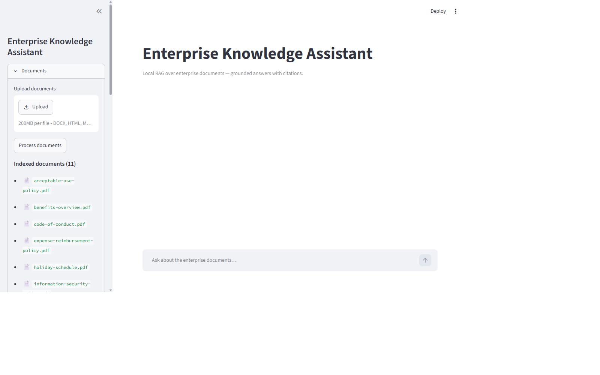
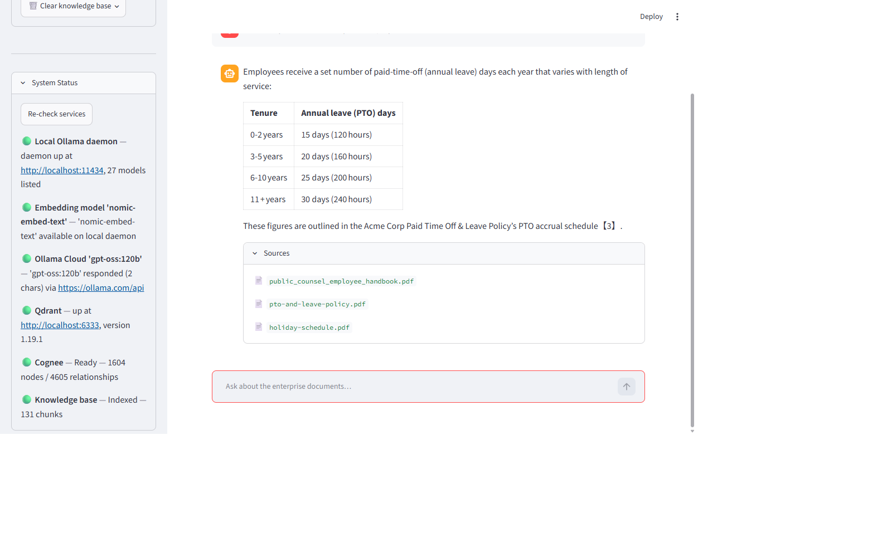
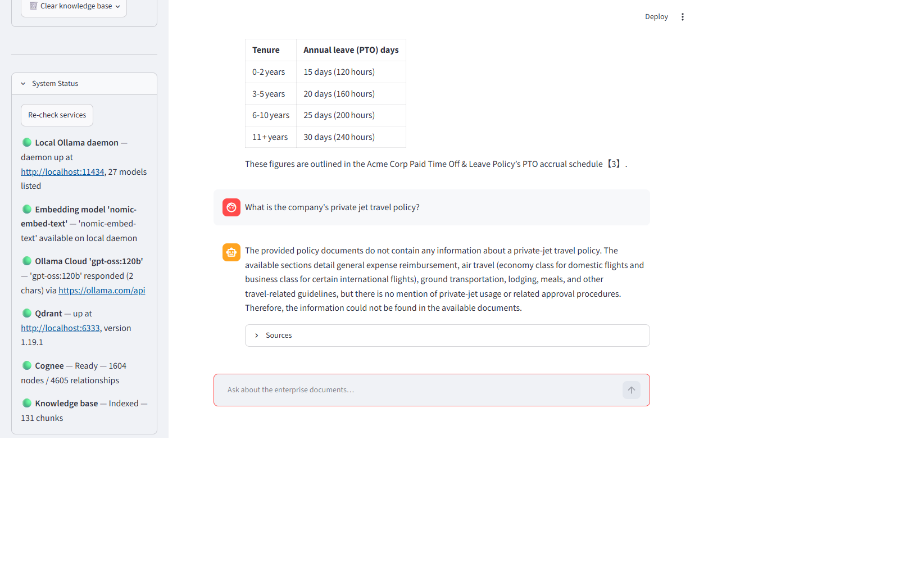
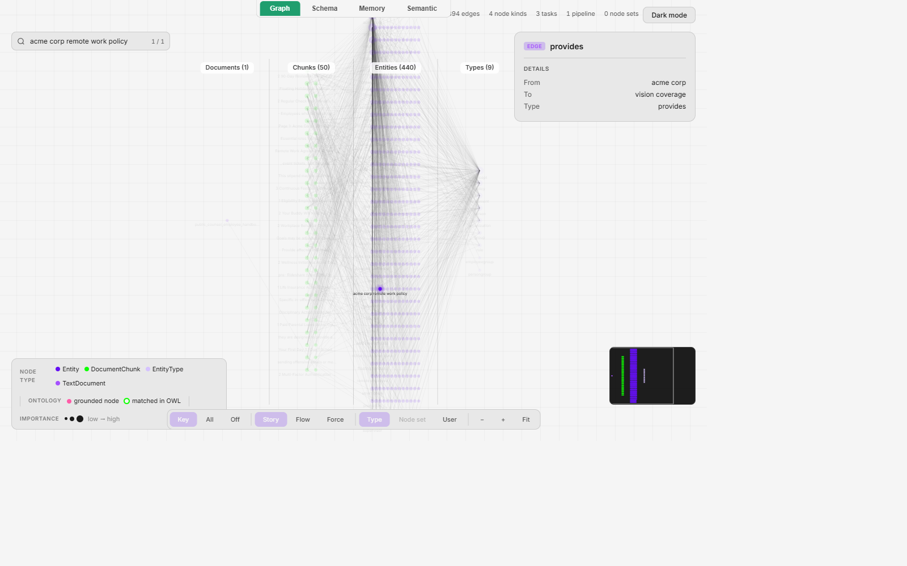

Languages: **English** | [日本語](README.ja.md)

---

# Enterprise Knowledge Assistant — Hybrid Graph RAG

> A fully local RAG chatbot over 11 enterprise HR/policy PDFs. A hybrid retriever fuses semantic vector search, BM25 keyword search and knowledge-graph relationships; a calibrated **evidence gate** refuses to answer *before the LLM is ever called* when the documents don't support the question; every claim carries real filenames.


## Demo Video

[](https://youtu.be/xhG9u-uPp8Y)

## Why This Project Exists

Demonstrates hybrid vector + lexical + graph retrieval where grounding isn't a prompt instruction — it's a mechanical gate: a hallucinated answer is impossible by construction, not by hoping the prompt behaves.

## What This Project Demonstrates

- Three-leg hybrid retrieval — semantic vector search, BM25 keyword search, knowledge-graph triplets — fused with Reciprocal Rank Fusion (rank-only math)
- A data-calibrated **evidence gate** (best cosine ≥ 0.55) that refuses *before any LLM call* on thin evidence
- Knowledge-graph ingestion via Cognee: 1,604 nodes / 4,605 relationships from an 11-PDF enterprise corpus
- A 58-question golden dataset (7 categories) with **quality gates that fail the build** (exit 1) on metric drops
- Interactive knowledge-graph visualization with provenance (source chunk + pipeline per node)

## Architecture

```text
INGESTION (one-time)
11 HR PDFs → Cognee (chunk → graph → embed) → Qdrant (131 chunks · 768-d)
                                            → Knowledge graph (1,604 nodes · 4,605 rels)
                                            → Hash ledger (skip duplicates)

QUERY TIME
Question (Streamlit chat)
  → Hybrid retriever (vector + BM25 + graph triplets → RRF fusion)
  → Evidence gate (best cosine ≥ 0.55?) ── no → refuse, LLM never called
  → Ollama LLM (grounded prompt) → Answer + file citations
```

## Workflow

1. **Ingest once** — Cognee chunks the PDFs, extracts entities/relationships into a knowledge graph, embeds everything into local Qdrant; a hash ledger skips already-ingested documents
2. **Ask** — the hybrid retriever runs three legs in parallel; RRF fuses the two chunk legs (every hit records *which legs found it* — "vector+bm25 ✔"); graph triplets (`travel expenses ──includes_section──> air travel`) ride alongside
3. **Gate** — the evidence gate compares the best cosine score against the calibrated 0.55 threshold; unrelated questions (scored ≤ 0.53 in testing) are refused mechanically — zero hallucination risk
4. **Generate** — LlamaIndex pipeline with a grounded prompt synthesizes only from retrieved evidence; every answer carries a Sources list of real corpus filenames
5. **Inspect** — debug mode exposes the full evidence chain: per-hit cosine scores, BM25 ranking, RRF fusion order, graph triplets; a graph view opens the Cognee knowledge map (Story/Flow/Force layouts, per-node provenance)

## Technology Stack

| Area | Technology |
|---|---|
| LLM | Ollama Cloud (`gpt-oss:120b`) or local `qwen3:8b` |
| Embeddings | `nomic-embed-text` (768-d) via local Ollama |
| RAG Framework | LlamaIndex 0.14 |
| Knowledge Graph | Cognee 1.4.2 (entity/relationship extraction) |
| Vector DB | Qdrant (local, 6 collections) |
| Retrieval | BM25 (`rank-bm25`), cosine vectors, graph-triplet search, RRF |
| UI | Streamlit chat + sidebar (document list, health probes, graph view, debug mode) |
| Testing | pytest (30 tests) |

## Key AI Engineering Concepts

- **Refuse before you generate** — the gate makes refusal mechanical, not prompt-dependent
- **Three legs beat one** — vectors find meaning, BM25 finds exact policy IDs (`ACME-HR-002`), the graph finds relationships (what governs what)
- **Measure, don't assume** — 58-question evaluation with a quality-gates file that fails CI when a metric drops

## Safety / Reliability

- Evidence gate refuses before generation when evidence is thin (calibrated threshold, unit-tested)
- Grounded prompt layer as a second defense — both refusal layers are unit-tested
- Hash-ledger ingestion skips duplicates; live service health probes in the sidebar (real probes, not placeholders)
- Every answer cites real filenames; unsupported questions get an honest "could not be found"

## Testing / Evaluation

Verified results from the shipped baseline (58 questions, 7 categories — factual, paraphrase, multi-hop, distractor, unsupported):

| Metric | Result |
|---|---|
| Citation accuracy | **96%** |
| Context relevance (retrieval precision) | **94%** |
| Refusal accuracy (gate + prompt layers) | 91% |
| Answer correctness (corpus-verified keywords) | 84% |
| Faithfulness (LLM-judged) | 77.5% (gate at 85% — exposed as the improvement backlog) |

- **30 pytest tests** covering fusion, evidence gate, groundedness, ingestion, Qdrant, retrieval, golden dataset, configuration and health
- `quality_gates.yaml` fails the run (exit 1) when a metric drops — CI-ready
- The dashboard exposes weak metrics out loud (retrieval strong, generation honesty as the improvement backlog) instead of hiding them

## Demo

13 real-run screenshots in [`docs/screenshots/`](docs/screenshots/) — grounded answer with citations, refusal on unsupported questions, debug trace with RRF fusion detail, knowledge-graph views:

| Fresh start | Grounded answer | Refusal | Graph view |
|:---:|:---:|:---:|:---:|
|  |  |  |  |

Full walkthrough: [`Enterprise Knowledge Assistant_Userguide.html`](Enterprise%20Knowledge%20Assistant_Userguide.html) — 4-tab guide with pipeline diagrams, debug-trace walkthrough and glossary. Testing manual: [`howtotest.md`](howtotest.md).

## How to Run

```powershell
# 1. Install (Python 3.11 tested)
pip install -r requirements.txt

# 2. Configure .env (copy from .env.example)
#    OLLAMA_API_KEY=<your ollama.com key>
#    OLLAMA_CLOUD_BASE_URL=https://ollama.com/v1
#    OLLAMA_EMBED_MODEL=nomic-embed-text (local daemon)
#    QDRANT_URL=http://localhost:6333

# 3. Start services (order matters): local Ollama → Qdrant → Streamlit
#    - Ollama daemon: ollama serve  (embeddings, port 11434)
#    - Qdrant:        start your local Qdrant instance (port 6333)
# 4. Run the app
.\.venv\Scripts\python.exe -m streamlit run app\main.py

# 5. Tests (30) and evaluation
pytest tests/
python scripts/evaluate_rag.py
```

Requires: local Ollama with `nomic-embed-text` (embeddings — cloud plan has no embedding models), a local Qdrant instance, and an Ollama Cloud API key for the LLM. Ingestion via `scripts/ingest_corpus.py`; interactive graph via `scripts/visualize_graph.py`.

## Project Structure

```text
Enterprise-Knowledge-Assistant/
├── app/
│   ├── main.py             # Streamlit entry point
│   ├── config/             # settings from .env (models, thresholds, paths)
│   ├── ingestion/          # Cognee ingestion + hash ledger
│   ├── knowledge/          # knowledge-graph access (nodes, edges, triplets)
│   ├── retrieval/          # hybrid retriever: vector + BM25 + graph → RRF fusion
│   ├── llm/                # Ollama local/cloud client + grounded prompt
│   ├── evaluation/         # evidence gate + quality-gates evaluation
│   ├── vectorstore/        # Qdrant adapter (6 collections)
│   ├── ui/                 # Streamlit components (chat, sidebar, debug panel)
│   └── static/             # graph visualization assets
├── data/
│   ├── documents/          # the 11-file HR/policy PDF corpus
│   └── eval/               # golden_dataset.jsonl (58 questions) + quality_gates.yaml
├── evaluation/             # evaluation run outputs (results.csv/json)
├── scripts/                # ingest, evaluate, visualize graph, probes, judges
├── tests/                  # 12 test modules / 30 tests
├── docs/screenshots/       # 13 real UI captures
└── Enterprise Knowledge Assistant_Userguide.html
```

## How This Project Differs

Hybrid vector + BM25 + **knowledge-graph** retrieval with a mechanical evidence gate — compared with Production RAG's two-leg hybrid and regression-gate approach, and the Knowledge Graph Builder (which constructs graphs from user data rather than fusing graph evidence into RAG answers).

## AI-Assisted Development

This project was developed using AI-assisted coding workflows. Architecture, implementation decisions, testing, debugging and validation were reviewed and refined during development.