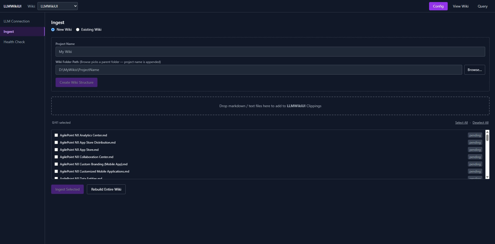
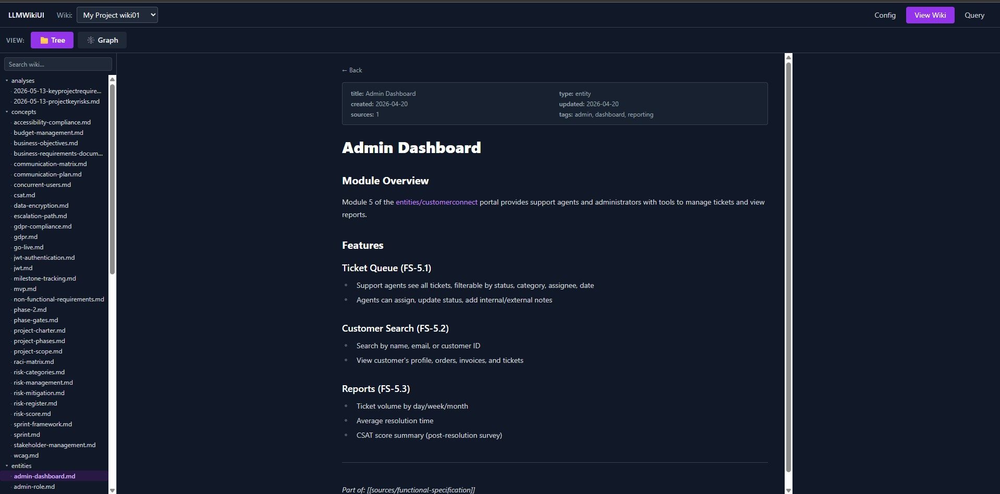
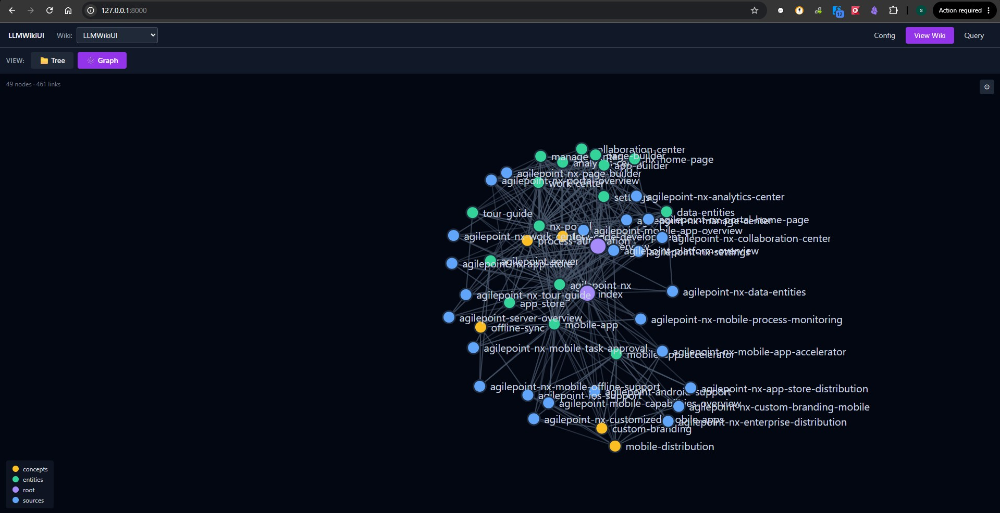
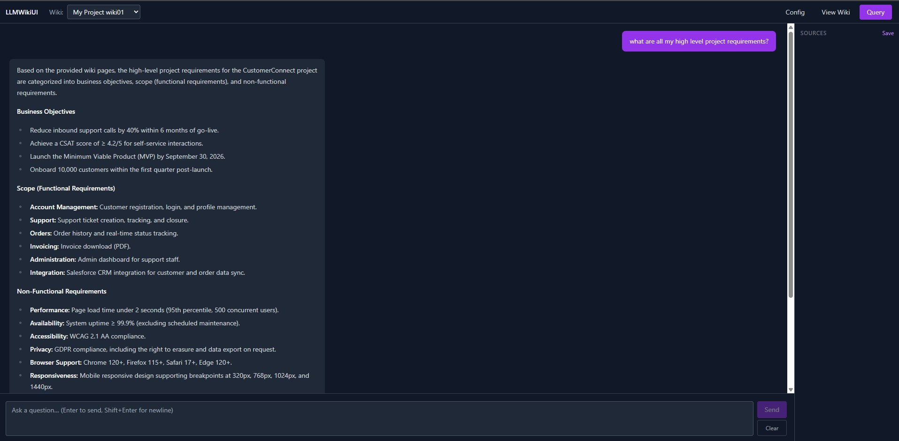
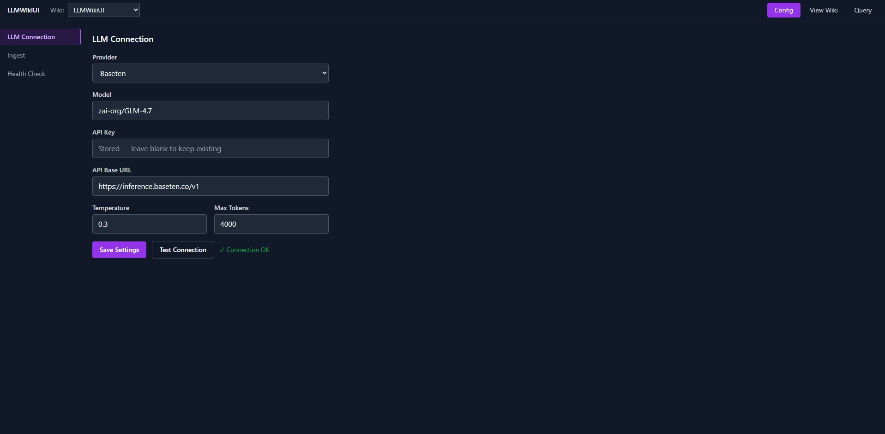
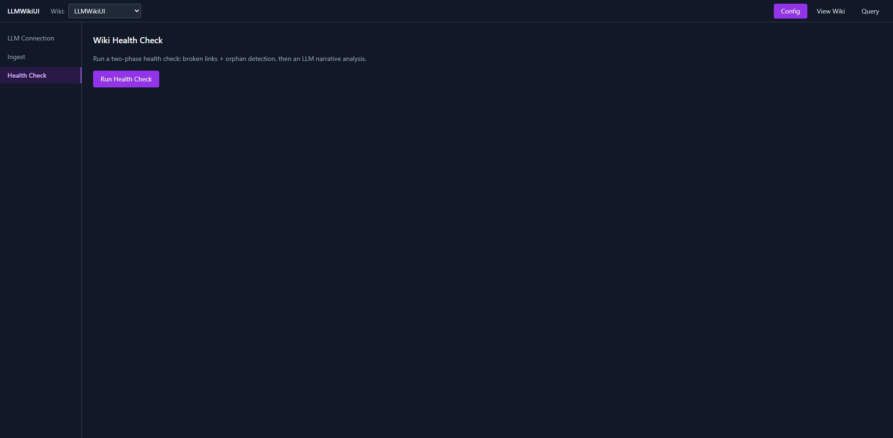

Languages: **English** | [日本語](README.ja.md)

---

# 📚 LLM Wiki — AI Knowledge Base Generator

> From a pile of documents to a living, cross-linked knowledge base — hands-free. Drop source documents into `Clippings/`, press *Run Ingest*, and an LLM writes a structured wiki: source pages, entity pages, concept pages and a master index, stitched together with Obsidian-style `[[wiki-links]]`. Browse it as a folder tree or a D3 force graph, and interrogate it in a streaming chat that cites its sources and grades its own confidence.


## Demo Video

[](https://youtu.be/dayj8CjGDhM)

## Why This Project Exists

Demonstrates that LLM output can become a persistent, navigable knowledge base — Git-friendly Markdown with wiki links and graph visualization — instead of answers that disappear when the chat ends. The wiki-building intelligence isn't in the app: it's in the contract (`AGENTS.md` schema + a strict `===FILE:===` output format + post-processing guards), so the same pipeline runs from a 2 GB local GGUF model to a frontier cloud model.

## What This Project Demonstrates

- Document-to-knowledge transformation: one ingest pass emits a source page, entity pages, concept pages and an updated index
- Entity/concept extraction into persistent, shared pages (a single source can touch 5–15 pages — by design, so entities and concepts are reused, not rewritten)
- Obsidian-style `[[wiki-links]]` navigation across plain `.md` files (no database)
- Graph visualization of the wiki's link structure (D3 force graph with orphan detection)
- Cited streaming chat (SSE) that answers from the wiki only — with citation chips and a confidence score
- A two-phase wiki Health Check: instant programmatic lint (broken links, orphans, dead ends) + LLM narrative review

## Architecture

```text
Documents (Clippings/ — .md .docx .xlsx .pdf .pptx, never modified)
   ↓  single streaming LLM call per source (AGENTS.md schema + current index.md in context)
===FILE:=== protocol → thinking-strip → path slugify/type-inference → guards
   ↓
Source / Entity / Concept Pages + index.md  (plain .md + YAML frontmatter)
   ↓
[[Wiki Links]] → folder tree view · D3 force graph
   ↓
Query (SSE): keyword/semantic page retrieval → grounded streaming answer
             → confidence score + citation chips ("wiki mode" only answers from the wiki)
```

- **Backend**: FastAPI — 6 routers (`config`, `ingest`, `wiki`, `query`, `lint`, `utils`) + SPA static mount
- **Frontend**: React 18 + Vite + Zustand + TailwindCSS, 3 tabs (Config / View Wiki / Query)
- **LLM**: 8 providers via `openai` + `anthropic` SDKs — OpenAI, Azure OpenAI, Anthropic, Ollama, LM Studio, Together, Baseten, plus **local-cpu**: GGUF models (Gemma 2 2B, Llama 3.2 3B, Qwen 2.5 3B, Phi 3.5 Mini…) served in-process via `llama-cpp-python`, downloaded on demand from Hugging Face
- **Storage**: plain Markdown + YAML frontmatter under `wiki/sources|entities|concepts|analyses` — no database, Obsidian-compatible, Git-friendly, fully regenerable (`Clippings/` is immutable)

## Key AI Engineering Concepts

- **Schema in `AGENTS.md`, not code** — per-project entity/concept taxonomies are editable Markdown, embedded into every ingest prompt
- **`===FILE:===` output protocol** — models follow "emit files with markers" far more reliably than nested JSON; the parser is forgiving (slugify, type-dir inference from frontmatter, degenerate-loop collapse)
- **Defence in depth for small models** — thinking-strip → empty-answer retry → token cap → timeout → extractive fallback → auto index rebuild
- **Grounded retrieval** — keyword token-overlap scoring (top 8) or LLM semantic page selection; 40 000-char context budget for cloud models, 12 000 with snippet reduction for local models
- **Honest failure** — the system prompt hard-forbids answering from general knowledge; if the wiki doesn't know, the model must say so

## Safety / Reliability

- Grounding contract: wiki mode answers **only** from retrieved pages — outside knowledge is forbidden by the system prompt; a fixed refusal message covers missing topics
- Path safety: every file operation passes a resolved-path guard against traversal; uploads and LLM-emitted paths are sanitized before touching disk
- `wiki/log.md` is append-only and can never be overwritten by the LLM
- Masked keys: the backend returns `***` for stored API keys and restores the real one server-side; env-provided keys are never written back to `config.json`
- Config priority: `config.json` (UI-saved values) > `.env`/environment (`LLMWIKI_*` variables) — see `.env.example`

## Technology Stack

| Area | Technology |
|---|---|
| LLM providers | OpenAI · Azure OpenAI · Anthropic · Ollama · LM Studio · Together · Baseten · local-cpu GGUF (`llama-cpp-python`) |
| Backend | FastAPI · Uvicorn · Pydantic v2 · SSE streaming |
| Document parsing | `python-docx` · `openpyxl` · `pypdf` · `python-pptx` |
| Frontend | React 18 · Vite 5 · Zustand 4 · TailwindCSS 3 · D3 7 · react-markdown 9 |
| Knowledge base | Markdown + YAML frontmatter (`python-frontmatter`), Obsidian-compatible |
| Config | `config.json` (gitignored) with `.env` fallback (`LLMWIKI_*` variables) |

## Demo

Real UI captures in [`docs/screenshots/`](docs/screenshots/):

| Ingest | Wiki tree | Wiki graph |
|:---:|:---:|:---:|
|  |  |  |
| **Query with citations** | **LLM connection** | **Health check** |
|  |  |  |

Full walkthrough: [`LLMWikiUI_Userguide.html`](LLMWikiUI_Userguide.html) — 4-tab guide (Elevator Pitch / Non-Technical / Technical / Glossary) with the ingest contract, retrieval internals, SSE event schema and health-check phases documented in detail.

## How to Run

```bash
# 1. Backend
python -m venv .venv
.venv\Scripts\activate              # Windows
pip install -r requirements.txt

# 2. LLM credentials (optional) — copy .env.example to .env and fill in,
#    or just type the key in the Config tab (stored in gitignored config.json)
copy .env.example .env

# 3. Frontend dependencies
cd frontend
npm install

# 4. Development — terminal 1 (backend), terminal 2 (frontend)
.venv\Scripts\python -m uvicorn backend.main:app --reload --port 8000
cd frontend && npm run dev          # → http://localhost:5173

# 5. Production (single port) — build the SPA, then serve it from FastAPI
cd frontend && npm run build
cd ..
.venv\Scripts\python -m uvicorn backend.main:app --host 0.0.0.0 --port 8000
# → http://localhost:8000
```

First use: open the **Config** tab → pick a provider (or `local-cpu` for a keyless GGUF model) → *Test Connection* → create a wiki project → drop documents into its `Clippings/` folder → *Run Ingest*.

Requires Python 3.10+ and Node.js 18+. Cloud providers need an API key; Ollama/LM Studio/local-cpu run without one.

## Workflow

1. **Configure** — set the LLM provider and model once (8 providers; Test Connection validates it)
2. **Create a project** — one folder = one wiki; the standard scaffold (`wiki/`, `Clippings/`, `raw/`, `AGENTS.md`) is created automatically
3. **Ingest** — the LLM reads each source and writes a source page + entity pages + concept pages + the updated index; every call includes `AGENTS.md` and the current `index.md` so naming stays consistent as the wiki grows; a log entry lands in `wiki/log.md` and the index is auto-rebuilt as a safety net
4. **Browse** — tree view for reading; graph view for seeing the shape of the knowledge (isolated nodes = orphan pages the Health Check will flag)
5. **Query & health-check** — streaming answers with citations and confidence; two-phase lint finds broken links, orphans, dead ends, contradictions and concept gaps

## How This Project Differs

Produces a persistent, navigable, Git-friendly knowledge base — compared with chat-first RAG assistants, where extracted knowledge lives in a vector store and answers vanish with the session. Here the knowledge base itself is the product: human-readable, Obsidian-compatible, versionable with Git, and the LLM maintains it.

## AI-Assisted Development

This project was developed using an AI-assisted coding workflow with VS Code. AI tools were used to accelerate implementation, while architecture, integration, testing, debugging and validation were reviewed and refined during development.
