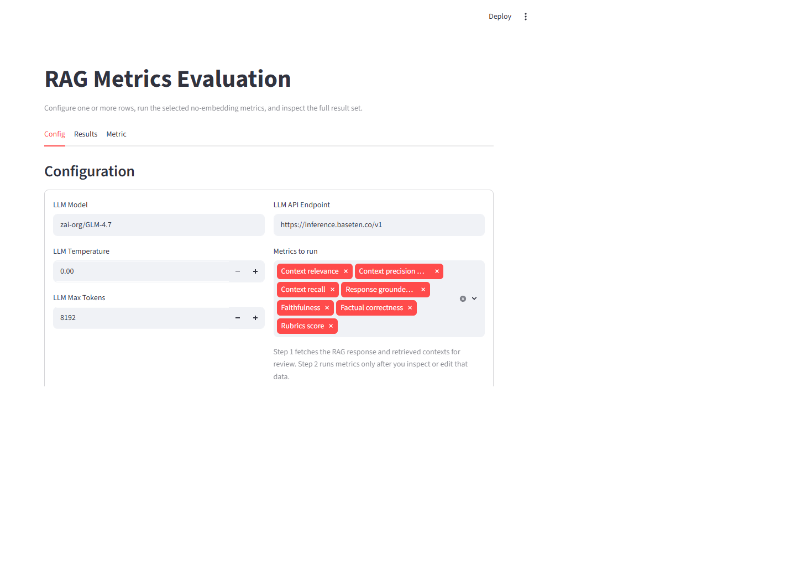
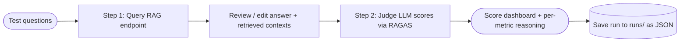

言語 / Languages: [English](README.md) | **日本語**

---

<div align="center">

# 📊 RAG 評価ハーネス

</div>

> [AI_Projects](../README.md) ショーケースの一環 — AI/ML プロジェクトの厳選コレクションです。

RAG システム向けの **Streamlit 評価ワークベンチ**。[RAGAS](https://docs.ragas.io/) ライブラリ上に構築されています。任意の RAG エンドポイントと任意の OpenAI 互換ジャッジ LLM を指定し、2 フェーズのワークフロー(RAG へのクエリ → 取得コンテキストの確認 → 品質の判定)を進めると、合格/不合格の閾値、メトリクスごとの判断理由、保存された実行履歴付きの LLM 判定スコアが得られます — **埋め込みモデルは不要**です。

## デモ動画

[](https://youtu.be/CWLI7SwQfIQ)
[](https://youtu.be/FvUk3OKzRgU)

## なぜこのプロジェクトが存在するのか

回答の主観的な目視確認だけに頼るのではなく、RAG システムを体系的に評価する方法 — LLM-as-a-judge メトリクス、閾値、実行履歴 — を示すプロジェクトです。

[](https://www.python.org/)
[](https://docs.ragas.io/)
[](https://streamlit.io/)
[](https://docs.pytest.org/)
[](../LICENSE)

## スクリーンショット

| 設定 — メトリクスとジャッジ LLM の選択 | マルチターン会話評価 |
|:---:|:---:|
|  |  |

## 何をするアプリか

アプリには 3 つのタブがあります:

1. **Config** — テスト質問の一覧表示(CSV/JSON のテストセットから読み込みも可能)、ジャッジ LLM の設定、実行するメトリクスの選択。
2. **Results** — スコアダッシュボード(ゲージ + 閾値バンド)に加え、各メトリクスの判断理由が並ぶ行単位の内訳。
3. **Metric** — 各スコアの意味と推奨レンジを示すアプリ内リファレンス。

フローは意図的に 2 フェーズ構成です:

- **Step 1 — Query RAG & Review**:各質問について RAG システムを呼び出し、その回答と取得ドキュメントを受け取ります。判定の前にこのデータを確認(および編集)できます。
- **Step 2 — Run Metrics**:質問・回答・取得コンテキスト、(任意で)リファレンス回答をジャッジ LLM に送信し、RAGAS 経由でスコアリングします。

すべてのメトリクスが**埋め込みベースではなく LLM 判定**のため、このハーネスは OpenAI 互換のチャットエンドポイントならどれでも使えます — ローカル Ollama、Baseten、OpenAI、Azure OpenAI などです。

## メトリクス

メトリクスは評価対象の RAG パイプラインのステージごとにグループ化されています:

| ステージ | メトリック | 必要な入力 |
|-------|--------|----------|
| 検索 (Retrieval) | コンテキストの関連性 (Context relevance) | contexts |
| 検索 (Retrieval)| コンテキストの適合率 (Context precision with reference) | contexts + reference |
| 検索 (Retrieval) | コンテキストの再現率 (Context recall) | contexts + reference |
| 拡張 (Augmentation) | 回答の根拠性 (Response groundedness) | response + contexts |
| 拡張 (Augmentation) | 忠実性 (Faithfulness) | response + contexts |
| 生成 (Generation)| 事実の正確性 (Factual correctness)| response + reference |
| 生成 (Generation) | ルーブリック評価スコア (Rubrics score | response + reference |

マルチターン評価にも対応しています(`MultiturnUI.py` / `Test6.py`):

- **Topic Adherence** — 会話を通じて AI は想定されたトピックを維持していましたか?
- **Faithfulness** — ターンをまたいで AI は自己矛盾していませんでしたか?

## ハイライト

- 🖥️ Streamlit ワークベンチ — 編集可能なデータグリッド、メトリクスの複数選択、推奨レンジ付きゲージダッシュボード
- 🧑‍⚖️ 埋め込み不要の RAGAS メトリクス 7 種 + マルチターンメトリクス 2 種、すべて設定した LLM が判定
- 🔁 2 フェーズワークフロー — スコアリングの*前に*取得コンテキストを確認できるため、悪い検索が結果を静かに歪めることはありません
- 💾 実行履歴はタイムスタンプ付き JSON ファイル(`runs/`)— データベース不要で過去の評価を保存・再読込・削除できます
- 🌐 エンドポイント非依存 — ローカル Ollama、Baseten、OpenAI、Azure OpenAI(いずれも OpenAI 互換)
- 🧪 pytest スイート(`Test1`–`Test7`)が各メトリクスを個別にカバー。さらに RAGAS の LLM ファクトリを環境変数から組み立てる `conftest.py` 付き
- 🏢 Aria バリアント — `Test*_aria.py` スクリプトは行単位の API 設定で社内の Aria 推論エンドポイントを評価します(汎用的なまま維持。認証情報はローカルの `1.env` に保管)

## プロジェクト構成

```text
rag-evaluation-harness/
├── Test5_allwithUI.py        # Main Streamlit UI (single-turn, all metrics)
├── MultiturnUI.py            # Multi-turn evaluation UI (Topic Adherence + Faithfulness)
├── Test1_contextprecision.py # Context precision pytest
├── Test2_contextrecall.py    # Context recall pytest
├── Test3_framework.py        # Context recall via ragas collections API
├── Test4_faithfullness.py    # Faithfulness pytest
├── Test5_all.py              # All metrics in one pytest run
├── Test5_factualcorrectness.py # Factual correctness pytest
├── Test6.py                  # Multi-turn: Topic Adherence + Agent Goal Accuracy
├── Test7.py                  # Rubrics score (5-point scale) pytest
├── Test1_contextprecisionaria.py # Aria-endpoint variant (context precision)
├── Test5_allwithUI_aria.py   # Aria-endpoint variant (full UI)
├── conftest.py               # Shared RAGAS llm_factory fixture (reads 1.env)
├── utils.py                  # RAG endpoint client (retries, mock mode) + test-data loader
├── eval_history_io.py        # JSON-file persistence for run history
├── testdata/                 # Test sets (CSV/JSON question + reference pairs)
├── runs/                     # Saved evaluation runs (timestamped JSON, gitignored)
├── docs/
│   ├── guides/               # HTML user guide + metrics guide
│   └── screenshots/
├── .env.example              # Template for 1.env
└── requirements.txt
```

## 2 フェーズワークフロー



## セットアップ

仮想環境を作成して有効化し、依存パッケージをインストールします:

```powershell
python -m venv .venv
.\.venv\Scripts\python.exe -m pip install -r requirements.txt
```

ジャッジ LLM と RAG エンドポイントは、`.env.example` を `1.env` としてコピーして以下を記入します:

```ini
LLM_API_ENDPOINT=http://localhost:11434/v1   # any OpenAI-compatible endpoint
LLM_MODEL=llama3.1:8b
OPENAI_API_KEY=ollama
RAG_ENDPOINT=https://your-rag-host.example.com/ask
```

対応するジャッジプロバイダー(いずれも OpenAI 互換 — 変更するのはこれらの値だけです):

| プロバイダー | `LLM_API_ENDPOINT` | 備考 |
|----------|--------------------|-------|
| Ollama (local) | `http://localhost:11434/v1` | デフォルト。キーは任意のプレースホルダーで可 |
| Baseten | `https://inference.baseten.co/v1` | ホステッド。例: `zai-org/GLM-4.7` |
| OpenAI | `https://api.openai.com/v1` | `gpt-4o-mini` など |
| Azure OpenAI | `https://YOUR-RESOURCE.openai.azure.com/...` | デプロイメント単位 |

## Streamlit UI の実行

```powershell
.\.venv\Scripts\python.exe -m streamlit run .\Test5_allwithUI.py
```

ブラウザで http://localhost:8501 を開きます。マルチターン評価の場合:

```powershell
.\.venv\Scripts\python.exe -m streamlit run .\MultiturnUI.py
```

## メトリクステストの実行

各 `Test*.py` は単体の pytest ファイルとしても機能します — CI のリグレッションゲートとして有用です:

```powershell
# All single-turn metrics in one run
& .\.venv\Scripts\python.exe -m pytest -q .\Test5_all.py -s

# Individual metrics
& .\.venv\Scripts\python.exe -m pytest -q .\Test5_factualcorrectness.py -s
& .\.venv\Scripts\python.exe -m pytest -q .\Test4_faithfullness.py -s
& .\.venv\Scripts\python.exe -m pytest -q .\Test2_contextrecall.py -s
```

## 補足

- **埋め込みは一切不使用** — すべてのメトリクスは LLM 判定のため、ベクトルストアへの依存がなく、任意のチャットエンドポイントで動作します。
- **設計によるヒューマンインザループ** — 取得コンテキストを確認した後でのみメトリクスが実行されるため、悪い検索がスコアを汚染する前に検知できます。
- **実行履歴はプレーンな JSON** — 実行ごとに `runs/`(gitignore 済み)へタイムスタンプ付きファイルを 1 件保存し、UI から読み込み・削除します。
- **`1.env` は gitignore 済み** — `.env.example` をコピーして自分のキーを追加してください。Aria バリアントも同じファイルから行単位の認証情報を読みます。機密情報はリポジトリに同梱されません。
- **モックモード** — `utils.py` にはモックの RAG レスポンダーが含まれており、稼働中の RAG エンドポイントなしで UI を試せます。

---

<div align="center">

**[AI_Projects](https://github.com/git4rajmohan/AI_Projects) コレクションの一環**

</div>
