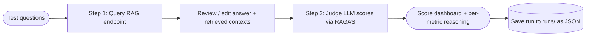

Languages: **English** | [日本語](README.ja.md)

---

<div align="center">

# 📊 RAG Evaluation Harness

</div>

> Part of the [AI_Projects](../README.md) showcase — a curated collection of AI/ML projects.

A **Streamlit evaluation workbench** for RAG systems, built on the [RAGAS](https://docs.ragas.io/) library. Point it at any RAG endpoint and any OpenAI-compatible judge LLM, step through a two-phase workflow (query the RAG → review the retrieved context → judge the quality), and get LLM-judged scores with pass/fail thresholds, per-metric reasoning, and saved run history — **no embedding models required**.

## Why This Project Exists

Demonstrates how RAG systems can be evaluated systematically — LLM-as-a-judge metrics, thresholds and run history — rather than relying only on subjective inspection of responses.

[](https://www.python.org/)
[](https://docs.ragas.io/)
[](https://streamlit.io/)
[](https://docs.pytest.org/)
[](../LICENSE)

## Screenshots

| Config — pick metrics & judge LLM | Multi-turn conversation evaluation |
|:---:|:---:|
|  |  |

## What It Does

The app has 3 tabs:

1. **Config** — list test questions (or load them from a CSV/JSON test set), set the judge LLM, and pick which metrics to run.
2. **Results** — a score dashboard (gauge + threshold bands) plus a per-row breakdown with each metric's reasoning.
3. **Metric** — an in-app reference for what each score means and its recommended range.

The flow is deliberately two-phase:

- **Step 1 — Query RAG & Review**: for each question, call your RAG system to get its answer and the documents it retrieved. You inspect (and can edit) that data before judging.
- **Step 2 — Run Metrics**: send the question, answer, retrieved contexts, and (optionally) a reference answer to a judge LLM, which scores them via RAGAS.

Because every metric is **LLM-judged rather than embedding-based**, the harness works with any OpenAI-compatible chat endpoint — local Ollama, Baseten, OpenAI, or Azure OpenAI.

## Metrics

Metrics are grouped by the RAG pipeline stage they evaluate:

| Stage | Metric | Requires |
|-------|--------|----------|
| Retrieval | Context relevance | contexts |
| Retrieval | Context precision (with reference) | contexts + reference |
| Retrieval | Context recall | contexts + reference |
| Augmentation | Response groundedness | response + contexts |
| Augmentation | Faithfulness | response + contexts |
| Generation | Factual correctness | response + reference |
| Generation | Rubrics score | response + reference |

Multi-turn evaluation is also supported (`MultiturnUI.py` / `Test6.py`):

- **Topic Adherence** — did the AI stay on the expected topics across the conversation?
- **Faithfulness** — did the AI contradict itself across turns?

## Highlights

- 🖥️ Streamlit workbench — editable data grid, metric multi-select, gauge dashboard with recommended ranges
- 🧑‍⚖️ 7 no-embedding RAGAS metrics + 2 multi-turn metrics, all judged by an LLM you configure
- 🔁 Two-phase workflow — review retrieved contexts *before* scoring, so bad retrievals don't silently skew results
- 💾 Run history as timestamped JSON files (`runs/`) — save, reload, and delete previous evaluations with zero database overhead
- 🌐 Endpoint-agnostic — local Ollama, Baseten, OpenAI, or Azure OpenAI (all OpenAI-compatible)
- 🧪 pytest suite (`Test1`–`Test7`) covering each metric individually, plus a `conftest.py` that wires the RAGAS LLM factory from env
- 🏢 Aria variant — `Test*_aria.py` scripts evaluate against an internal Aria inference endpoint with per-row API config (kept generic; credentials stay in your local `1.env`)

## Project Structure

```text
rag-evaluation-harness/
├── Test5_allwithUI.py        # Main Streamlit UI (single-turn, all metrics)
├── MultiturnUI.py            # Multi-turn evaluation UI (Topic Adherence + Faithfulness)
├── Test1_contextprecision.py # Context precision pytest
├── Test2_contextrecall.py    # Context recall pytest
├── Test3_framework.py        # Context recall via ragas collections API
├── Test4_faithfullness.py    # Faithfulness pytest
├── Test5_all.py              # All metrics in one pytest run
├── Test5_factualcorrectness.py # Factual correctness pytest
├── Test6.py                  # Multi-turn: Topic Adherence + Agent Goal Accuracy
├── Test7.py                  # Rubrics score (5-point scale) pytest
├── Test1_contextprecisionaria.py # Aria-endpoint variant (context precision)
├── Test5_allwithUI_aria.py   # Aria-endpoint variant (full UI)
├── conftest.py               # Shared RAGAS llm_factory fixture (reads 1.env)
├── utils.py                  # RAG endpoint client (retries, mock mode) + test-data loader
├── eval_history_io.py        # JSON-file persistence for run history
├── testdata/                 # Test sets (CSV/JSON question + reference pairs)
├── runs/                     # Saved evaluation runs (timestamped JSON, gitignored)
├── docs/
│   ├── guides/               # HTML user guide + metrics guide
│   └── screenshots/
├── .env.example              # Template for 1.env
└── requirements.txt
```

## The Two-Phase Workflow



## Setup

Create and activate a virtual environment, then install dependencies:

```powershell
python -m venv .venv
.\.venv\Scripts\python.exe -m pip install -r requirements.txt
```

Configure the judge LLM and RAG endpoint by copying `.env.example` to `1.env` and filling in:

```ini
LLM_API_ENDPOINT=http://localhost:11434/v1   # any OpenAI-compatible endpoint
LLM_MODEL=llama3.1:8b
OPENAI_API_KEY=ollama
RAG_ENDPOINT=https://your-rag-host.example.com/ask
```

Supported judge providers (all OpenAI-compatible — only these values change):

| Provider | `LLM_API_ENDPOINT` | Notes |
|----------|--------------------|-------|
| Ollama (local) | `http://localhost:11434/v1` | Default; key can be any placeholder |
| Baseten | `https://inference.baseten.co/v1` | Hosted, e.g. `zai-org/GLM-4.7` |
| OpenAI | `https://api.openai.com/v1` | `gpt-4o-mini` etc. |
| Azure OpenAI | `https://YOUR-RESOURCE.openai.azure.com/...` | Deployment-based |

## Run The Streamlit UI

```powershell
.\.venv\Scripts\python.exe -m streamlit run .\Test5_allwithUI.py
```

Open http://localhost:8501 in your browser. For multi-turn evaluation:

```powershell
.\.venv\Scripts\python.exe -m streamlit run .\MultiturnUI.py
```

## Run The Metric Tests

Each `Test*.py` is also a standalone pytest file — useful as a regression gate in CI:

```powershell
# All single-turn metrics in one run
& .\.venv\Scripts\python.exe -m pytest -q .\Test5_all.py -s

# Individual metrics
& .\.venv\Scripts\python.exe -m pytest -q .\Test5_factualcorrectness.py -s
& .\.venv\Scripts\python.exe -m pytest -q .\Test4_faithfullness.py -s
& .\.venv\Scripts\python.exe -m pytest -q .\Test2_contextrecall.py -s
```

## Notes

- **No embeddings anywhere** — every metric is LLM-judged, so there is no vector store dependency and any chat endpoint works.
- **Human-in-the-loop by design** — metrics run only after you review the retrieved contexts, so a bad retrieval is caught before it pollutes scores.
- **Run history is plain JSON** — one timestamped file per run in `runs/` (gitignored), loaded/deleted through the UI.
- **`1.env` is gitignored** — copy `.env.example` and add your own keys. The Aria variants read per-row credentials from the same file; nothing sensitive ships with the repo.
- **Mock mode** — `utils.py` includes a mock RAG responder so you can exercise the UI without a live RAG endpoint.

---

<div align="center">

**Part of the [AI_Projects](https://github.com/git4rajmohan/AI_Projects) collection**

</div>