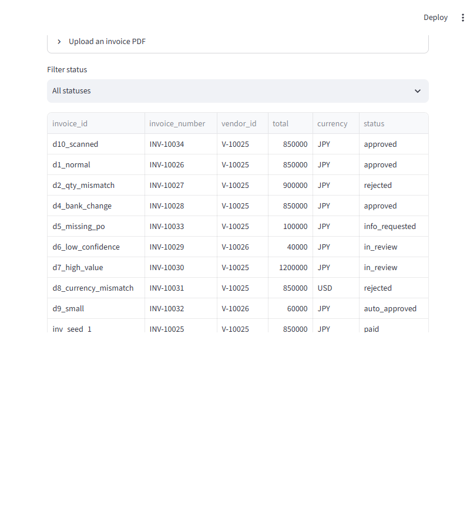
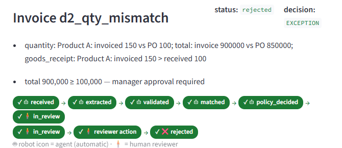
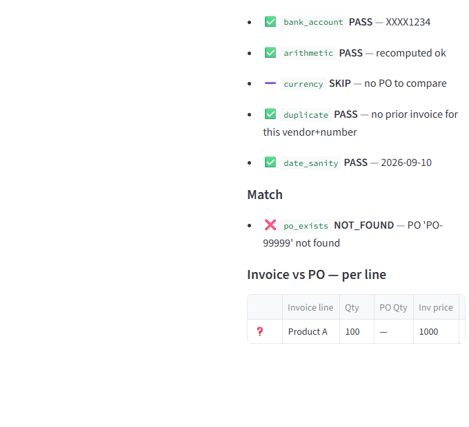
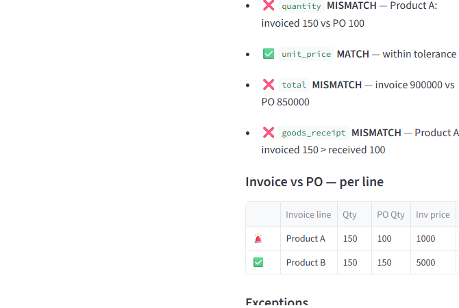
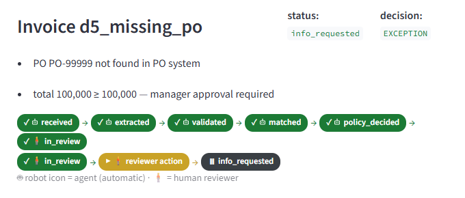

Languages: **English** | [日本語](README.ja.md)

---

# DocFlow — AI Document Intelligence & Invoice Approval Engine

An invoice-approval workflow where **AI reads, code decides, humans own risk**: an invoice PDF
(even a pure image-only scan) is read by an LLM with per-field confidence, but every financial
decision is made by deterministic validation, ordered policy rules — and only genuinely risky
invoices reach a human reviewer, with the full evidence side-by-side.

> FastAPI · Streamlit · SQLite · PyMuPDF · Tesseract OCR · Ollama (live or mock) · pytest

## What This Project Demonstrates

- **Document intelligence** — PDF text-layer extraction (PyMuPDF) with a Tesseract OCR fallback
  for image-only scans; structured LLM field extraction with a **confidence score per field**
- **Deterministic decision core** — 9 validation checks, two-way/three-way PO matching, and the
  ordered policy rules R001–R008, all pure Python with **zero LLM imports**
- **Human-in-the-loop approval** — evidence-first reviewer UI (document, fields, checks, rule
  reasons side-by-side) with approve / reject / request-info / correct-and-resubmit actions
- **Append-only audit trail** — every pipeline stage appends an event; the UI's workflow strips
  are rendered *from* the audit events, so the picture can never disagree with the database
- **Measurable evaluation** — a 6-level eval harness over 10 invoice scenarios with a
  risk-weighted error score (critical fields ×5)

## Why This Project Exists

Demonstrates a production-style document AI workflow where the LLM reads and extracts, but
deterministic validation and policy rules make the financial decisions — with humans owning the
risk through review gates. LLMs are excellent readers and unreliable judges: a confident wrong
answer on a ¥1M payment is expensive, so the extraction LLM here has no authority over thresholds,
approvals, or fraud calls. The same pattern generalizes to contract review, insurance claims, and
clinical prior authorization.

## Architecture

```text
                INVOICE (.pdf, even image-only)
                          ↓
              PyMuPDF text load (quality-graded)
                          ↓
              AI Field Extraction (Ollama or mock)
                structured JSON + per-field confidence
                          ↓
        ┌─────────────────┴─────────────────┐
        ↓                                   ↓
 Vendor Validation (9 checks)    Line-Item Arithmetic (recomputed in code)
        ↓                                   ↓
        └─────────────────┬─────────────────┘
                          ↓
              Invoice ↔ PO Match (two-way + AI line map, code-verified)
                          ↓
              Optional Goods-Receipt Match (three-way)
                          ↓
              Deterministic Policy Engine (R001–R008, first trigger wins)
                          ↓
              ┌───────────┴───────────┐
              ↓                       ↓
        AUTO_APPROVE          HUMAN_REVIEW / EXCEPTION / REJECT
              (¥<100k green)          ↓
                          Human Reviewer (Streamlit, evidence-first)
                          ↓
              Systems of Record (SQLite) + append-only Audit Trail
```

The **policy engine is a pure function** of (validation report, match report, extracted invoice)
— unit-tested without any AI. The **only AI component is extraction** (`app/extraction/`): an
OpenAI-compatible LLM call that returns structured JSON; the LLM never touches the database and
never decides anything financial.

## Workflow

1. **Upload → pipeline runs**: `received → extracted → validated → matched → policy_decided → outcome`,
   each stage updating invoice status and appending an audit event before the next begins
2. **Automatic exits**: clean invoices under ¥100k auto-approve (R008); duplicates are rejected
   *pre-insert* (R001) — the block event lands on the original invoice, no orphan rows
3. **Human loop** (only for risk): reviewer sees the document, extracted fields, all 9 checks,
   the match report and the exact fired rule — then approves, rejects, requests info, or corrects
   a field (corrections re-enter the pipeline **from validation**, corrected fields get confidence
   1.0, the rest keep their original scores — no confidence laundering)

## Policy Engine — R001–R008 (ordered, first trigger wins as the decision; all triggered rules collected into `reasons[]`)

| Rule | Trigger | Decision |
|---|---|---|
| R001 | same vendor + invoice number already recorded | **REJECT** (blocked pre-insert) |
| R002 | bank account ≠ vendor master | **HUMAN_REVIEW** (mandatory) |
| R003 | PO number not found | **EXCEPTION** |
| R004 | any FAIL / MISMATCH check | **EXCEPTION** |
| R005 | any critical-field confidence < 0.6 | **HUMAN_REVIEW** |
| R006 | total > ¥1,000,000 | **FINANCE_REVIEW** |
| R007 | total ≥ ¥100,000 | **MANAGER_REVIEW** |
| R008 | everything green, < ¥100,000 | **AUTO_APPROVE** |

Thresholds, tolerances and the confidence floor are deterministic `.env` settings the LLM never
sees.

## Technology Stack

| Area | Technology |
|---|---|
| LLM extraction | OpenAI-compatible client → Ollama (`gpt-oss:120b`), live **or** mock mode |
| Backend | FastAPI (8 routes) + Pydantic v2 wire models |
| Reviewer UI | Streamlit (thin `requests` client — zero DB access) |
| Documents | PyMuPDF (text layer + rasterization), pytesseract + Pillow (optional OCR) |
| Storage | SQLite (vendors, POs, receipts, invoices, exceptions, reviews, audit_events) |
| Testing | pytest — 101 passed, 1 skipped (the skipped test needs a live LLM) |

Mock-first by design: `.env` ships `EXTRACTION_MODE=mock`, which replays each sample's
ground-truth JSON — the whole pipeline (validation → matching → policy → review) runs and is
tested with **zero LLM dependency**; flip one env var for live Ollama.

## Demo

Screenshots from a real run of the shipped app (FastAPI + Streamlit reviewer). The sidebar sets the
API address and the reviewer's name — the name gates the action buttons, because *who approved
what* is part of the audit record.

**All Invoices** — every scenario's final status at a glance: approved (d1, d4, d10), rejected
(d2, d8), auto-approved (d9 — never entered the inbox), info-requested (d5), finance-parked (d7):



**Decision banner + workflow strips** — invoice d2 (billed 150, PO says 100) shows the fired rule,
the reasons list, and two strips rendered from the audit events: 🤖 robot steps all green, 🧍
human loop ending at **rejected**:



**Evidence-first review** — the reviewer never reads a raw PDF and guesses: document and extracted
fields on one side, all 9 validation checks and the match report on the other:



**Invoice vs PO — per line** — the exact mismatch, side by side: Product A 🚨 150 vs 100, Product
B ✅ 150 vs 150:



**Human loop on the missing-PO exception (d5)** — the strip parks at *info_requested* until the
real PO number arrives:



- **Exception inbox** lists only invoices waiting on a human — safe small invoices never appear
- **Audit timeline** expander: one timestamped event per stage, replayable months later

**Full guide:** [`userguide.html`](./userguide.html) — 4-tab walkthrough (pitch, non-technical,
technical, glossary). **Scenario walkthroughs:** [`demo_script.md`](./demo_script.md);
step-by-step test matrix: [`howtotest.md`](./howtotest.md).

## Sample documents (data/invoices/, 10 scenarios)

| sample | scenario | expected decision |
|---|---|---|
| `d1_normal` | normal ¥850k invoice, PO-12345 | MANAGER_REVIEW (R007 band) |
| `d2_qty_mismatch` | billed 150, PO says 100 | EXCEPTION (R004) |
| `d3_duplicate` | invoice number already paid | REJECT (R001), blocked pre-insert |
| `d4_bank_change` | bank account ≠ vendor master | HUMAN_REVIEW (R002) |
| `d5_missing_po` | PO-99999 not in the PO system | EXCEPTION (R003) |
| `d6_low_confidence` | degraded scan, confidence capped | HUMAN_REVIEW (R005) |
| `d7_high_value` | ¥1.2M invoice | FINANCE_REVIEW (R006) |
| `d8_currency_mismatch` | USD invoice vs JPY PO | EXCEPTION (R004) |
| `d9_small` | ¥60k, everything green | AUTO_APPROVE (R008) |
| `d10_scanned` | image-only scan (zero text layer) | MANAGER_REVIEW via OCR (HUMAN_REVIEW without Tesseract) |

Samples regenerate deterministically with `tools/make_sample_invoices.py`; each has a
`*_ground_truth.json` used by mock extraction and the eval harness.

## How to Run

```bash
py -3.11 -m venv .venv
.venv/Scripts/pip install -r requirements.txt
copy .env.example .env    # then paste your Ollama key (or keep EXTRACTION_MODE=mock for offline)

# eval harness: 10 scenarios through the real pipeline → evaluation/report.md + results.json
.venv/Scripts/python.exe -m evaluation.run_eval

# API (terminal 1) — seed the DB first if data/docflow.db is missing
.venv/Scripts/python.exe -c "import app.db; app.db.seed('data/docflow.db')"
.venv/Scripts/python.exe -m uvicorn app.api.main:app --port 8000

# reviewer UI (terminal 2)
.venv/Scripts/python.exe -m streamlit run ui/reviewer.py

# tests
.venv/Scripts/python.exe -m pytest tests/ -q
```

Setup and verification steps for every scenario are in [`howtotest.md`](./howtotest.md).
The project was developed against **Python 3.11/3.12** on Windows.

## API Routes (app/api/main.py)

`GET /health` · `POST /invoices/upload` · `GET /invoices[?status=]` · `GET /invoices/{id}`
(assembled from audit events) · `GET /invoices/{id}/audit` · `GET /invoices/{id}/document` ·
`POST /invoices/{id}/review` · `DELETE /invoices/{id}` (delete-for-retest, refuses seeded
fixtures) · `GET /exceptions`

## Testing / Evaluation

```bash
.venv/Scripts/python.exe -m pytest tests/ -q          # 101 passed, 1 skipped (live LLM)
.venv/Scripts/python.exe -m evaluation.run_eval       # 6-level harness → report.md
```

The eval harness runs all 10 scenarios through the real pipeline in one fresh DB and reports:
field accuracy (critical fields `total_amount` / `bank_account` / `vendor` weighted ×5), match
accuracy, exception recall, false approvals, latency (avg + p95), and estimated review-time
saved. Latest shipped results live in [`evaluation/report.md`](./evaluation/report.md); on the
sample suite: **decision accuracy 1.0, match accuracy 1.0, exception recall 1.0, false approvals
0**. These are **sample/project evaluation results on 10 seeded scenarios**, not general
production performance claims.

## Key AI Engineering Concepts

- Document AI with per-field confidence scoring and OCR fallback
- Deterministic policy engine as a pure function (no LLM in the decision path)
- Human-in-the-loop review with evidence-first UI
- Append-only audit trail driving the UI state machine
- Mock-first LLM testing (offline-replayable demos and test suites)

## Safety / Reliability

- Duplicate guard is **pre-insert** (idempotency without orphan rows)
- Arithmetic is always recomputed in code — LLM-stated totals are never trusted
- Every check is emitted on every run (a missing check is itself suspicious)
- Graceful OCR degradation: no Tesseract binary → image-only pages read as poor quality → human
  review, never a 500
- Corrections re-run the whole verification chain (no confidence laundering)

## Project Layout

```text
app/           ingest, extraction, validation, matching, policy, workflow, audit, api
ui/            Streamlit reviewer (thin API client, zero DB access)
data/          sample invoices + ground truth (DB & uploads are gitignored, created at runtime)
evaluation/    6-level eval harness → report.md + results.json
tests/         pytest per phase (conftest regenerates samples)
tools/         make_sample_invoices.py, build_userguide.py, capture_screens.py
```

## How This Project Differs

Document AI where the LLM is confined to *reading*: a deterministic, ordered policy engine makes
every financial call, humans own the risky minority, and an append-only audit trail makes every
decision replayable. Unlike a chat-with-PDF demo, the AI component here is deliberately
untrusted — the value is in what surrounds it.

## AI-Assisted Development

This project was developed using AI-assisted coding workflows. Architecture, implementation
decisions, testing, debugging and validation were reviewed and refined during development.