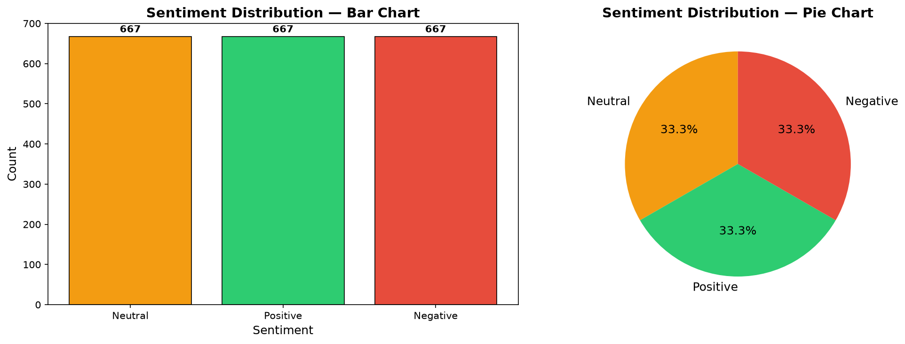
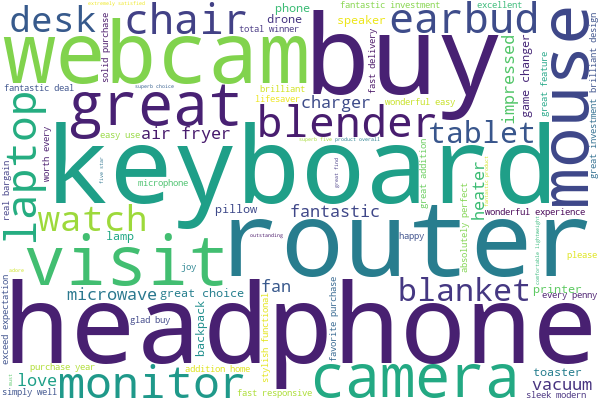
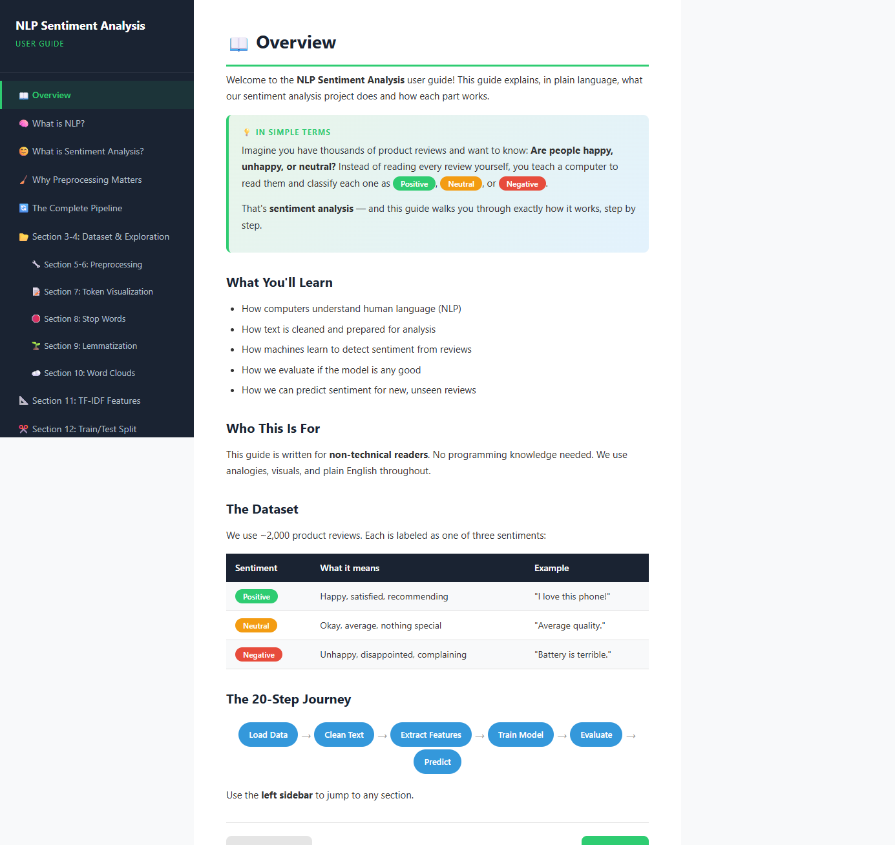
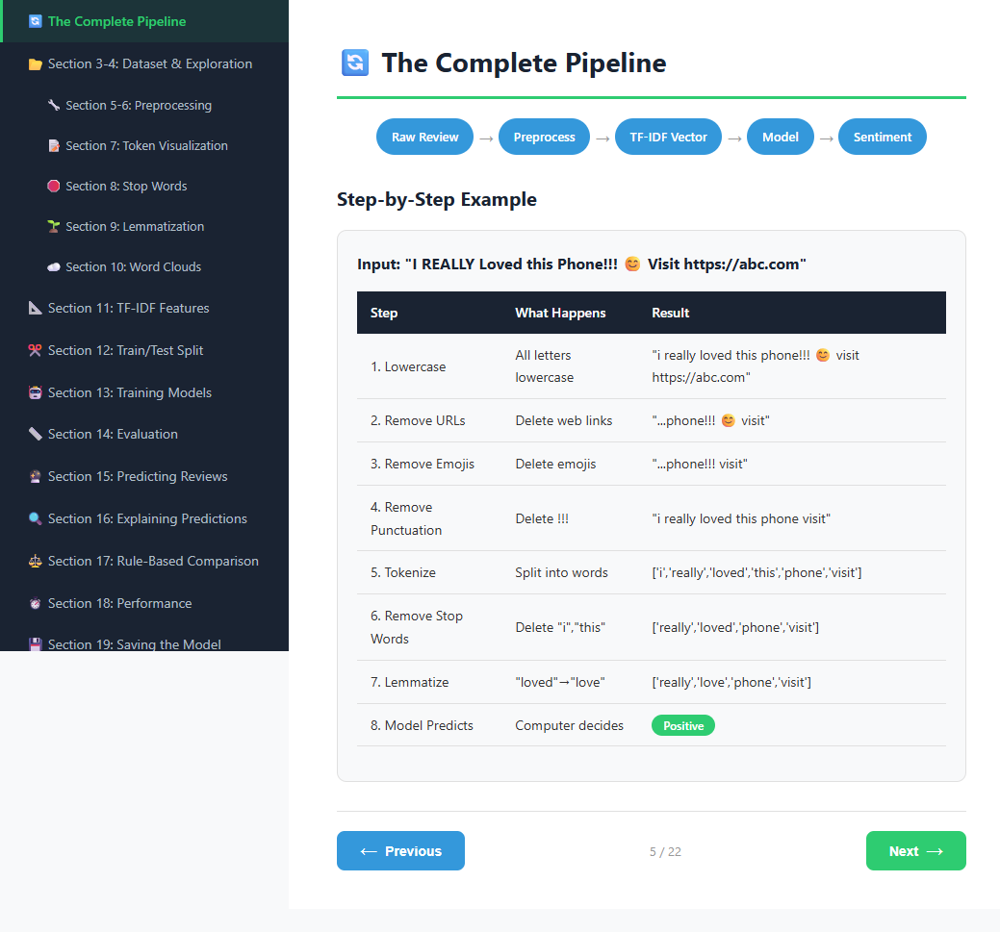
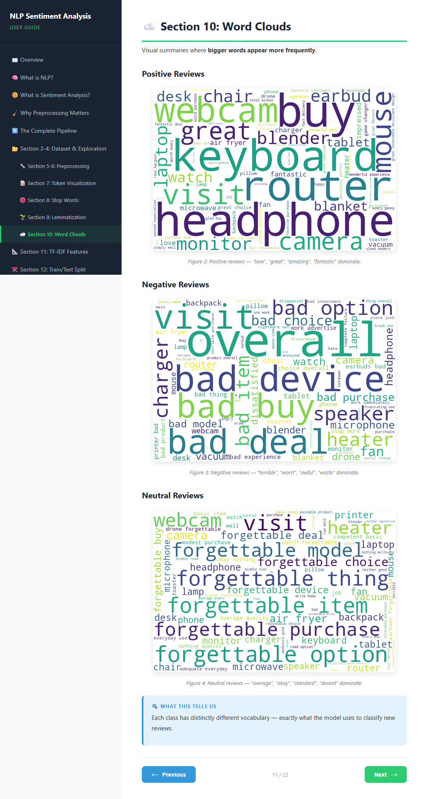
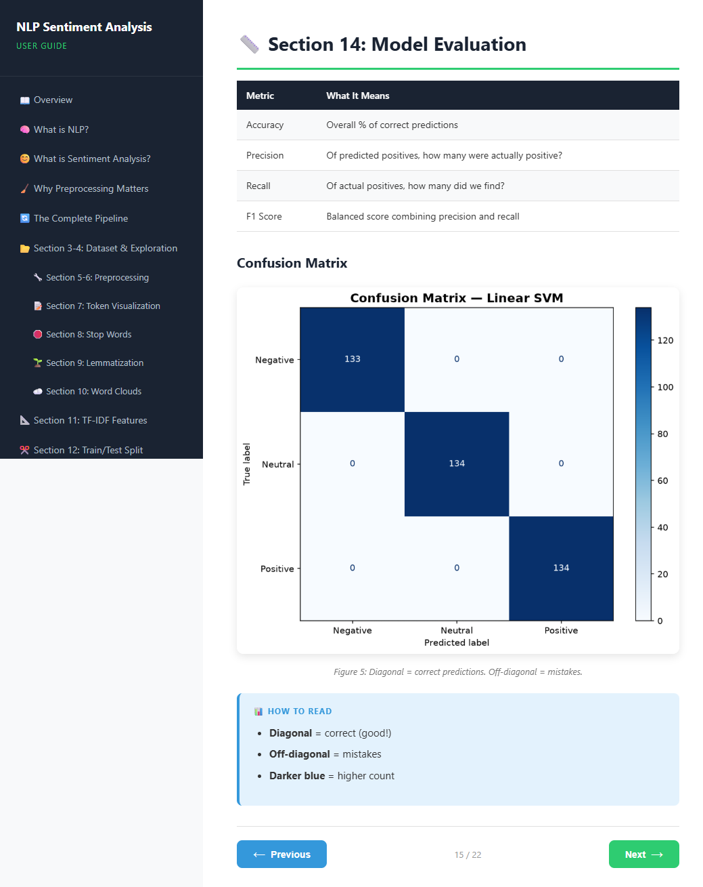

言語 / Languages: [English](README.md) | **日本語**

---

<div align="center">

# 📝 NLP Machine Learning Sentiment Analysis

**約 2,000 件の製品レビューからなる独自データセットで 3 クラス感情分析（Positive / Neutral / Negative）を行う、NLP パイプライン全体を示す完全な教育用 Jupyter ノートブックです — 生テキストのクリーニングから、学習・解釈・保存済みの ML モデルまで。**

## デモ動画

[](https://youtu.be/900X8pSTb1M)

## なぜこのプロジェクトが存在するのか

前処理、TF-IDF による特徴量エンジニアリング、教師ありモデルの比較といった古典的 NLP/ML の基礎を、このポートフォリオのモダンな LLM・エージェント系プロジェクトと並ぶ AI スタックの土台として示すプロジェクトです。


</div>

---

## 🎯 このプロジェクトが行うこと

生のノイズだらけの製品レビュー（URL、絵文字、HTML タグ、全大文字、余分な空白）を取り込み、**NLP 感情分析パイプライン全体**を段階的にたどります — すべてのステップが可視化され、解説付きです：


- **🧹 前処理** — 12 関数からなるクリーニングパイプライン（小文字化、URL/絵文字/HTML の除去、トークン化、否定語を保持したストップワード除去、POS 考慮のレンマタイゼーション）
- **📐 特徴量抽出** — 2 語句の語彙を持つ TF-IDF ベクトル化
- **🤖 モデル学習** — Logistic Regression、Naive Bayes、Linear SVM を並べて比較
- **📏 評価** — 正解率、適合率、再現率、F1、混同行列
- **🔍 説明可能性** — LR の係数による予測ごとの特徴量寄与
- **⚖️ ベースライン比較** — ルールベースの TextBlob & VADER と学習済み ML モデルの対比
- **💾 永続化** — モデル + ベクトライザーを `.pkl` 成果物として保存、FastAPI バックエンドですぐ使える形に

## 📊 結果（テストセット — 401 件のレビュー）

| モデル | 正解率 | 適合率 | 再現率 | F1 |
|-------|:---:|:---:|:---:|:---:|
| **Linear SVM** 🏆 | **1.0000** | 1.0000 | 1.0000 | 1.0000 |
| Logistic Regression | 0.9975 | 0.9975 | 0.9975 | 0.9975 |
| Naive Bayes | 0.9925 | 0.9926 | 0.9925 | 0.9925 |
| VADER（ルールベース） | 0.8404 | — | — | — |
| TextBlob（ルールベース） | 0.5910 | — | — | — |

Linear SVM はテストレビューすべてを完璧に分類します — クラス固有の語彙が強いテンプレート生成データセットでは期待どおりの結果です。ルールベースのベースラインが、なぜ学習モデルが勝つのかを示しています。

## 🖼️ 可視化出力

| 感情分布 | 混同行列（Linear SVM） |
|:---:|:---:|
|  |  |
| **Positive ワードクラウド** | **Negative ワードクラウド** |
|  |  |

## 📚 20 セクションのノートブック

| セクション | トピック |
|---------|-------|
| 1–2 | はじめに、ライブラリのセットアップ、NLTK/spaCy リソースのダウンロード |
| 3–4 | データセットの読み込み、探索（棒/円グラフ、レビュー長の統計） |
| 5–6 | ソースコード付き 12 の前処理関数、段階的なデモ |
| 7–9 | トークンとストップワードの可視化、レンマタイゼーションのデモ |
| 10 | 感情クラスごとのワードクラウド |
| 11–12 | TF-IDF 特徴量抽出、層化 80/20 訓練/テスト分割 |
| 13–14 | LR / NB / SVM の訓練、混同行列による完全な評価 |
| 15–16 | カスタムレビューの予測、係数による予測の説明 |
| 17 | ルールベースとの比較（TextBlob、VADER vs ML） |
| 18–20 | パフォーマンス計測、モデルの保存/読み込み、まとめ |

## 📁 プロジェクト構成

```
NLP_MachineLearning_SentimentAnalysis/
├── SentimentAnalysis.ipynb      # メインノートブック (20セクション構成)
├── preprocessing.py             # 再利用可能な前処理関数 (FastAPI組み込み対応)
├── data/
│   ├── generate_dataset.py      # ノイズ注入機能を備えたテンプレートベースのデータセット生成スクリプト
│   └── reviews.csv              # ラベル付きレビューデータ 約2,000件 (レビュー本文, 感情ラベル)
├── models/                      # 保存された学習済みモデル・ベクトル変換器 (ノートブックで再生成可能)
│   ├── sentiment_model.pkl
│   └── tfidf_vectorizer.pkl
├── outputs/                     # 生成された可視化チャート
│   ├── sentiment_distribution.png
│   ├── confusion_matrix.png
│   ├── wordcloud_positive.png
│   ├── wordcloud_negative.png
│   └── wordcloud_neutral.png
├── images/                      # ユーザーガイド用スクリーンショット
├── userguide.html               # インタラクティブな22ページ構成のビジュアルユーザーガイド (単一ファイル完結型)
├── generate_userguide.py        # 画像埋め込み処理を行い userguide.html を再構築するスクリプト
└── requirements.txt             # 依存ライブラリのバージョン固定ファイル
```

## 🚀 セットアップ

```powershell
# 1. Create and activate a virtual environment
py -3.11 -m venv venv
.\venv\Scripts\Activate.ps1

# 2. Install dependencies
pip install -r requirements.txt
python -m spacy download en_core_web_sm

# 3. Generate the dataset (if regenerating)
python data/generate_dataset.py

# 4. Run the notebook
#    Open SentimentAnalysis.ipynb in VS Code or Jupyter and run all cells top-to-bottom
```

## 🏗️ FastAPI ですぐ使える前処理

`preprocessing.py` はスタンドアロンモジュールです — ノートブックで使っているのと同じ関数が、Web バックエンドにそのまま組み込めます：

```python
from fastapi import FastAPI
import joblib
import preprocessing as pp

app = FastAPI()
model = joblib.load("models/sentiment_model.pkl")
vectorizer = joblib.load("models/tfidf_vectorizer.pkl")

@app.post("/predict")
def predict(review: str):
    cleaned = pp.clean_text(review)
    vec = vectorizer.transform([cleaned])
    pred = model.predict(vec)[0]
    probs = model.predict_proba(vec)[0]
    return {"sentiment": pred, "confidence": round(float(max(probs)), 4)}
```

## 📖 ユーザーガイド

**自己完結型のインタラクティブユーザーガイド**（`userguide.html` — 22 ページ、画像埋め込み、サーバー不要）が、非技術者向けにプロジェクト全体を平易な言葉で説明します：NLP とは何か、なぜ前処理が重要か、TF-IDF はどう動くか、モデルがどう比較されるか。

| 概要 | パイプライン全体 |
|:---:|:---:|
|  |  |
| **ワードクラウド** | **モデル評価** |
|  |  |

チャートを再生成した後はビルドし直します：`python generate_userguide.py`

## 🔧 使用ライブラリ

| ライブラリ | 役割 |
|---------|------|
| **pandas / numpy** | データ操作と数値演算 |
| **nltk** | トークン化、ストップワード、レンマタイゼーション用リソース |
| **spacy** | POS 考慮のレンマタイゼーション（`en_core_web_sm`） |
| **scikit-learn** | TF-IDF、Logistic Regression、Naive Bayes、Linear SVM、メトリクス |
| **matplotlib** | 棒/円グラフ、混同行列、ヒストグラム |
| **wordcloud** | クラスごとのワードクラウド可視化 |
| **textblob / vaderSentiment** | ルールベースの感情ベースライン |
| **joblib** | モデルとベクトライザーの永続化 |

## 📝 メモ

- **データセット**はテンプレート生成で約 15% のノイズ注入（URL、絵文字、HTML タグ、数値、全大文字）を含みます — 意図的に汚くしてあるため、どの前処理ステップにも実際の仕事があります。
- 否定語（`not`、`never`、`n't` など）はストップワード除去の際に**保持**されます — 感情を反転させるため、分類に不可欠だからです。
- NLP の概念をエンドツーエンドで学ぶことに焦点を当てた教育プロジェクトです。
