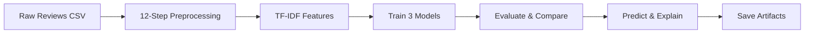

<div align="center">

# 📝 NLP Machine Learning Sentiment Analysis

**A complete, educational Jupyter notebook demonstrating the full NLP pipeline for 3-class sentiment analysis (Positive / Neutral / Negative) on a custom dataset of ~2,000 product reviews — from raw text cleaning to a trained, explained, and saved ML model.**

## Why This Project Exists

Demonstrates foundational classical NLP/ML — preprocessing, TF-IDF feature engineering and supervised model comparison — as the base of the AI stack alongside the modern LLM and agentic projects in this portfolio.


</div>

---

## 🎯 What This Project Does

Takes raw, noisy product reviews (URLs, emojis, HTML tags, ALL CAPS, extra whitespace) and walks through the **entire NLP sentiment analysis pipeline** — every step visualized and explained:



- **🧹 Preprocessing** — a 12-function cleaning pipeline (lowercase, URL/emoji/HTML removal, tokenization, stop-word removal with negation retention, POS-aware lemmatization)
- **📐 Feature extraction** — TF-IDF vectorization with a 2-word phrase vocabulary
- **🤖 Model training** — Logistic Regression, Naive Bayes, and Linear SVM compared side by side
- **📏 Evaluation** — accuracy, precision, recall, F1, and confusion matrices
- **🔍 Explainability** — per-prediction feature attribution via LR coefficients
- **⚖️ Baseline comparison** — rule-based TextBlob & VADER vs. the trained ML model
- **💾 Persistence** — model + vectorizer saved as `.pkl` artifacts, ready for a FastAPI backend

## 📊 Results (Test Set — 401 reviews)

| Model | Accuracy | Precision | Recall | F1 |
|-------|:---:|:---:|:---:|:---:|
| **Linear SVM** 🏆 | **1.0000** | 1.0000 | 1.0000 | 1.0000 |
| Logistic Regression | 0.9975 | 0.9975 | 0.9975 | 0.9975 |
| Naive Bayes | 0.9925 | 0.9926 | 0.9925 | 0.9925 |
| VADER (rule-based) | 0.8404 | — | — | — |
| TextBlob (rule-based) | 0.5910 | — | — | — |

The linear SVM classifies every test review perfectly — expected for a template-generated dataset with strong class-specific vocabulary. The rule-based baselines show why learned models win.

## 🖼️ Visual Outputs

| Sentiment Distribution | Confusion Matrix (Linear SVM) |
|:---:|:---:|
|  |  |
| **Positive Word Cloud** | **Negative Word Cloud** |
|  |  |

## 📚 The 20-Section Notebook

| Section | Topic |
|---------|-------|
| 1–2 | Introduction, library setup, NLTK/spaCy resource downloads |
| 3–4 | Load dataset, explore (bar/pie charts, review-length stats) |
| 5–6 | 12 preprocessing functions with source code, step-by-step demo |
| 7–9 | Token & stop-word visualization, lemmatization demos |
| 10 | Word clouds per sentiment class |
| 11–12 | TF-IDF feature extraction, stratified 80/20 train/test split |
| 13–14 | Train LR / NB / SVM, full evaluation with confusion matrices |
| 15–16 | Predict custom reviews, explain predictions via coefficients |
| 17 | Rule-based comparison (TextBlob, VADER vs ML) |
| 18–20 | Performance timing, model saving/loading, conclusions |

## 📁 Project Structure

```
NLP_MachineLearning_SentimentAnalysis/
├── SentimentAnalysis.ipynb      # Main notebook (20 sections)
├── preprocessing.py             # Reusable preprocessing functions (FastAPI-ready)
├── data/
│   ├── generate_dataset.py      # Template-based dataset generator with noise injection
│   └── reviews.csv              # ~2,000 labeled reviews (Review, Sentiment)
├── models/                      # Saved artifacts (regenerated by the notebook)
│   ├── sentiment_model.pkl
│   └── tfidf_vectorizer.pkl
├── outputs/                     # Generated charts
│   ├── sentiment_distribution.png
│   ├── confusion_matrix.png
│   ├── wordcloud_positive.png
│   ├── wordcloud_negative.png
│   └── wordcloud_neutral.png
├── images/                      # User guide screenshots
├── userguide.html               # Interactive 22-page visual user guide (self-contained)
├── generate_userguide.py        # Rebuilds userguide.html with embedded images
└── requirements.txt             # Pinned dependencies
```

## 🚀 Setup

```powershell
# 1. Create and activate a virtual environment
py -3.11 -m venv venv
.\venv\Scripts\Activate.ps1

# 2. Install dependencies
pip install -r requirements.txt
python -m spacy download en_core_web_sm

# 3. Generate the dataset (if regenerating)
python data/generate_dataset.py

# 4. Run the notebook
#    Open SentimentAnalysis.ipynb in VS Code or Jupyter and run all cells top-to-bottom
```

## 🏗️ FastAPI-Ready Preprocessing

`preprocessing.py` is a standalone module — the same functions used in the notebook drop straight into a web backend:

```python
from fastapi import FastAPI
import joblib
import preprocessing as pp

app = FastAPI()
model = joblib.load("models/sentiment_model.pkl")
vectorizer = joblib.load("models/tfidf_vectorizer.pkl")

@app.post("/predict")
def predict(review: str):
    cleaned = pp.clean_text(review)
    vec = vectorizer.transform([cleaned])
    pred = model.predict(vec)[0]
    probs = model.predict_proba(vec)[0]
    return {"sentiment": pred, "confidence": round(float(max(probs)), 4)}
```

## 📖 User Guide

A **self-contained interactive user guide** (`userguide.html` — 22 pages, images embedded, no server needed) explains the entire project in plain language for non-technical readers: what NLP is, why preprocessing matters, how TF-IDF works, and how the models compare.

| Overview | The Complete Pipeline |
|:---:|:---:|
|  |  |
| **Word Clouds** | **Model Evaluation** |
|  |  |

Rebuild it after regenerating charts: `python generate_userguide.py`

## 🔧 Libraries Used

| Library | Role |
|---------|------|
| **pandas / numpy** | Data manipulation and numerical operations |
| **nltk** | Tokenization, stop words, lemmatization resources |
| **spacy** | POS-aware lemmatization (`en_core_web_sm`) |
| **scikit-learn** | TF-IDF, Logistic Regression, Naive Bayes, Linear SVM, metrics |
| **matplotlib** | Bar/pie charts, confusion matrix, histograms |
| **wordcloud** | Per-class word cloud visualizations |
| **textblob / vaderSentiment** | Rule-based sentiment baselines |
| **joblib** | Model and vectorizer persistence |

## 📝 Notes

- **Dataset** is template-generated with ~15% noise injection (URLs, emojis, HTML tags, numbers, ALL CAPS) — deliberately messy so every preprocessing step has real work to demonstrate.
- Negation words (`not`, `never`, `n't` …) are **retained** during stop-word removal — they flip sentiment and are critical for classification.
- Educational project focused on learning NLP concepts end-to-end.