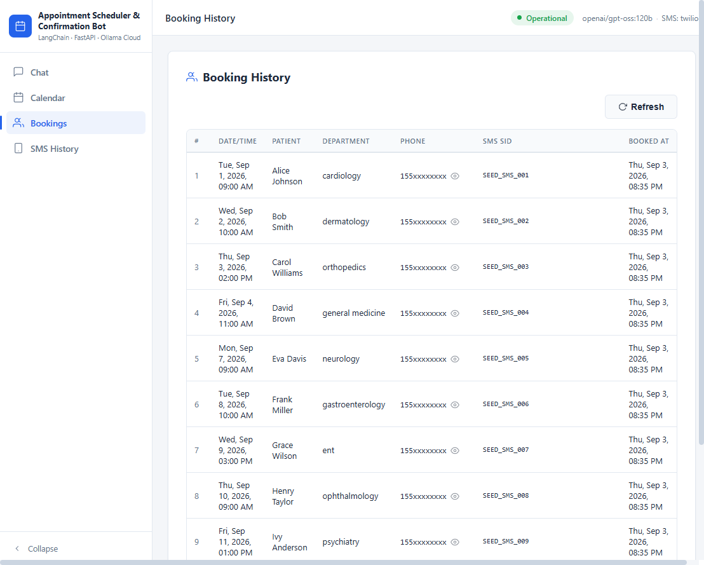
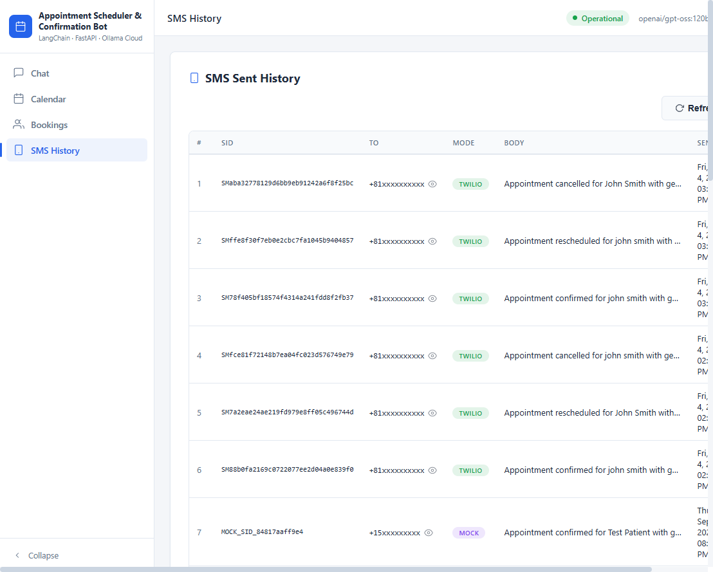
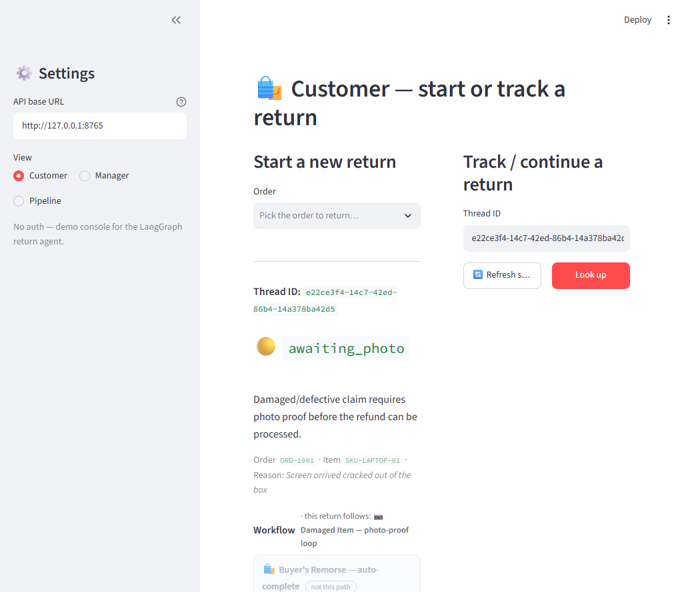
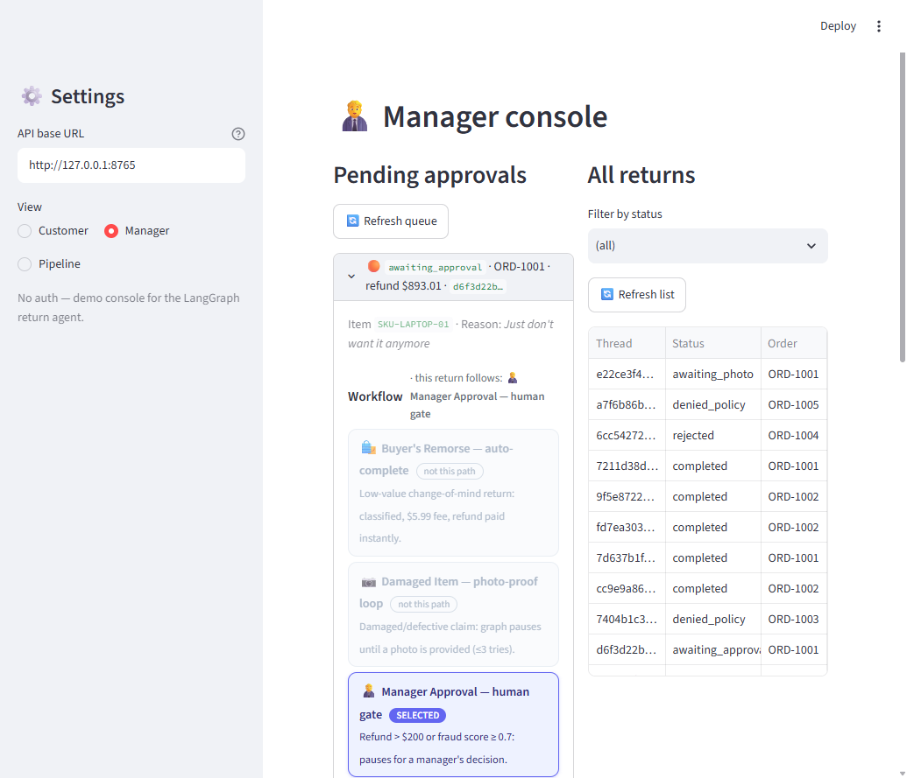
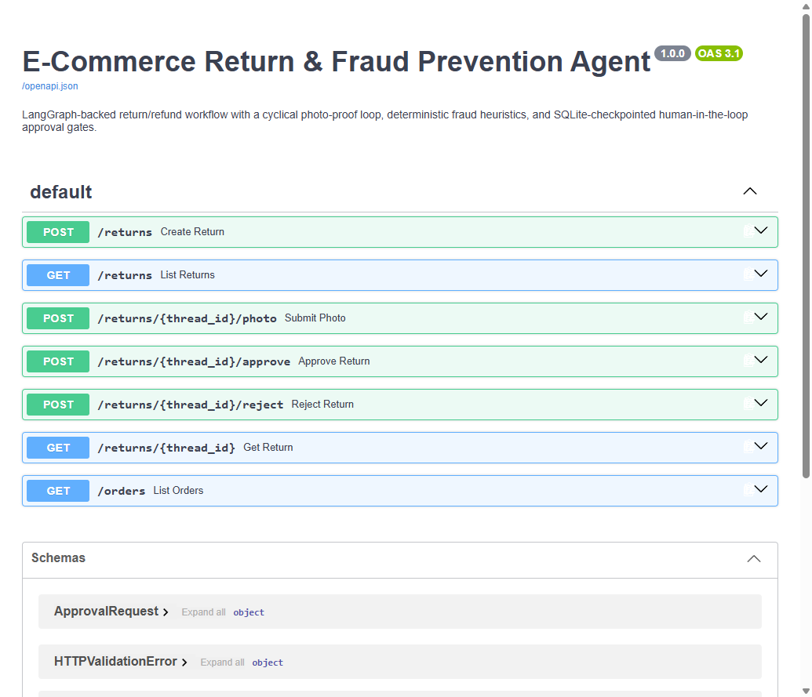
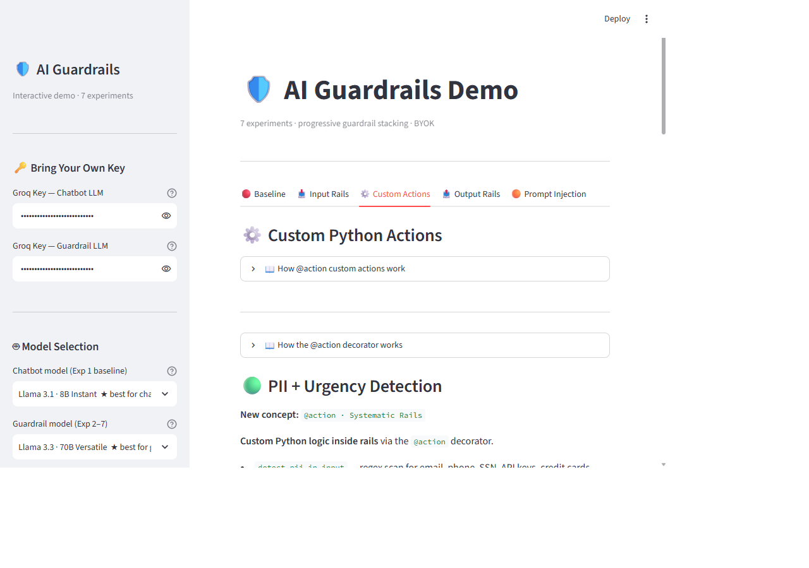
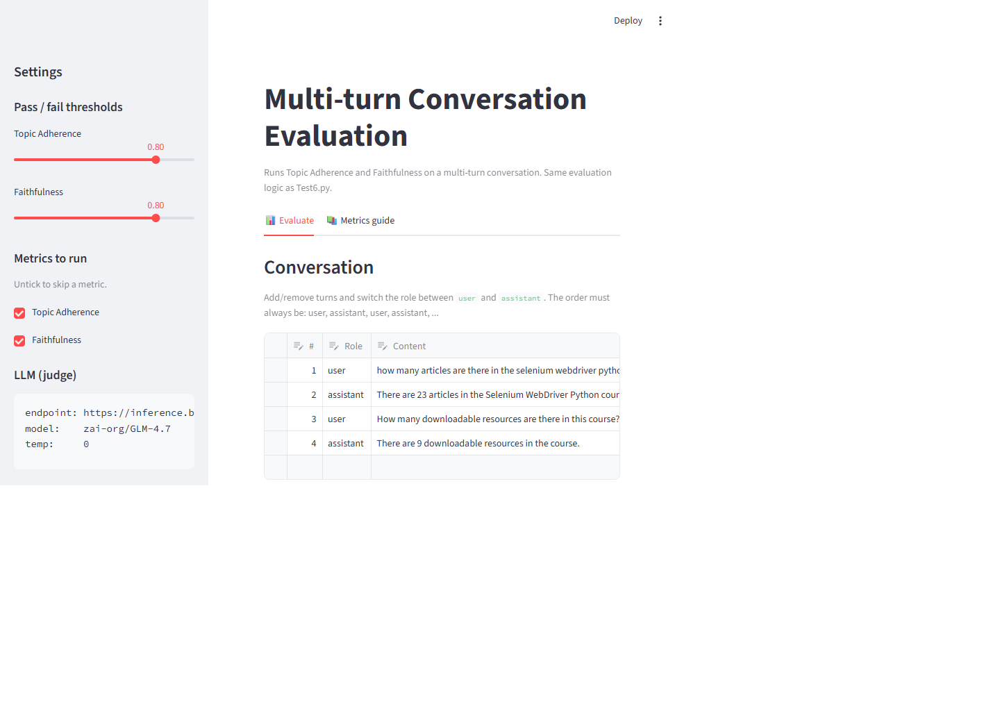
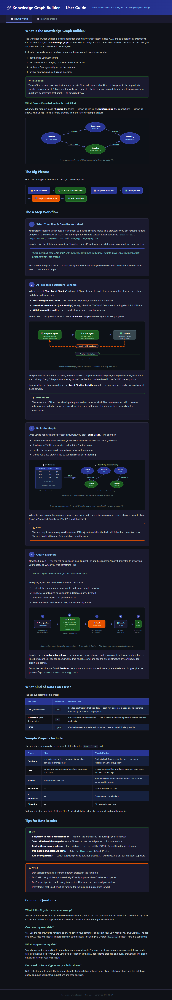
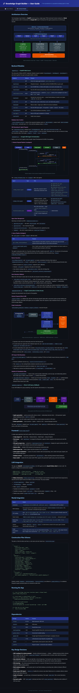
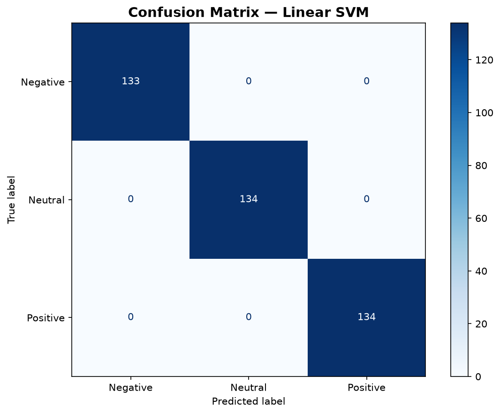

# 🧠 AI_Projects

**A curated showcase of AI and Machine Learning projects featuring local LLM workflows, RAG systems, model evaluation, automated AI testing frameworks, and classic NLP/ML text classification.**

---

## 📂 Projects

| # | Project | Stack | Status |
|---|---------|-------|--------|
| 1 | **[Hospital Appointment Scheduler & Confirmation Bot](./hospital-appointment-scheduler/)** | LangChain LCEL · FastAPI · Ollama Cloud (`gpt-oss:120b`) · Twilio SMS | ✅ Complete |
| 2 | **[Automated Order Returns & Fraud Prevention Agent](./langgraph-return-fraud-agent/)** | LangGraph · FastAPI · Streamlit · Ollama Cloud (`gpt-oss:120b`) · SQLite checkpointing | ✅ Complete |
| 3 | **[AI Guardrails Demo](./ai-guardrails-demo/)** | NeMo Guardrails · Streamlit · Groq Llama 3.x · BYOK | ✅ Complete |
| 4 | **[RAG Evaluation Harness](./rag-evaluation-harness/)** | RAGAS · Streamlit · OpenAI-compatible judge LLMs · pytest | ✅ Complete |
| 5 | **[Knowledge Graph Builder](./KnowledgegraphUIapp/)** | Google ADK · FastAPI · Neo4j · Ollama Cloud (`gpt-oss:120b`) · Vanilla JS | ✅ Complete |
| 6 | **[NLP Machine Learning Sentiment Analysis](./NLP_MachineLearning_SentimentAnalysis/)** | scikit-learn (TF-IDF · LR · NB · SVM) · NLTK · spaCy · Jupyter | ✅ Complete |

### 1️⃣ Hospital Appointment Scheduler & Confirmation Bot

A production-style backend service + enterprise web console that processes natural-language appointment requests for a hospital: parses intent via LLM, checks calendar availability, books slots, and sends SMS confirmations.

**Highlights**

- 💬 Conversational booking bot — *"Book a cardiology appointment for John Doe next Monday at 2pm"*
- 🧩 LangChain LCEL pipeline with Pydantic v2 structured extraction
- 🖥️ Enterprise light-theme web console (sidebar shell, calendar, bookings, SMS audit trail)
- 📱 Real Twilio SMS integration with mock/seed/twilio modes
- 🗄️ SQLite persistence · 🧪 pytest suite (LLM mocked in unit tests)

> 📄 **Full docs, setup guide, API reference, and screenshots:** [`hospital-appointment-scheduler/README.md`](./hospital-appointment-scheduler/README.md) ·
> 📚 **In-depth technical documentation (HTML):** [`Documents/documentation.html`](./Documents/documentation.html)

| Chat Console | Calendar View |
|:---:|:---:|
|  |  |
| **Booking History** | **SMS History** |
|  |  |

---

### 2️⃣ Automated Order Returns & Fraud Prevention Agent

A LangGraph state-machine backend that automates e-commerce return/refund
decisions: policy checks, an LLM return-reason classifier, a cyclical
photo-proof loop, deterministic fraud scoring, and a native `interrupt()`
human-in-the-loop gate for manager approval on high-value or high-risk
refunds — all checkpointed to SQLite so runs survive server restarts.

**Highlights**

- 🧠 4-path workflow (auto-complete, photo-proof loop, manager approval, policy denial) in a single `StateGraph`
- 🤖 LLM return-reason classifier (Ollama Cloud `gpt-oss:120b`) with deterministic keyword fallback
- 🚦 Deterministic fraud scoring (return velocity, no-photo-after-retries, high refund amount)
- 🖥️ Streamlit console — Customer, Manager, and Pipeline (workflow-stage dashboard) views
- 🧪 149 pytest tests (unit + FastAPI integration)

> 📄 **Full docs, architecture, setup guide, and screenshots:** [`langgraph-return-fraud-agent/README.md`](./langgraph-return-fraud-agent/README.md)

| Customer view | Workflow pipeline dashboard |
|:---:|:---:|
|  |  |
| **Manager console** | **API reference** |
|  |  |

---

### 3️⃣ AI Guardrails Demo

An interactive Streamlit teaching app for **NVIDIA NeMo Guardrails**: 7 progressive experiments that layer safety rails onto a raw LLM — from zero protection to a production-grade guarded Enterprise IT Assistant (Kubernetes · Intel hardware · enterprise networking). Users bring their own Groq API key (BYOK) and watch each rail block a different class of abuse.

**Highlights**

- 🛡️ 7 cumulative experiments — Topic Guard, Jailbreak Shield, Sensitive Topic Block, Dialog Rails, Custom Actions, Output Sanitizer
- 📝 Colang DSL in action — `define user / define bot / define flow` with semantic intent matching via FastEmbed + guard LLM
- 🐍 Custom `@action` Python rails — PII regex scanner, urgency classifier, credential sanitizer, prompt-injection detector
- 🟠 Bonus prompt-injection lab — hidden-in-data attacks with a Without-Rails vs With-Rails comparison
- 📊 Token & latency tracking per LLM call, plus optional Logfire (OpenTelemetry) tracing
- 🔐 BYOK security — keys entered at runtime as password fields, never stored, logged, or committed

> 📄 **Full docs, theory reference, setup guide, and screenshots:** [`ai-guardrails-demo/README.md`](./ai-guardrails-demo/README.md)

| Landing & experiment map | Input Rails — Topic Guard |
|:---:|:---:|
|  |  |
| **Custom Python Actions** | **Prompt Injection lab** |
|  |  |

---

### 4️⃣ RAG Evaluation Harness

A Streamlit evaluation workbench for RAG systems built on **RAGAS**: point it at any RAG endpoint plus any OpenAI-compatible judge LLM and step through a two-phase workflow — query the RAG, review the retrieved contexts, then score quality with 7 LLM-judged (no-embedding) metrics, complete with pass/fail thresholds, per-metric reasoning, and JSON run history.

**Highlights**

- 🧑‍⚖️ 7 no-embedding RAGAS metrics — context relevance/precision/recall, groundedness, faithfulness, factual correctness, rubrics score
- 🔁 Two-phase human-in-the-loop workflow — review retrieved contexts *before* scoring so bad retrievals never silently skew results
- 🖥️ Streamlit workbench — editable data grid, metric multi-select, gauge dashboard with recommended ranges
- 💬 Multi-turn evaluation — Topic Adherence & Faithfulness across a full conversation, editable turn-by-turn
- 💾 Run history as timestamped JSON files — save/reload/delete evaluations with zero database overhead
- 🌐 Endpoint-agnostic — local Ollama, Baseten, OpenAI, or Azure OpenAI judge LLMs
- 🧪 pytest suite (`Test1`–`Test7`) doubles as a CI regression gate for every metric

> 📄 **Full docs, setup guide, and screenshots:** [`rag-evaluation-harness/README.md`](./rag-evaluation-harness/README.md)

| Config — pick metrics & judge LLM | Multi-turn conversation evaluation |
|:---:|:---:|
|  |  |

---

### 5️⃣ Knowledge Graph Builder

A web application that automates the creation of knowledge graphs from structured data files (CSV) and unstructured text (Markdown). A team of AI agents (Google ADK `LoopAgent`) iteratively proposes, critiques, and validates a graph schema, then constructs the graph in Neo4j, and finally lets you query it using natural language — all through a clean web UI with live agent progress streaming.

**Highlights**

- 🤖 3-agent refinement loop (Proposer → Critic → Checker, max 3 iterations) for schema proposal via Google ADK
- 📁 File browser — select CSV, Markdown, or JSON files from any folder
- 🏗️ One-click graph building — auto-creates Neo4j DB, copies CSVs via `docker cp`, runs Cypher `LOAD CSV` + `MERGE`
- 🔍 Natural language Q&A — AI agent translates questions to Cypher, executes, and summarizes results
- 📊 Interactive Canvas graph visualization with zoom/pan/drag
- 📡 SSE streaming for real-time agent activity during schema proposal
- 🗄️ Multi-database isolation — each project gets its own Neo4j database
- 📋 6 sample datasets — Furniture, Tech, Reviews, Healthcare, E-commerce, Education

> 📄 **Full docs, setup guide, architecture, and screenshots:** [`KnowledgegraphUIapp/README.md`](./KnowledgegraphUIapp/README.md) ·
> 📚 **Interactive user guide (HTML, 2 tabs):** [`KnowledgegraphUIapp/userguide.html`](./KnowledgegraphUIapp/userguide.html)

| User Guide — How It Works | User Guide — Technical Details |
|:---:|:---:|
|  |  |

---

### 6️⃣ NLP Machine Learning Sentiment Analysis

A complete, educational Jupyter notebook that walks through the **full NLP pipeline** for 3-class sentiment analysis (Positive / Neutral / Negative) on a custom ~2,000-review dataset — every step visualized and explained, from raw noisy text cleaning to a trained, explained, and saved ML model.

**Highlights**

- 🧹 12-function preprocessing pipeline (URL/emoji/HTML removal, tokenization, stop words with **negation retention**, POS-aware lemmatization via spaCy)
- 📐 TF-IDF feature extraction with n-gram vocabulary and top-feature inspection
- 🤖 Three models compared head-to-head — Logistic Regression (99.75%), Naive Bayes (99.25%), Linear SVM (**100%**)
- ⚖️ Rule-based baselines benchmarked against ML — TextBlob (59.1%) and VADER (84.0%)
- 🔍 Prediction explainability via LR feature coefficients
- 📊 Word clouds, sentiment distribution, and confusion matrix visualizations
- 🏗️ FastAPI-ready — `preprocessing.py` + saved `.pkl` artifacts drop straight into a web backend
- 📖 Self-contained interactive **user guide** (`userguide.html`, 22 pages) in plain language for non-technical readers

> 📄 **Full docs, setup guide, and results:** [`NLP_MachineLearning_SentimentAnalysis/README.md`](./NLP_MachineLearning_SentimentAnalysis/README.md) ·
> 📚 **Interactive user guide (HTML, 22 pages):** [`NLP_MachineLearning_SentimentAnalysis/userguide.html`](./NLP_MachineLearning_SentimentAnalysis/userguide.html)

| Sentiment Distribution | Confusion Matrix (Linear SVM) |
|:---:|:---:|
|  |  |
| **User Guide — Overview** | **User Guide — Word Clouds** |
|  |  |

---

## 🗺️ Roadmap

- [x] 5️⃣ Knowledge Graph Builder — ADK agents + Neo4j + natural language Q&A → **[KnowledgegraphUIapp](./KnowledgegraphUIapp/)**
- [x] 6️⃣ Model Evaluation Harness — automated LLM benchmarking & regression testing → **[rag-evaluation-harness](./rag-evaluation-harness/)**
- [x] 7️⃣ Classic NLP / ML Sentiment Analysis — end-to-end text classification teaching notebook → **[NLP_MachineLearning_SentimentAnalysis](./NLP_MachineLearning_SentimentAnalysis/)**
- [ ] 8️⃣ Multi-Agent Workflow Orchestrator — ADK-style agent collaboration patterns

## 🛠️ Common Tech

| Layer | Tools |
|-------|-------|
| LLM Orchestration | LangChain (LCEL), LangGraph, Google ADK, NVIDIA NeMo Guardrails |
| Evaluation | RAGAS (LLM-judged metrics), pytest, Streamlit dashboards |
| LLM Providers | Ollama Cloud (gpt-oss:120b, glm-5.2, kimi-k2.6), local Ollama |
| APIs & UI | FastAPI, Uvicorn, Streamlit, vanilla-JS enterprise consoles |
| Data & Validation | Pydantic v2, SQLite |
| Testing | pytest, pytest-asyncio |
| Integrations | Twilio (SMS), Neo4j (graph data) |
| Classic NLP / ML | scikit-learn (TF-IDF, LR, NB, SVM), NLTK, spaCy, TextBlob, VADER |

---

**Each project is self-contained** in its own folder with independent setup, `.env.example`, and tests.

